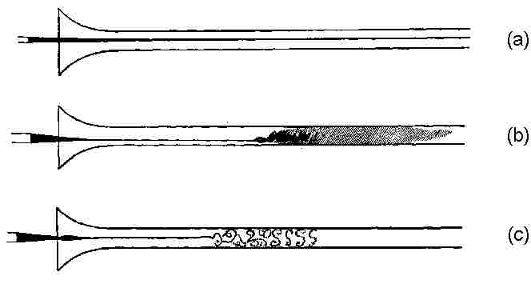

# B1 Flows Fluctuations and Complexity <!-- omit in toc -->

- [Flows](#flows)
  - [Diagrams of flows](#diagrams-of-flows)
    - [Flow Fields](#flow-fields)
    - [Streamlines](#streamlines)
    - [Stream Function](#stream-function)
    - [Velocity Potential](#velocity-potential)
  - [Navier Stokes Equation](#navier-stokes-equation)
    - [Fluxes and Conservation principles](#fluxes-and-conservation-principles)
      - [Conservation of Mass](#conservation-of-mass)
    - [Derivation of the Formula](#derivation-of-the-formula)
      - [Pressure Gradient Force](#pressure-gradient-force)
      - [Viscous Force](#viscous-force)
      - [External force](#external-force)
      - [A correction to acceleration](#a-correction-to-acceleration)
      - [Navier Stokes](#navier-stokes)
    - [Solutions to Navier Stokes](#solutions-to-navier-stokes)
      - [Poiseuille Flow](#poiseuille-flow)
    - [Reynolds Number and Dynamical Similarity](#reynolds-number-and-dynamical-similarity)
    - [Boundary Layers](#boundary-layers)
      - [Impulsive Boundary Layers](#impulsive-boundary-layers)
      - [Blasius Boundary Layers](#blasius-boundary-layers)
      - [Boundary Separation](#boundary-separation)
  - [Vorticity and Circulation](#vorticity-and-circulation)
    - [Kelvins Circulation Theorem](#kelvins-circulation-theorem)
    - [Bernouli's Theorem](#bernoulis-theorem)
    - [Lift Force](#lift-force)
  - [Special Cases](#special-cases)
    - [Very Viscous Flows](#very-viscous-flows)
      - [Stokes Equations](#stokes-equations)
      - [EXAMPLE Stokes flow past a sphere](#example-stokes-flow-past-a-sphere)
      - [Biological Motility At Low Reynolds Number](#biological-motility-at-low-reynolds-number)
    - [Thin-Film Approximation](#thin-film-approximation)
    - [Waves](#waves)
      - [Linear Wave Equations](#linear-wave-equations)
      - [Waves and incompressibility](#waves-and-incompressibility)
      - [Non-Linear Waves](#non-linear-waves)
        - [Physics](#physics)
- [Dynamical Systems](#dynamical-systems)
  - [Flows in Phase Space](#flows-in-phase-space)
  - [Two Dimensional Phase Space](#two-dimensional-phase-space)
  - [Liouvilles Theorem](#liouvilles-theorem)
  - [Attractors/Fixed Points and Their Stability](#attractorsfixed-points-and-their-stability)
    - [Limit Cycles](#limit-cycles)
    - [Classifying Fixed Points](#classifying-fixed-points)
  - [Bifurcations](#bifurcations)
    - [Saddle Node Bifurcation](#saddle-node-bifurcation)
    - [Transcritical Bifurcation](#transcritical-bifurcation)
    - [Pitchfork Bifurcation](#pitchfork-bifurcation)
      - [Supercritical Pitchfork](#supercritical-pitchfork)
      - [Subcritical Pitchfork](#subcritical-pitchfork)
      - [Imperfect Pitchfork Bifurcation](#imperfect-pitchfork-bifurcation)
    - [Hopf Bifurcations](#hopf-bifurcations)
      - [Supercritical Hopf](#supercritical-hopf)
      - [Subcritical Hopf](#subcritical-hopf)
  - [The Strange Attractor](#the-strange-attractor)
  - [Aperiodicity and Predictability in Simple Chaotic Systems](#aperiodicity-and-predictability-in-simple-chaotic-systems)
  - [Lyapunov Exponents](#lyapunov-exponents)
- [Ideal Fluid Examples](#ideal-fluid-examples)
  - [Hydraulic Jumps](#hydraulic-jumps)
  - [Bath Plug Vortex](#bath-plug-vortex)

# Flows
A fluid is a gas or a liquid whose molecules can slide past each other (unlike a solid whose molecules are regularly bound) a gas is compressible whereas a liquid can be considered mostly incompressible.

## Diagrams of flows

### Flow Fields
A useful way to diagram flows is to draw flow fields, or arrows, a good way to do this is to evaluate the arrows on the axis and work from there.

### Streamlines
Another useful way is to draw *streamlines* which are curves in the direction of $\underline{u}$ for any given t. They are defined by 

$$
\frac{dx}{u_x} = \frac{dy}{u_y} = \frac{dz}{u_z} = dt
$$

### Stream Function

A Stream function can be defined as

$$
\underline{u} = \nabla\times(\psi\underline{e}_z)
$$

Which seems a little weird but basically comes to

$$
u_x = \frac{\partial\psi}{dy},\ u_y = \frac{\partial\psi}{dx}
$$

The definition using curl means that a fluid defined with a stream function would be incompressible ($\nabla\cdot\underline{u}=0$)

### Velocity Potential

If the flow is irrotational we have $\nabla\times\underline{u} = 0$ (we'll see that later) so we can define a velocity potential.

$$
\underline{u} = \nabla\phi
$$

Lines of constant $\phi$ are equipotential lines and are perpendicular to streamlines.

## Navier Stokes Equation

Let's look for an equation of fluid motion! Before we start though we need to look at some conservation principles.

### Fluxes and Conservation principles

There are two forms of conservation in this topic, **Lagrangian** and **Flux-form** conservation.
+ **Lagrangian conservation** is something like conservation of momentum where we are thinking about particles. In a fluid we use the material derivative and think about fluid particles.
  + $\frac{D\rho}{Dt} = 0$, here $D/Dt$ refers to rate of change w.r.t time following a fluid parcel.
+ **Flux-Form conservation** is conservation in a continuum. A quantity is conserved if it's rate of change and divergence of flux sum to zero, the kind of equation we see a lot.
  + $\frac{\partial\rho}{\partial t} + \nabla\cdot(\rho\underline{u})$

#### Conservation of Mass
If mass is conserved we get a simple conservation law:
$$
\frac{\partial\rho}{\partial t} + \nabla\cdot(\rho\underline{u}) = 0 
$$

We can say that if the fluid is incompressible $\rho$ is constant in time and space, which leads to:

> Incompressible $\implies \nabla\cdot\underline{u} = 0$

Liquids generally aren't very compressible so this is a useful condition.

### Derivation of the Formula

Lets think of a small fluid parcel (differential volume $\delta x\delta y\delta z$) and apply some classical mechanics. The force on the parcel is given by Newtons second law.

$$
\delta\underline{F} = \rho(\delta x\delta y\delta z)\underline{a}
$$

The force also can be written as the sum of the three components, 
+ Pressure gradient force
+ Viscous force
+ External Force

#### Pressure Gradient Force

Consider a box with walls per unit area with a pressure gradient across it. In the x direction the force on the box is the force from the negative direction minus the force from the positive direction:

$$
F_{-x} - F_{+x}
=p\delta y \delta z-(p+\delta p)\delta y \delta z 
$$

This means the force per unit volume is:

$$
  \frac{dF_p}{dV} = -\frac{\delta p \delta y \delta z}{\delta x\delta y\delta z} = -\frac{\delta p}{\delta x} = -\nabla p\\
  \frac{da_p}{dM} = -\frac{\nabla p}{\rho}
$$

#### Viscous Force

Viscous force is due to shear stress, i.e planes of different velocity rubbing into each other. The justification is similar to the one given in Kinetic Theory and is not very formal. Remember the picture of particles from high speed areas drifting into low speed areas and vice versa, producing a transfer of momentum.

$$
\frac{dF_\nu}{dA} = \rho\nu\frac{\partial u}{\partial y}
$$

Where $\frac{dF_\nu}{dA}$ is called viscous shear stress and $\nu$ is the coefficient of viscosity. Continuing for this we need to find an acceleration:
$$
F_\nu = \rho\nu\frac{\partial u}{\partial y}\delta x \delta z\\
a_\nu = \frac{F_\nu}{\rho \delta x \delta y \delta z} = v\frac{\partial^2 u}{\partial y^2}
$$ 

In general we find that viscous acceleration is more complicated.
$$
a_\nu = \nu\bigg(\nabla^2\underline{u} + \frac{1}{3}\nabla\nabla\cdot\underline{u}\bigg)
$$
If we assume incompressibility (which we often can) then the condition $\nabla\cdot\underline{u} = 0$ can be used.

#### External force

Often the external force to consider is gravity so here the acceleration due to external force can be written as $\underline{a}_{ext} = -\underline{g}$

#### A correction to acceleration

Typically we think of acceleration as $\underline{a} = \frac{d\underline{u}}{dt}$ with $\underline{u}(t)$ but here we have been thinking of fluid parcels so we need to think of following that fluid parcel through space (i.e the *material derivative*) when we calculate $\underline{a}$.
$$
\begin{aligned}
    \frac{d}{dt}\underline{u}(x, y, z, t) &= \frac{\partial\underline{u}}{\partial x}\frac{dx}{dt} + \frac{\partial\underline{u}}{\partial y}\frac{dy}{dt}  + \frac{\partial\underline{u}}{\partial z}\frac{dz}{dt} + \frac{\partial\underline{u}}{\partial t}\\
    \frac{Du}{Dt}=\underline{a} &= \frac{\partial\underline{u}}{\partial t} + (\underline{u}\cdot \nabla)\underline{u}
\end{aligned}
$$

#### Navier Stokes

To get something out of this we need to put all these accelerations together.

$$
\underline{a} = \underline{a}_p + \underline{a}_\nu + \underline{a}_{ext}\\
\ \\
\frac{\partial \underline{u}}{\partial t} + (\underline{u}\cdot\nabla)\underline{u} + \frac{\nabla p}{\rho} + \underline{g} = \nu\nabla^2\underline{u}
$$

This is the navier stokes equation for incompressible fluids (as we used $\nabla\cdot\underline{u} = 0$ to simplify $\underline{a}_\nu$)

### Solutions to Navier Stokes
#### Poiseuille Flow

Poiseuille flow is tough to spell but otherwise it's pretty simple, it just means pressure induced flow, or laminar flow between two plates.

Let's consider poiseuille flow through two plates (at $y=\pm h$) since our fluid is incompressible and gravity is ignored we have,

$$
\frac{\partial \underline{u}}{\partial t} + (\underline{u}\cdot\nabla)\underline{u} + \frac{\nabla p}{\rho} = \nu\nabla^2\underline{u}
$$

we'll seek a *steady state solution*, and assume $u$ is independent of $z$ so we have $u(y)$ only. This means the equation simplifies to,

$$
\frac{1}{\rho}\frac{\partial p}{\partial x} = \nu\frac{\partial^2u}{\partial y^2} = G\\
G = \frac{1}{\rho}\frac{\partial p}{\partial x}
$$

The pressure gradient is in the x$ direction along our flow. This gives the solution,

$$
    u = \frac{G}{2\nu}(h^2 - y^2)
$$

This is a parabolic flow like so:

### Reynolds Number and Dynamical Similarity

When we have an equation like Navier Stokes it helps to represent them in a dimensionless form so we can solve them generally and apply dimensions later. For example Navier Stokes uses a velocity and length scale which we can remove.

$|\underline{u}| \sim U$

$\nabla \sim 1/L$

if we write the terms of the equation in non-dimensional versions we can solve for a non-dimensional navier stokes.

$$
\underline{\tilde{u}} = \frac{\underline{u}}{U},\ \underline{\tilde{x}} = \frac{\underline{x}}{L},\ \tilde{t} = \frac{U}{L}t,\ \tilde{p} = \frac{p}{\rho U^2}, \tilde{\nabla} = L\nabla\\
\ \\
\implies \frac{\partial\underline{\tilde{u}}}{\partial\tilde{t}} + \underline{\tilde{u}} \cdot\tilde{\nabla}\underline{\tilde{u}} + \tilde{\nabla}\tilde{p} = \frac{1}{Re}\tilde{\nabla}^2\underline{\tilde{u}}\\
\text{if }\  \tilde{\nabla} \cdot \underline{\tilde{u}} = 0
$$

The only dimensional number here is Re, **Reynolds Number**.
$$
Re = \frac{UL}{\nu}
$$
 Physical systems with the same Reynolds number, are geometrically scaled in the same way, and applied forces and pressure gradients also scale together, will be dynamically similar and will behave similarly.
 It is clear that for high Re viscosity can be ignored and for low Re it dominates. Reynold conducted an experiment where he increased Reynolds number and observed a stream of ink and showed this very clearly.

(a) is low Re, (b) is critical and (c) is high Re.

(a) is described as **Steady laminar flow**, (b) as **Unsteady Laminar flow** and (c) as **Turbulence**. Transitions between regimes are called Bifurcations but we'll get to those later.

### Boundary Layers

A key Boundary condition for solving navier stokes is the no normal flow (and sometimes the no slip) boundary condition. That is that velocity perpendicular (and sometimes parallel)
to a fixed surface is $0$. A boundary layer of velocity zero must then exist.

#### Impulsive Boundary Layers
Imagine a fluid adjacent to a plate which starts moving with speed $u=U_0$ at time $t=0$. Thanks to the no-slip condition the fluid touching the plate has speed $U_0$ what gives us the width $\delta$ defined as the distance until the speed is $1\%$ of $U_0$?

The relevant terms of Navier Stokes (as we'll see later) are:

$$
\frac{\partial u}{\partial t} = \nu\frac{\partial^2u}{\partial y^2}
$$

The solution can't depend on U_0 (The notes aren't specific as to why >:( but I guess it's because it needs to scale dimensionally) so the only dimensionally sane result from this is

$$
\delta = \kappa(\nu t)^{1/2}
$$

Where $\kappa$ is a dimensionless constant. This is experimentally confirmed with $\kappa\approx4.99$

#### Blasius Boundary Layers

Now consider a uniform flow approaching a finite plate (I'm sure you can so I'm not including a picture) the flow far from the plate is $u=U_0$. We can now interpret $t$ from above as the time a fluid particle has been in contact with the plate ($x/U_0$) which gives 
$$
\delta = \kappa\bigg(\frac{\nu x}{U_0}\bigg)^2
$$

This is correct and agrees with an analytical solution to navier stokes!

#### Boundary Separation

When flow just outside the boundary layer slows down the boundary layers separate which leads to some interesting effects.

## Vorticity and Circulation

*Vorticity* is defined as the curl of velocity
$$
\underline{\omega} = \nabla\times\underline{u}
$$

*Circulation* around a closed contour is defined as the line integral of velocity along that contour:

$$
\Gamma_C = \oint_C\underline{u}\cdot d\underline{l} = \iint_S\underline{\omega}\cdot d\underline{S}
$$

Vorticity is a local measure of spin. I.e the spin of a small fluid parcel around it's own axis. If you placed a little paddle in a fluid it's angular speed would be $\omega/2$.

### Kelvins Circulation Theorem

The rate of change of a circulation for a closed contour is:

$$
\frac{D\Gamma_C}{Dt} = \oint_C\bigg(\frac{D\underline{u}}{Dt}\bigg)\cdot d\underline{l} + \oint_C\underline{u}\cdot\bigg(\frac{Dd\underline{l}}{Dt}\bigg)
$$

Looking at the way the contour changes we can evaluate our terms:

So we get

$$
\dfrac{Dd\underline{l}}{Dt} = d\underline{l}\cdot\nabla\underline{u}
$$

So

$$
\oint_C\underline{u}\cdot\bigg(\frac{Dd\underline{l}}{Dt}\bigg)=\oint_C\underline{u}\cdot(d\underline{l}\cdot\nabla\underline{u})=\oint\nabla\bigg(\frac{\underline{u}\cdot\underline{u}}{2}\bigg)\cdot d\underline{l} = 0
$$

We can use navier stokes to get $D\underline{u}/Dt$ so we end up with Kelvin's Circulation Theorem:

$$
\frac{D\Gamma_C}{Dt} = -\oint_C\frac{dp}{\rho} + \oint_c\nu\nabla^2\underline{u}\cdot d\underline{l}
$$

In the absence of density and viscosity variations circulation is conserved which is apparently very useful, yay us!

### Bernouli's Theorem

If we take the scalar product of $\underline{u}$ with Navier Stokes we get the KE equation:

$$
\frac{\partial}{\partial t}\bigg(\frac{\underline{u}\cdot\underline{u}}{2}\bigg) + \underline{u}\cdot\nabla\bigg(\frac{\underline{u}\cdot\underline{u}}{2} + \frac{p}{\rho} + gz\bigg)=\nu\underline{u}\cdot\nabla^2\underline{u}
$$

Without time dependence or viscosity we have:

$$ 
\underline{u}\cdot\nabla\bigg(\frac{\underline{u}\cdot\underline{u}}{2} + \frac{p}{\rho} + gz\bigg) = 0
$$

or

$$ 
\frac{\underline{u}\cdot\underline{u}}{2} + \frac{p}{\rho} + gz = B(\psi)
$$

This is a form of *Bernoulli's theorem* basically along a streamline of constant height (potential enrgy) when pressure is low velocity is high and vice versa. It's basically a statement of conservation of energy:

$$
\underbrace{\overbrace{P_1}^\text{Pressure Energy} + \overbrace{\frac{1}{2}\rho v^2_1}^\text{KE density} + \overbrace{\rho gh_1}^\text{Potential Density}}_\text{Energy Density Before} = \underbrace{\overbrace{P_2}^\text{Pressure Energy} + \overbrace{\frac{1}{2}\rho v^2_2}^\text{KE density} + \overbrace{\rho gh_2}^\text{Potential Density}}_\text{Energy Density After}
$$

### Lift Force

A result of Bernouli's theorem is lift force, if a fluid is flowing faster on the lower edge to the upper edge of an object then the pressure differential creates a lift force.

## Special Cases

### Very Viscous Flows

#### Stokes Equations 

Very viscous flows a flows with $Re<<1$ this allows us to neglect $\underline{u}\cdot\nabla\underline{u}$ the *inertial acceleration* term of Navier Stokes as well as assume $\rho$ is constant and neglect time dependence and gravity! This is a useful set of assumptions and gives us the momentum equation:

$$
\nabla p = \mu\nabla^2\underline{u}
$$

We can also use the incompressibility equation:

$$
\nabla\cdot\underline{u} = 0
$$

These are known as **Stokes Equations**

If we take the divergence of the former we get a laplace equation for pressure but if we do the curl instead we get

$$
\nabla^2(\nabla\times\underline{u}) = \nabla^2\underline{\omega} = 0
$$

A set of laplacian equations in the components of vorticity! We can couple this with the boundary conditions no-slip and no-normal-flow to use $\underline{u}=0$ at solid boundaries!

#### EXAMPLE Stokes flow past a sphere
<!-- TODO: STOKES FLOW PAST A SPHERE LECTURE 7-->
#### Biological Motility At Low Reynolds Number
In viscous flows we have *Purcell's scallop theorem* which states that viscous flows are reversible this means an animal with just one hinge like a scallop will open and close and be in the exact same space. Motion is only possible if movement is non-reciprocal.

### Thin-Film Approximation
<!-- TODO: Thin film approx-->

### Waves

For a wave in a fluid (i.e sound waves) we clearly need it to be *compressible*

#### Linear Wave Equations

The equations for the motion of an inviscid ($\nu=0$) compressible fluid are:

$$
\begin{aligned}
\frac{\partial \rho}{\partial t} + \nabla\cdot(\rho\underline{u}) &= 0\\
\ \\
\rho\bigg(\frac{\partial \underline{u}}{\partial t} + \underline{u} \cdot \nabla\underline{u}\bigg) + \nabla p &= 0\\
\ \\
\bigg(\frac{\partial}{\partial t} + \underline{u}\cdot\nabla\bigg)\frac{p}{\rho^\gamma} &= 0
\end{aligned}
$$

If we suppose we're looking at a small perturbation from the simplest rest solution $\underline{u} = 0, \rho=\rho_0,$ and $p=p_0$. This gives:

$$
\underline{u} = \delta\underline{u}\\
\rho = \rho_0 + \delta\rho\\
p = p_0 + \delta p
$$

We can put these into the equations above to get:

$$
\begin{aligned}
\frac{\partial \delta\rho}{\partial t} + \rho_0\nabla\cdot(\delta\underline{u}) &= 0\\
\ \\
\rho_0\frac{\partial \delta\underline{u}}{\partial t} + \nabla\delta p &= 0\\
\ \\
\frac{\partial}{\partial t}\bigg(\delta p - \gamma\frac{p_0}{\rho_0}\delta\rho\bigg) &= 0
\end{aligned}
$$

If we make another assumption, that $p = p(\rho)$ which is the assumption that equation of state is a function of density from Kinetic Theory we can expand pressure about density:

$$
\nabla\delta p = \frac{\partial p}{\partial \rho}\bigg|_{\rho = \rho_0} \nabla\delta\rho
$$

By taking derivatives of the equations above we can get:

$$
\boxed{
  \frac{\partial^2\delta\rho}{\partial t^2} = c_s^2\nabla^2\delta p,\ \ c_s^2 = \frac{\partial p}{\partial\rho}\bigg|_{\rho=\rho_0}
}
$$

So we have sound waves with a phase velocity $c_s$.

#### Waves and incompressibility

We talk about incompressibility sometimes and waves are a good way to define that condition. We can define the incompressibility condition as:

>Pressure variation due to flow $\ll$ pressure variation due to sound waves $\implies$ incompressible

To formalise this we can use Bernoulli's equation:

$$
\frac{\underline{u}^2}{2} + \frac{p}{\rho} = constant\\
\implies \Delta p \sim u^2\Delta\rho
$$

From above we can find a similar relation for sound waves.

$$
\Delta p \sim c^2\Delta\rho
$$

So for incompressibility we can have

$$
u^2\ll c^2\\
Ma\ll1\\
\text{where } Ma=\frac{u}{c}
$$

#### Non-Linear Waves

Our wave equation derivation looked at small linear perturbations that remain small, Navier Stokes is not linear though and often creates chaotic systems that change quickly! What sort of thing do we get from this?

##### Physics

The speed of sound usually increases with increasing pressure so the collapse of the stable system is due to peaks catching up to troughs

Sound waves can't break (peaks overtake troughs) like with water waves as those move in two dimensions and sound waves move only in one. instead a *wave shock* forms

# Dynamical Systems
A dynamical system is a set of equations which describe the time dependence of a point in geometric space. It is typically expressed as a set of differential equations applied to a vector for the state.

## Flows in Phase Space
Even when a system can be solved analytically to give $t(x)$ or $x(t)$ it is sometimes easier to visualise it's behavior in *phase space*. This is a plot of $\dot{x}$ by $x$ and can give a better understanding of the stability of the system. Points where $\dot{x} = 0$ are fixed points.

The example provided in the notes (David Marshall Lecture 10) is this
$$
\dot{x} = \sin x
$$

This gives:

$$
t = \ln\bigg(\frac{\sin x}{1+\cos x}\bigg) + C
$$

Which is a mess to follow but if we look at the phase diagram:

It is clear from this where the fixed points are and which initial $x$ values will move in the $\pm$ directions. Phase diagrams only grow more useful as we look at more complicated examples.

Typically a fixed point is called an "attractor"

## Two Dimensional Phase Space

It is useful to represent two dimensional equations as a vector equation like so:

$$
\dot{\underline{x}} = \bold{A}\underline{x}
$$

This allows us to diagonalise the matrix to understand it the flow better.

## Liouvilles Theorem
<!-- TODO understand Liouvilles Theorem-->
Louivilles theorem states that for a hamiltonian:

$$
\sum^n_{i=1}\bigg(\frac{\partial \dot{p}_i}{\partial p} + \frac{\partial \dot{q}_i}{\partial q_i}\bigg) = 0
$$

Subbing into the continuity equation for phase space
$$
\frac{D}{Dt}\delta V = \delta V \sum_{i=1}^n\frac{\partial\dot{x}_i}{\partial x}
$$

We get

$$
\frac{D}{Dt}\delta V = 0
$$

So volume is conserved by elements moving in phase space so a Hamiltonian system can never conserve on an attractor i.e a system with no dissipation.

## Attractors/Fixed Points and Their Stability

Imagine we had a fixed point $\underline{r}_0$ and we wanted to know it's stability. The best thing to do is to look at what we get at small displacements from that fixed point. We can write this as $\underline{r} = \underline{r}_0 + \delta\underline{r}$ and then we can expand the equation $\underline{\dot{r}} = f(\underline{r})$

$$
\underline{\dot{r}} = \delta\underline{\dot{r}}= f(\underline{r}_0 + \delta\underline{r}) \approx \frac{\partial f}{\partial \underline{r}}\bigg|_{\underline{r}=\underline{r_0}}\cdot\delta\underline{r} = + ...
$$

This results in
$$
\delta\dot{\underline{r}} = \mathcal{J}\delta\underline{r}
$$

where $\mathcal{J}$ is the Jacobian matrix the two dimensional example is below.

$$
\mathcal{J} =
\begin{pmatrix}
  \frac{\partial\dot{x}}{\partial x} & \frac{\partial \dot{x}}{\partial y}\\
  \frac{\partial\dot{y}}{\partial x} & \frac{\partial \dot{y}}{\partial y} 
\end{pmatrix}
$$

We can then diagonalise $\mathcal{J}$ to eigenvalues $\lambda_1$ and $\lambda_2$ and their values allow us to classify any fixed point.

### Limit Cycles

Limit cycles are fixed orbits, almost like a fixed point but not quite, an example system would be

$$
\dot{r} = r(1-r^3)\\
\dot{\theta} = 1
$$

Which looks like this:

You can have stable and unstable limit cycles.

### Classifying Fixed Points

+ $\lambda_1, \lambda_2$ real and positive $\rightarrow$ unstable node
+ $\lambda_1, \lambda_2$ real and negative $\rightarrow$ unstable node
+ $\lambda_1, \lambda_2$ real with opposite signs $\rightarrow$ saddle node
+ $\lambda_1, \lambda_2$ purely imaginary $\rightarrow$ stable orbit
+ $\lambda_1, \lambda_2$ complex with positive real parts $\rightarrow$ unstable spiral
+ $\lambda_1, \lambda_2$ complex with negative real parts $\rightarrow$ stable spiral

## Bifurcations

Bifurcations happen when varying a parameter has a large change on the behaviour of the system. It is easier to look at some examples of specific Bifurcations. We will take each system and create a Bifurcation diagram where we draw fixed points curves on an $x$ by $r$ plot

### Saddle Node Bifurcation

$$
\dot{x} = r - x^2
$$

Clearly has stable points only at $x_0 = \pm\sqrt{r}$ so at the boundary $r=0$ behaviour drastically changes! Let's look at the bifurcation diagram.

We can look at the arrows to see that one of the nodes is stable and the other is not.

### Transcritical Bifurcation

In this example there is always a fixed point but their stabilities are exchanged with one another. A general form of this is:

$$
\dot{x} = rx - x^2
$$

Whose bifurcation diagram looks like this:

### Pitchfork Bifurcation

The pitchfork bifurcation is one where one fixed point splits into three (like a pitchfork)

#### Supercritical Pitchfork

Here a stable fixed point becomes unstable

$$
\dot{x} = rx - x^3
$$

Which gives fixed points at $x_0=0,\ x_0\pm\sqrt{r}$ for $r>0$ which we'll see below.

#### Subcritical Pitchfork

The subcritical pitchfork is the opposite here a two unstable fixed points 'collide' with a stable fixed point and annihilate each other. It typically looks like:

$$
\dot{x} = rx + x^3
$$

It has fixed points at $x_0=0,\ x_0\pm\sqrt{-r}$ for $r<0$.

This isn't very physical as $\dot{x}$ tends to infinity at large x which is some big bangish infinite energy bullshit. We can fix it with an extra term and get some hysteresis as we vary $r$.

$$
\dot{x} = rx + x^3 - x^5
$$

Here the red line shows the hysteresis behaviour as we vary $r$

#### Imperfect Pitchfork Bifurcation

There's an even weirder pitchfork bifurcation created by adding a small imperfection parameter $\epsilon$.

$$
\dot{x} = \epsilon + rx - x^3
$$

This is a more difficult stability diagram to draw. If we start by assuming x is small then the stationary point equation becomes:

$$
0 = \epsilon + rx - x^3 \sim \epsilon + rx \rightarrow x \sim -\frac{\epsilon}{r}
$$

Here we've used $x^3\ll rx$ meaning $x\ll \sqrt{r}$ or $r\gg\epsilon^{2/3}$ so in that region we have the curve $x=-\epsilon/r$, also we know that for large $x$ and $r$ the curve tends towards the pitchfork. This gives the stability diagram below:

If we want to look at how the graph changes with $\epsilon$ we need to look at intersections between $f(x) = rx-x^3$ and $g(x)=-\epsilon$. We can look at the critical point $\epsilon_c$ where the number of fixed points goes from $3$ to $1$ it will occur at the minimum of $f(x)$.

### Hopf Bifurcations

These are bifurcations which can lead to oscillations. 
#### Supercritical Hopf

There is the supercritical hopf where a stable spiral becomes am unstable spiral, which can go into a limit cycle.

#### Subcritical Hopf

This is the reverse, we get an unstable spiral which turns into a stable fixed point and unstable limit cycle.

## The Strange Attractor

The strange attractor is a very weird concept, really it is best described with the example of the lorenz attractor but I'll do that later.

The strange attractor results in a chaotic local system but is globally confined and results from the application of the continuity equation for phase space:

$$
\frac{\delta\dot{V}}{\delta V} = \frac{\partial\dot{x}}{\partial{x}} + \frac{\partial\dot{y}}{\partial{y}} + \frac{\partial\dot{z}}{\partial{z}} = -C
$$

Where C is positive (in the case of the Lorenz Attractor $C = \sigma + 1 + b$). This means volumes collapse to a confined space so even a chaotic system will be confined to a limited volume.

## Aperiodicity and Predictability in Simple Chaotic Systems

The Lorenz attractor is an example of deterministic chaos (one of many in fluids). Deterministic chaotic systems are typically 
+ **Aperiodic in the long term** - don't settle into a fixed point or periodic orbit but may still be confined into a fixed region of space
+ **Sensitive to initial conditions** - small changes in initial conditions will cause large changes in the future.
+ **Deterministic** - There is no randomness or stochasticity, the weirdness comes from the non-linear equations of motion. 

Toby sums it up by quoting Edward Lorenz himself:

> Chaos : When the present determines the future but the approximate present doesn't approximately determine the future. 

## Lyapunov Exponents

Sometimes it is useful to look at how volumes expand or contract (like we did with the strange attractor) we can do this with Lyapunov Exponents here it their derivation:

$$
\delta\dot{\underline{x}} \approx J\delta\underline{x}
$$

This means

$$
\frac{D}{Dt}||\delta x||^2 = \frac{D}{Dt}(\delta\underline{x}^T\delta\underline{x}) = \delta\underline{\dot{x}}^T\delta\underline{x} + \delta\underline{x}^T\delta\underline{\dot{x}} \approx \delta\underline{x}^T(J+J^T)\delta\underline{x}
$$

So if $\delta\underline{x}$ is aligned to the eigenfunctions of $(J+J^T)/2$ with eigenvalue $\lambda_i$ then:

$$
\frac{D}{Dt}||\delta\underline{x}||^2 = 2\lambda_i||\delta\underline{x}||^2
\implies ||\delta\underline{x}|| \approx ||\delta\underline{x}||_0e^{\lambda_i t}
$$

The result is only relevant for short times as it ignores $O(\delta\underline{x}^2)$ terms. The eigenvalues are real as $(J+J^T)/2$ is a symmetric matrix. The eigenvalues $\lambda_i$ are called the local Lyapunov Exponents, if they are large and positive then the system diverges along that eigenvector, large and negative means the system flattens along that vector and small ones mean oscillations can occur.

# Ideal Fluid Examples
An ideal fluid is a fluid is inviscid ($\nu = 0$) and of uniform density ($\nabla\rho=0$ and $\nabla\cdot\underline{u}=0$) In this limit we have

$$
\frac{D\Gamma_C}{Dt} = 0
$$

And in two dimensional flow it is irrotational ($D\omega/Dt = 0$)

## Hydraulic Jumps
A hydraulic jumps are produced when a fast moving region encounters a slow moving region. The result is a rising water level sort of like a water traffic jam. I'm not sure how much we're meant to know since it's in none of the notes.

## Bath Plug Vortex

<!-- TODO: IDEAL FLUID EXAMPLE LECTURE 5 or 6 @20m-->

