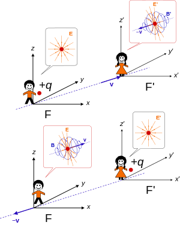

# Symmetry and Relativity <!-- omit in toc -->

- [Linear Algebra Returns](#linear-algebra-returns)
  - [Tensors](#tensors)
  - [WTF is contravariant and covariance.](#wtf-is-contravariant-and-covariance)
    - [The metric](#the-metric)
  - [Some rules for tensor algebra](#some-rules-for-tensor-algebra)
  - [Tensors in $\R^4$](#tensors-in-r4)
    - [Rank-2](#rank-2)
    - [Rank-1](#rank-1)
    - [Rank-0](#rank-0)
  - [The 4-Gradient](#the-4-gradient)
- [Newtonian to Relativistic Mechanics](#newtonian-to-relativistic-mechanics)
  - [Newtonian Relativity; the galilean transformation.](#newtonian-relativity-the-galilean-transformation)
  - [Einstein's Postulates](#einsteins-postulates)
  - [The Lorenz Transformation](#the-lorenz-transformation)
    - [Spacetime Diagrams](#spacetime-diagrams)
  - [I Am a 4-Vector and I'm Your Friend](#i-am-a-4-vector-and-im-your-friend)
    - [Lorenz and 4-Vectors](#lorenz-and-4-vectors)
    - [Proper Time and Proper length](#proper-time-and-proper-length)
    - [Invariants](#invariants)
    - [The interval](#the-interval)
      - [Timelike and Spacelike Vectors](#timelike-and-spacelike-vectors)
    - [Basic 4-Vectors](#basic-4-vectors)
      - [4-Displacement](#4-displacement)
      - [4-Velocity](#4-velocity)
      - [4-Acceleration](#4-acceleration)
      - [4-Momentum](#4-momentum)
      - [4-Force](#4-force)
      - [4-Wave-Vector (not so catchy)](#4-wave-vector-not-so-catchy)
  - [Using 4-Vectors](#using-4-vectors)
    - [Applying the 4-Wave-Vector](#applying-the-4-wave-vector)
      - [The Doppler Effect](#the-doppler-effect)
      - [Aberration and the Headlight Effect](#aberration-and-the-headlight-effect)
    - [Applying 4-Force](#applying-4-force)
      - [Motion Under a Pure Force](#motion-under-a-pure-force)
      - [Linear Motion](#linear-motion)
      - [Hyperbolic Motion](#hyperbolic-motion)
      - [Motion under constant force](#motion-under-constant-force)
      - [Circular Motion](#circular-motion)
    - [Applying 4-Momentum](#applying-4-momentum)
      - [Conservation of Energy and Momentum](#conservation-of-energy-and-momentum)
        - [Center of momentum frame](#center-of-momentum-frame)
      - [Particle Decay](#particle-decay)
        - [Decay at rest](#decay-at-rest)
      - [Absorption](#absorption)
        - [Annihilation](#annihilation)
      - [Compton Scattering](#compton-scattering)
- [Electromagnetism and Special Relativity](#electromagnetism-and-special-relativity)
  - [Transformation of EM fields](#transformation-of-em-fields)
    - [E fields](#e-fields)
    - [B Fields](#b-fields)
    - [Putting them together](#putting-them-together)
  - [Fields of a uniformly moving point charge](#fields-of-a-uniformly-moving-point-charge)
  - [Electromagnetic Potential as a 4-Vector](#electromagnetic-potential-as-a-4-vector)
    - [4-Current](#4-current)
    - [Putting it into practice.](#putting-it-into-practice)
      - [Retarded potentials](#retarded-potentials)
      - [Potential of An Arbitrarily Moving Point Charge.](#potential-of-an-arbitrarily-moving-point-charge)
      - [Field of An Arbitrarily Moving Point Charge (Accelerated Charge)](#field-of-an-arbitrarily-moving-point-charge-accelerated-charge)
        - [Radiated Power and Lamour's formula.](#radiated-power-and-lamours-formula)
        - [Dipole Oscillations](#dipole-oscillations)
        - [The Half Wave Electric Dipole Antenna](#the-half-wave-electric-dipole-antenna)
- [Lagrangians](#lagrangians)
  - [The Classical Lagrangian](#the-classical-lagrangian)
  - [Relativistic Lagrangian Density](#relativistic-lagrangian-density)
  - [Motion of a Charged Particle in an Electromagnetic Field](#motion-of-a-charged-particle-in-an-electromagnetic-field)

# Linear Algebra Returns

There's a lot of new and scary linear algebra used in relativity and I want to get that all nice and understood first.

## Tensors

Tensors seem horrible but actually can be described quite simply, they describe linear relationships between vectors, scalars, and other tensors. A tensor $A$ of valence $(p,q)$ is a multidimensional array:
$$
A_{j_1...j_q}^{i_1...i_p}\big[\underline{b}\big]
$$

The upper and lower indices refer to components of the tensor these are **contravariant** or **covariant** respectively. A tensor with only contravariant or covariant indices is contravariant or covariant itself, a tensor with both is mixed. The **valence** $(p,q)$ is the number of contravariant and covariant indices. A *rank-r* tensor requires r indices to label one component in the array $r=p+q$ A tensor is defined by being conserved under a particular transformation but we'll look at that in GR.

## WTF is contravariant and covariance.

Think back to the simpler times of dot products. Back then we did the good old fashioned
$$
\underline{A}\cdot \underline{B}
$$

for our dot product. That however was **WRONG** foolishly we assumed a flat vector space! Never again will I make such a mistake. We can define a brand new fancy mathematical concept to fix this. We can have contravariant vectors (or vectors) $\underline{A} = A^\mu\underline{e}_\mu$ and covariant vectors (or covectors) $\underline{B} = B_\nu\underline{e}^\nu$. These are defined by the basis and *dual basis* respectively.
>The fact that a dual basis is being used gives me a distinctly Bra-Ket sort of vibe. I don't think it's quite like that but it's similar enough sometimes.

### The metric

 An inner product now only works with a product of a contravariant and covariant vector like so $A^\mu B_\mu$ to turn a covector into a vector we need to define the geometry of the curve, let $g_{\mu\nu}=\underline{e}_\mu\underline{e}_\nu$ We call g **the metric**
$$
B^\mu = g^{\mu\nu}B_\nu\\
A_\nu = g_{\nu\mu}A^\mu\\
$$

Also remember that $\underline{e}_\mu\underline{e}_\nu = \delta_{\mu\nu}$ this leads to the useful statement $\underline{e}_\mu\underline{e}^\nu = \delta_\mu^\nu$ where $A^\mu = \delta^\mu_\nu A_\nu$. We can also find a similar relation for $g$

$$
g_{\mu\nu}g^{\nu\rho} = \delta^\rho_\mu
$$

With the metric we can define a scalar product of two vectors:

$$
\underline{A}\cdot\underline{B} = A^TgB = A^\mu g_{\mu\nu}B^\nu

$$

## Some rules for tensor algebra

+ Sums of equal valence are done entry by entry 
  + $A^{\mu\nu} + B^{\mu\nu} = C^{\mu\nu}$
+ Scalar multiples are also simple 
  + $\alpha A^{\mu\nu} = (\alpha A)^{\mu\nu}$
+ Products are done like this. For rank-1 tensors it will behave like a matrix product.
  + $A^{\mu\nu}B^\rho_\sigma = (AB)^{\mu\nu\rho}_\sigma =  C^{\mu\nu\rho}_\sigma$.
+ We can define a contraction with einstein summation convention. This results in the reduction of rank.
  + $A^{\mu\nu\rho}B_\rho = \sum_\rho A^{\mu\nu\rho}B_\rho = C^{\mu\nu}$
+ Differentiation operators can be defined to behave like you'd expect 
  + $\partial_\mu = \frac{\partial}{\partial {x^\mu}},\ 
\partial^\mu = \frac{\partial}{\partial {x_\mu}} = g^{\mu\nu}\partial_\nu$
  + With some identities:  
  + $\partial_\mu x^\nu = \delta^\nu_\mu$
  + $\partial_\mu x_\nu = g_{\mu\nu}$

## Tensors in $\R^4$

In relativity we're constantly concerned with 4 dimensional space. So we might as well look at that.

### Rank-2
In this module we only really need fully contravariant ($A^{\mu\nu}$) or fully covariant ($A_{\mu\nu}$) tensors. This looks like a matrix...
$$
A_{\mu\nu} =
\begin{pmatrix}
    A_{00}  &|& A_{01} & A_{02} & A_{03}\\ 
    \hline
    A_{10}  &|& A_{11} & A_{12} & A_{13}\\
    A_{20}  &|& A_{21} & A_{22} & A_{23}\\
    A_{30}  &|& A_{31} & A_{32} & A_{33}\\
\end{pmatrix}
$$

$A_{00}$ is the *time-time* component, $A_{i,j}$ are *space-space* components, $A_{0,i}$ and $A_{i, 0}$ are *time-space* and *spacetime* components respectively. These distinctions end up being pretty important.

When we transform $A$ it turns out to be a standard matrix transformation

$$
A^\prime = \Lambda^TA\Lambda \longleftrightarrow A^{\prime\rho\sigma} = \Lambda^\rho_\mu\Lambda^\sigma_\nu A^{\mu\nu}
$$

### Rank-1
Rank-1 tensors in $\R^4$ are called *four-vectors* and they're your friends. They can be represented as a row or column vector.
$$
A_\mu = (A_0, A_1, A_2, A_3)
$$
Here $A_0$ is the time component and $A_{1,2,3}$ are spatial components. We use i and j to refer only to spatial components, when we include a time component it's *time* (get it) to bring out the greek indices such as $\mu$ and $\nu$. 

Four vectors transform differently depending on if their vectors or covectors:
$$
\begin{aligned}
    \text{Contravariant: } {A^{\prime}}^\nu &= \Lambda^\nu_\mu A^\mu\\
    \text{Covariant: } {A^{\prime}}_\nu &= (\Lambda^{-1})_\nu^\mu A_\mu\\
\end{aligned}
$$
### Rank-0

These are our scalar products, they are beautiful invariants and we love them. We can create them with contractions such as:
$$
A^\mu_\mu \text{ or } A^{\mu\nu}A_{\mu\nu}
$$

## The 4-Gradient

I mentioned differentiation operators earlier, these are defined as 

$$
\partial_\beta = 
\begin{pmatrix}
    -\frac{1}{c}\frac{\partial}{\partial t}, &\frac{\partial}{\partial x}, & \frac{\partial}{\partial y}, & \frac{\partial}{\partial z} 
\end{pmatrix}\\
\partial = \partial^\alpha = g^{\alpha\beta}\partial_\beta = 
\begin{pmatrix}
    \frac{1}{c}\frac{\partial}{\partial t}, &-\frac{\partial}{\partial x}, & -\frac{\partial}{\partial y}, & -\frac{\partial}{\partial z} 
\end{pmatrix}
$$

We also have a d'Alembert operator which is like a 4-laplacian so people sometimes use $\Box^2$:

$$
\Box^2 = \partial\cdot\partial = \partial^\mu g_\mu\nu\partial^\nu = \partial_\nu\partial^\nu = \frac{1}{c^2}\frac{\partial^2}{\partial t^2} - \underline{\nabla}^2
$$

# Newtonian to Relativistic Mechanics

Relativity is confusing. God knows I know that. It might be nice to start with a bit of a revision of newtonian relativity (the galilean transformations) followed by defining some simple relativistic concepts as a groundwork.

## Newtonian Relativity; the galilean transformation.

Vectors classically would transform to a new reference frame pretty simply:
$$
\begin{bmatrix}
    t^\prime\\
    x^\prime\\
    y^\prime\\
    z^\prime\\
\end{bmatrix}

=
\begin{bmatrix}
    1  & 0 & 0 & 0\\
    -v & 1 & 0 & 0\\
    0  & 0 & 1 & 0\\
    0  & 0 & 0 & 1\\
\end{bmatrix}
\begin{bmatrix}
    t\\
    x\\
    y\\
    z\\
\end{bmatrix}
$$

Where the primed frame is moving a velocity v in the x direction relative to the unprimed frame. A nice way to put this is:

$$
\begin{bmatrix}
    t^\prime\\
    \underline{r}^\prime
\end{bmatrix}
= G
\begin{bmatrix}
    t\\
    \underline{r}
\end{bmatrix}
$$

Where G is the matrix above. We can also say 
$$

\begin{bmatrix}
    t\\
    \underline{r}
\end{bmatrix}
= G^{-1}
\begin{bmatrix}
    t^\prime\\
    \underline{r}^\prime
\end{bmatrix}
$$

The take away is that these sorts of transformations aren't new to special relativity.

## Einstein's Postulates

1. **"Principle of relativity":**
   + The laws of physics take the same mathematical form in all reference frames.
2. **"Light speed postulate"**
   + Version A: There is a finite maximum speed for signals
   + Version B: There is an inertial reference frame where the speed of light in a vacuum is independent of the motion of it's source.

> Einstein made a couple of other assumptions, one is called postulate 0 in which he assumes Euclidean geometry which falls apart for General Relativity and the other (Steane calls it postulate 3) is conservation of momentum which is required for the famous $E=mc^2$

Clearly to preserve these postulates the galilean transformation doesn't work (such as with the speed of light produced from a torch moving at close to $c$). So Einstein needed some new transformation.

## The Lorenz Transformation

Enter our hero Lorenz who came up with a wonderful transformation to solve everything:

$$
\begin{aligned}
t^\prime &= \gamma(t-vx/c^2)\\
x^\prime &= \gamma(x -vt)\\
y^\prime &= y\\
z^\prime &= z
\end{aligned}
$$

> Here we're in standard configuration so $S^\prime$ is moving a speed $v$ in the $x$ axis relative to $S$

Gamma is the **Lorenz factor** defined below:

$$
\gamma = \frac{1}{\sqrt{1-\beta^2}}\\
\beta = v/c
$$

Using the lorenz transformation we can produce a relativistic transformation of velocity, Steane does this by stating $x=u_xt$, $y=u_yt$, $z=u_zt$, $x^\prime=u_x^\prime t^\prime$ and so on. It's quite easy although I like writing the lorenz transformations in terms of differentials and then finding a fraction like below:

$$
\begin{aligned}
    dt^\prime &= \gamma(dt-vdx/c^2)\\
    dx^\prime &= \gamma(dx -vdt)\\
    dy^\prime &= dy\\
    dz^\prime &= dz\\
    \implies \frac{dx^\prime}{dt^\prime} &= \frac{\gamma(dx -vdt)}{\gamma(dt-vdx/c^2)} = \frac{\frac{dx}{dt} - v}{1 - \frac{v\frac{dx}{dt}}{c^2}} = \frac{u_x - v}{1 - \frac{vu_x}{c^2}}\\
    \&\ \frac{dy^\prime}{dt^\prime} &= \frac{u_y}{\gamma(1 - \frac{vu_x}{c^2})}\\
    \&\ \frac{dz^\prime}{dt^\prime} &= \frac{u_z}{\gamma(1 - \frac{vu_x}{c^2})}
\end{aligned}
$$

A nicer vector form of this is:

$$
\underline{u}^\prime_{||} = \frac{\underline{u}_{||} - \underline{v}}{1 - \underline{u}\cdot\underline{v}/c^2}\ \ \underline{u}^\prime_\perp = \frac{\underline{u}_\perp}{\gamma_v(1-\underline{u}\cdot\underline{v}/c^2)}
$$

This velocity addition has the useful (somewhat designed) property of keeping our universal speed limit set.

### Spacetime Diagrams

Spacetime diagrams are useful for visualising a situation for a spacetime diagram there are a few useful rules to use:
+ Lines of simultaneity are parallel to the x-axis, their intersection with t define their position in time.
+ Lines of locality (I'm not sure what they're actually called but I think that works) are parallel with the t-axis.
+ A worldline is the trajectory of a physical body each segment is causally connected with the previous segment.
+ A lorenz "boost" pushes the x and t axes closer to the null line. Time like and space like vectors will always be that way. 

## I Am a 4-Vector and I'm Your Friend

Do you remember the Rank-1 tensors in $\R^4$ from [above](#rank-1) these are very useful in relativity, for example let's make a 4-Vector for displacement in spacetime. We'll use Steane's invariants to define a 4-Vector later but for now X is definitely one.

$$
X\equiv
\begin{pmatrix}
    ct\\
    x\\
    y\\
    z
\end{pmatrix}
$$

> Note we use ct to give us consistent dimensions.

### Lorenz and 4-Vectors
This definition gives us the nice relation:

$$
X^\prime = \Lambda X
$$

where

$$
\begin{aligned}
\Lambda&\equiv 
\begin{bmatrix}
    \gamma & -\gamma\beta  & 0 & 0\\
    -\gamma\beta & \gamma & 0 & 0\\
    0            & 0      & 1 & 0\\ 
    0            & 0      & 0 & 1\\ 
\end{bmatrix}\\
\text{also }
\Lambda^{-1}&\equiv 
\begin{bmatrix}
    \gamma & \gamma\beta  & 0 & 0\\
    \gamma\beta & \gamma & 0 & 0\\
    0            & 0      & 1 & 0\\ 
    0            & 0      & 0 & 1\\ 
\end{bmatrix}
\end{aligned}
$$

This lorenz transformation matrix can also be written in terms of *rapidity* $\rho$ defined by:
$$
\tanh{(\rho)} = \beta
$$

So

$$
\Lambda=
\begin{bmatrix}
    \cosh\rho & -\sinh\rho  & 0 & 0\\
    -\sinh\rho & \cosh\rho & 0 & 0\\
    0            & 0      & 1 & 0\\ 
    0            & 0      & 0 & 1\\ 
\end{bmatrix}
$$

Which looks like a rotation! This actually makes a lot of things simpler although I (and therefore you) don't fully get it. Steane's example is repeated transformations:

$$
\text{if: } V^{\prime\prime} = \Lambda_v\Lambda_uV = \Lambda_wV\\
\text{Then some simple hyperbolic identities show that:}\\
\rho_w = \rho_v + \rho_u\\
\text{for motion in a single direction}
$$

This is analogous to summed rotations. This can then be used to get velocity addition from the identity for $\tanh$ if we remember that $\tanh\rho = v/c$:

$$
\begin{aligned}
\tanh(\rho_u + \rho_v) &= \frac{\tanh(\rho_u) + \tanh(\rho_v)}{1 + \tanh(\rho_u)\tanh(\rho_v)}\\
\implies w &= \frac{u+v}{1 + uv/c^2}
\end{aligned}
$$

Which is kind of  cool.

### Proper Time and Proper length

It's useful when coordinates can be transformed depending on your rest frame to define some proper intervals. By that I mean when length and time can contract and dilate we need to know what we're talking about when we say 2m away or 10 minutes ago. Here Proper Time and Proper Length are useful they are defined in the rest frame of the object. Thus the proper length of a spaceship is the length of the spaceship in it's own rest frame. Similarly the half-life of a muon is defined in that muons rest frame, it's proper time. A nice mathematical way to state this is:

$$
\frac{dt}{d\tau} = \gamma
$$

Where $\tau$ is proper time. If $\gamma=1$ then $dt=d\tau$ as we'd expect.
### Invariants

The definition of 4-Vectors as Rank-1 tensors means that their scalar product is invariant. Although we need to remember that **the scalar product for tensors in this space is the product of a vector and covector**. Remember we can write this in terms of the metric:

$$
X^2 = X^TgX
$$

g in special relativity is given as:

$$
g=
\begin{bmatrix}
    -1 & 0 & 0 & 0\\
    0  & 1 & 0 & 0\\    
    0  & 0 & 1 & 0\\
    0  & 0 & 0 & 1\\
\end{bmatrix}
$$

g has the important property that:

$$
\Lambda^Tg\Lambda = g
$$

Which means any quantity $A$ which transforms like $X$ will have a constant scalar quantity $A^TgA$ under lorenz transformation. This is called a **lorenz invariant** and 4-Vectors are defined as 
> 4-Vector = A set of four scalar quantities which transform like X under a change of reference frame.

So a 4-Vector always has a lorenz invariant! Lorenz invariants are very useful and they make me happy.

### The interval

The lorenz invariant for the four-displacement X is called the interval s:
$$
s = -c^2t^2 + x^2 + y^2 + z^2
$$

We can define proper time using the interval:

$$
\tau = \frac{\sqrt{-s^2}}{c}
$$

#### Timelike and Spacelike Vectors

Depending on the sign of an invariant we can split it into 3 types.

1. Timelike $A^2 < 0$ a timelike difference between 4-displacements means the two events are causally linked meaning it is physically possible to move from one to the other. 
2. Spacelike $A^2 > 0$ a spacelike vector connects two events that can never be causally connected.
3. Null $A^2 = 0$ Null vectors separate timelike and spacelike vectors. A null like displacement is a displacement that can only be crossed at the speed of light.

### Basic 4-Vectors

#### 4-Displacement

We've already defined this as 
$$
X = (ct, \underline{x})\\
\implies X^2 = s^2 = -c^2t^2 + \underline{x}\cdot\underline{x} = -c^2\tau^2
$$
$X^2=-c^2\tau^2$ is clear from calculating the interval in the rest frame of the object.

#### 4-Velocity

We define 4-Velocity as:

$$
U = \frac{dX}{d\tau} = \gamma(c, \underline{u})\\
\implies U^2 = -c^2
$$
Which isn't a massively useful invariant, luckily the invariant inner product of two 4-Velocities is pretty useful:
$$
U\cdot V = \gamma_u\gamma_v(-c^2 + \underline{u}\cdot\underline{v})
$$

Which evaluated at the rest frame of a body (where $U = (c, \bold0)$) gives us $-\gamma_wc^2$. This means we can equate these to find the gamma factor of a body in the lab frame $\gamma_w$ using the gamma factor of the body $\gamma_u$ in a frame which has a gamma factor of its own relative to the lab frame $\gamma_v$
$$
\gamma_w = \gamma_u\gamma_v\bigg(1 - \frac{\underline{u}\cdot\underline{v}}{c^2}\bigg)
$$

If we want to get velocity addition we can apply lorenz transformations and then use the above to combine gamma factors.

#### 4-Acceleration

Similarly acceleration is:

$$
\begin{aligned}
A &= \frac{dU}{d\tau} = \gamma\frac{dU}{dt}\\
&= \gamma(\dot{\gamma}c, \dot{\gamma}\underline{u} + \gamma\underline{a})
\end{aligned}
$$

By looking at the rest frame using the definition in proper time we can evaluate the invariant

$$
A = \bigg(\frac{dc}{d\tau}, \frac{d\underline{u}}{d\tau}\bigg) = (0, \underline{a}_0)\\
\ \\
\implies A^2 = a_0^2
$$

Here $a_0$ is proper acceleration. It's interesting to note that 4-Acceleration is always perpendicular to 4-Velocity which makes sense as the length of a 4-Vector (and so the length of 4-Velocity) is conserved.

#### 4-Momentum
$$
P = mU = (\gamma mc, \gamma m\underline{u}) = (E/c, \underline{p})\\
P^2 = -(E/c)^2 + \underline{p}\cdot\underline{p} = -m_0c^2
$$

> Note $\underline{p}$ here is $\gamma m\underline{u}$ not $m\underline{u}$ so it is **not** classical 3-momentum

Where $m_0$ is the rest mass. 4-Momentum is very useful for collision questions. 

#### 4-Force
$$
F = \frac{dP}{d\tau} = \bigg(\frac{1}{c}\frac{dE}{d\tau}, \frac{d\underline{p}}{d\tau}\bigg) = \bigg(\frac{\gamma}{c}\frac{dE}{dt}, \gamma\underline{f}\bigg)
$$

The 4-Force has a useful invariant with 4-Velocity:

$$
U\cdot F = \gamma^2 (-\frac{dE}{dt} + \underline{u}\cdot\underline{f})
$$
In the rest frame:
$$
U\cdot F = c^2 \frac{dm_0}{d\tau}
$$

So *when $U\cdot F = 0$ rest mass is conserved*. A force which does not change rest mass is a **pure force**.

The transformation of a force is a bit messy (because of the two gamma factors) luckily we can use the equation we found with [4-Velocity](#4-Velocity) to solve our problem. Doing so gives:

$$
f^\prime_{\parallel} = \frac{f_\parallel - \frac{\underline{v}}{c^2}\frac{dE}{dt}}{1-\underline{u}\cdot\underline{v}/c^2}\\
\underline{f}^\prime_\perp = \frac{f_\perp}{\gamma_v(1-\underline{u}\cdot\underline{v}/c^2)}
$$

Note that

+ $\underline{f}$ is not invariant
+ $\underline{f}$ may be independent of $\underline{v}$ in one frame but can be dependent in another.

#### 4-Wave-Vector (not so catchy)
This is a 4-Vector analogous to $\underline{k}$ the classical wave 3-vector:

$$
K = (\omega/c, \underline{k})
$$

Remember that $\omega = 2\pi f$ and $\underline{k}$ is a vector parallel to wave motion with magnitude $k = 2\pi/\lambda$. The wave vector is useful for any quantity which varies through spacetime like so:

$$
a = a_0\cos(\underline{k}\cdot\underline{r} - \omega t)
$$

As this can be defined in terms of the invariant inner product:

$$
a = a_0\cos(K\cdot X)
$$

Clearly these are equivalent.

## Using 4-Vectors

Now that we have our 4-Vectors it's time to take them for a spin through some simple relativistic kinematics.
### Applying the 4-Wave-Vector

#### The Doppler Effect

The doppler effect is a classic problem in physics let's look at it relativistically. Lets think of a source in the $S^\prime$ frame which emits light at an angle $\theta_0$ to the $x^\prime$ axis. This means $K=(\omega_0/c, k_0\cos\theta_0, k_0\sin\theta_0, 0)$

Applying the inverse lorenz we find:

$$
\begin{pmatrix}
    \omega/c\\
    k\cos\theta\\
    k\sin\theta\\
    0
\end{pmatrix} =
\begin{pmatrix}
    \gamma(\omega_0/c + \beta k_0\cos\theta_0)\\
    \gamma(\beta\omega_0/c + k_0\cos\theta_0)\\
    k_0\sin\theta_0\\
    0
\end{pmatrix}
$$

Extracting the first line and using $\omega_0/k_0 = c$ (this substitution assumes light but not using it leaves us a valid doppler effect for any wave) we have:
$$
\omega = \gamma(1+\beta\cos\theta_0)\omega
$$

$\theta_0 = 0$ gives us longitudinal doppler:

$$
\frac{\omega}{\omega_0} = \gamma(1 + v/c) = \bigg(\frac{1+v/c}{1-v/c}\bigg)^{1/2}
$$

$\theta = \pi/2$ gives the transverse doppler effect (this is perpendicular *in the reference frame of the receiver* i.e $\theta_0$ is not necessarily $\pi/2$). For the transverse doppler:
$$
\frac{\omega}{\omega_0} = \frac{1}{\gamma}
$$

Which is basically time dilation.

Sometimes we want the doppler effect in terms of the angle in the lab frame we can get this with the invariant $K\cdot U$ where U is the velocity of the source, equating the rest frame with the lab frame and then solving for the doppler shift:

$$
-\omega_0 = -\gamma\omega\bigg(1 - \frac{kv}{\omega}\cos\theta\bigg)\\
\implies \frac{\omega}{\omega_0} = \frac{1}{\gamma(1 - (v/v_p)cos\theta)}
$$

Where $v_p=\frac{w}{k}=phase\ velocity$

#### Aberration and the Headlight Effect

In the previous section we used the relationship between the transformed timelike components of the 4-Wave-Vector, but if we look at the Y component of the 3-wave-vector we can see
$$
k\sin\theta = k_0\sin\theta_0
$$

which implies that

$$
\omega\sin\theta = \omega_0\sin\theta_0
$$

This suggests that as the wave is doppler shifted the angle changes as well, this effect is called aberration. By taking the ratio of the t and x components we can find:

$$
\cos\theta = \frac{\cos\theta_0 + v/c}{1 + (v/c)\cos\theta_0}\\
\text{(Considering the simpler case of light)}
$$

This has an effect of bending a light towards the axis of motion which is called the headlight effect.

### Applying 4-Force

#### Motion Under a Pure Force

After [defining the 4-Force](#4-Force) we defined a "pure force" as a force which conserves rest mass. Remember:

$$
\begin{aligned}
\underline{f} &= \frac{d\underline{p}}{dt} = \frac{d}{dt}(\gamma_um\underline{u})\\
&= \gamma_um\underline{a} + m\frac{d\gamma_u}{dt}\underline{u}\\
&= \gamma_um\underline{a} + m(\frac{1}{mc^2}\underline{f}\cdot\underline{u})\underline{u}\\
&= \gamma_um\underline{a} + \frac{1}{c^2}(\underline{f}\cdot\underline{u})\underline{u}
\end{aligned}
$$

The first term is pretty standard but the second is weird, it leads to the change in velocity not being necessarily in the direction of $\underline{u}$! We can then resolve into components parallel and perpendicular to $\underline{u}$

$$
f_\parallel = \gamma ma_\parallel + \frac{1}{c^2}f_\parallel u^2 = \gamma^3ma_\parallel\\
\underline{f}_\perp = \underline{f} - f_\parallel\underline{\hat{u}} = \gamma m\underline{a}_\perp
$$

#### Linear Motion

Steane has a nice bit on linear motion. Basically for a particle undergoing linear motion it's useful to consider rapidity because that has a simple relationship as you move from one frame to the next.

Think of a particle accelerating along a line. In it's instantaneous rest frame (A) it has velocity $0$ in the next instant it has velocity $dv = a_0d\tau$. Remember rapidity is $\rho=\tanh^{-1}(v/c)$ So rapidity in this instantaneous rest is:
$$
d\rho_0 = \tanh^{-1}\bigg(\frac{a_0d\tau}{c}\bigg) \approx \frac{a_0d\tau}{c}\\
\implies \frac{d\rho_0}{d\tau} = \frac{a_0}{c}
$$

Now we can consider some other frame S in s rapidity is $\rho = \rho_A + \rho_0$ where $\rho_A$ is rapidity of A in S, as A is only an *instantaneous* rest frame it is fixed in S so $\frac{d\rho_A}{d\tau}=0$ this means:

$$
\frac{d\rho}{d\tau} = \frac{d\rho_0}{d\tau} + \frac{d\rho_0}{d\tau} = \frac{a_0}{c}
$$

So for linear motion rate of change of rapidity with respect to proper time is the proper acceleration divided by c in all frames.

#### Hyperbolic Motion
This is sometimes known as the "relativistic rocket" it refers to constant acceleration in the objects rest frame $\frac{da_0}{d\tau}=0\implies v=a_0t$. If the rocket starts from rest in the lab frame we have:

$$
\begin{aligned}
    \beta\gamma = \sinh\rho &= \frac{a_0t}{c} \\
    \implies \beta &= \frac{a_0t/c}{\sqrt{1+(a_0t/c)^2}}\\
    \implies u(t) &= \frac{a_0t}{\sqrt{1+(a_0t/c)^2}}
\end{aligned}
$$

A nice little check is noticing that as $t\rightarrow\infty$ we have $u\rightarrow c$ which keeps the good old universal speed limit. 

Now we can use rapidity to calculate distance travelled:
$$
\begin{aligned}
    \dot{x} &= \beta c = c\tanh\rho\\
    dx &= c\tanh(\rho) dt\\
    \text{but } \sinh\rho = a_0t/c \implies dt &= \frac{c}{a_0}\cosh(\rho)d\rho\\
    \text{so } dx &= \frac{c^2}{a_0}\sinh(\rho)d\rho\\
    \implies (x-b)^2 - ct^2 &= \bigg(\frac{c}{a_0}\bigg)^2 \text{ where be is a boundary of integration}
\end{aligned}
$$

This is a hyperbolic curve and is where hyperbolic motion gets its name.

#### Motion under constant force

This means that $\underline{p}= \underline{p}_0 + \underline{f}t$ if we take $\underline{p}_0=0$ then we have:

$$
\begin{aligned}
p = \gamma mu \implies ft &= \frac{mu}{\sqrt{1-u^2/c^2}}\\
u(t) = \frac{ft}{\sqrt{m^2 + f^2t^2/c^2}}
\end{aligned}
$$

Which preserves $t\rightarrow\infty \implies u\rightarrow c$ and other things from hyperbolic motion.

#### Circular Motion

As we saw in pure force above a force perpendicular to velocity is defined as:

$$
\underline{f} = \gamma m \underline{a}
$$

> The lecture notes go into more detail for ths with a magnetic field example but it seems like simple circular motion stuff tbh so I won't bother copying it out.

### Applying 4-Momentum
When it comes to momentum there is a very simple rule, **isolate and square** below we will see some conservation of momentum equations like
$$
 P = P_1 + P_2
$$
The simple method is to isolate the thing whose final momentum you don't care about and square both sides. This means the thing you dont care about can be evaluated in the rest frame and the important stuff is all that's left. A good example of this is in [Particle Decay](#particle-decay)

#### Conservation of Energy and Momentum
We no longer have the three momentum as a conserved quantity. Which can be shown using the spacetime diagram below which shows the worldlines of two particles mutually repelling each other:

In frame $S$ momentum is clearly conserved as L and R have equal and opposite velocities. However in frame $S^\prime$ lines of simultaneity shift with a lorenz boost and 3-momentum is no longer conserved (at $t^\prime_1$ velocities are close to opposite whereas at $t^\prime_2$ magnitudes are quite different)

Luckily we have a new conserved quantity to make up for the loss of 3-momentum, 4-Momentum! The quantities $\gamma m\underline{u}$ and $\gamma mc$ are conserved so total $P$ of a system is conserved in all components.
##### Center of momentum frame

The center of momentum frame is the frame where 3-momentum is 0 so $P = (m_0c, \underline{0})$ it is analogous to the rest frame of the system.

#### Particle Decay

Consider a single particle which decays into two other particles such that:
$$
\begin{aligned}
P &= P_1 + P_2\\
\implies P_2 &= P - P_1\\
P_2^2 &= (P - P_1)\cdot(P-P_1) = P^2 + P_1^2 - 2P\cdot P_1\\
\implies P\cdot P_1 &= \frac{1}{2}(P^2 + P_1^2 - P_2    ^2)\\
P\cdot P_1 &= -\frac{1}{2}(M^2c^2 + m_1^2c^2 - m_2^2c^2)
\end{aligned}
$$

The final step involves evaluating the invariants in the rest frame of the particle but because it involves invariants it is true in any frame. Notice we were able to ignore the final momentum of $P_2$ by using the isolate and square method.

##### Decay at rest

At rest we the initial particle has 4-momentum $P=(Mc, \underline(0))$ so $P\cdot P_1 = ME_1$ which means the general case above becomes:

$$
E_1 = \frac{m_2^2 - m_1^2 - M^2}{2M}c^2
$$

Using the invariant for $P_1$ we can find $\underline{p}$, the decay at rest treatment can be applied to any situation of one particle and then the values in the lab frame can be found with a lorenz boost.

#### Absorption

Absorption is basically decay in reverse! Our 4-momentum conservation equation is this:

$$
P_i + P = P_f
$$

Where a particle of momentum $P_i$ hits a target of momentum $P$. To solve a problem we need to use an isolate and square method like in decay.
$$
\begin{aligned} 
(P_i + P)^2 = P_f^2 &= -M_f^2c^2\\
P_i^2 + P^2 + 2P_i\cdot P &= -M_f^2c^2\\
-m_i^2c^2 - M^2c^2 - 2(E_iM - \underline{p}_i\cdot\underline{p}) &= -M_f^2c^2\\
\implies E_i &= \frac{M_f^2c^2 - M^2c^2 - m_i^2c^2}{2M}
\end{aligned}
$$

Which looks similar to decay as we'd expect.

##### Annihilation

Annihilation is a particle and an antiparticle colliding to form a photon. It's a special case of absorption really with a conservation of momentum equation like this:

$$
P_e + P_{\bar{e}} = P_\gamma
$$

#### Compton Scattering

In an effort to be more general we might as well initially look at compton scattering as a $2 \rightarrow 2$ process such that:

$$
P^\prime_1 + P^\prime_2 = P_1 + P_2
$$

If we isolate and square we can ignore the final momentum of the second particle.

$$
\begin{aligned}
    P^\prime_2 &= P_1 + P_2 - P^\prime_1\\
    (P^\prime_2)^2 &= (P_1 + P_2 - P^\prime_1)^2\\
    -m_2^2c^4 &= -m_1^2c^4 - m_2c^4 - m_1c^4 + 2P_1\cdot P_2 - 2P_1\cdot P^\prime_1 - 2P_2\cdot P^\prime_1
\end{aligned}
$$

If we choose the lab frame where $P_2$ is stationary we can start to work out some invariants:

$$
\begin{aligned}
    2P_1\cdot P_2 &= 2E_1m_2\\
    2P_2\cdot P^\prime_1 &= 2E_1^\prime m_2\\
    2P_1\cdot P^\prime_1 &= 2(\underline{p}_1\cdot\underline{p}_1^\prime - E_1E_1^\prime/c^2)\\
    &=2(p_1p^\prime_1\cos\theta - E_1E_1^\prime/c^2)\\
    \implies 0 &= m_1^2c^6 + (E_1-E_1^\prime)m_2^2c^2 + (c^2p_1p^\prime_1\cos\theta - E_1E_1^\prime)
\end{aligned}
$$
In the final equation we substitute the invariants in and multiply through by $c^2/2$. Finally lets look at some actual compton scattering, in this case the incoming particle (1) is a photon and the target (2) is an electron. This means:

$$
\begin{aligned}
    m_1c^2 &= 0\\
    m_2c^2 &= m_ec^2\\
    E_1 &= hc/\lambda\\
    E_2 &= hc/\lambda^\prime\\
    \implies0 &= (E_1 - E^\prime_1)m_ec^2 - E_1E^\prime_1(1-\cos\theta)\\
    \frac{E_1-E_1^\prime}{E_1E_1^\prime} &= \frac{1-\cos\theta}{m_ec^2}\\
    \implies \lambda^\prime - \lambda &= \frac{h}{m_ec}(1-\cos\theta)
\end{aligned}
$$
The final line is the usual formula for compton scattering.

# Electromagnetism and Special Relativity

## Transformation of EM fields

Given we know how forces transform it may be best to think of EM fields in terms of the force first
$$
\underline{f} = q(\underline{E} + \underline{v} \times \underline{B})
$$
### E fields

Let's start with Electric fields we have $\underline{f} = q\underline{E}$ in a fame $S$ with no B-field. If we use our transformations for force we get:

$$
\underline{f}_\parallel^\prime = \frac{q(\underline{E}_\parallel - \underline{v}(\underline{E}\cdot\underline{u})/c^2)}{1-\underline{u}\cdot\underline{v}/c^2}\\
\ \\
\underline{f}_\perp^\prime = \frac{qE_\perp}{\gamma(1-\underline{u}\cdot\underline{v}/c^2)}
$$

If we choose $\underline{u}=\underline{v}$ we get $S^\prime$ as the rest frame of the particle, this means the force is due only to the E field and we get the equations...
$$
\begin{aligned}
\underline{f}^\prime_\parallel &= q\underline{E}_\parallel,&\underline{f}^\prime_\perp &= \gamma q\underline{E}_\perp\\
\implies \underline{E}^\prime_\parallel &= \underline{E}_\parallel,&\underline{E}^\prime_\perp &= \gamma\underline{E}_\perp
\end{aligned}
$$

Using this result we can find the magnetic field in the $S^\prime$ frame when it isn't the rest frame
$$
\underline{f}^\prime_\perp = q\underline{E}^\prime_\perp\gamma(1+\underline{u}^\prime\cdot\underline{v}/c^2) = q(\underline{E}^\prime + \underline{u}^\prime\times\underline{B}^\prime)\\
\ \\
\implies \underline{u}^\prime \times \underline{B}^\prime = \underline{E}_\perp \gamma u^\prime v/c^2\\
\ \\
\implies \underline{B}^\prime_\perp = \gamma\frac{-\underline{v}\times\underline{E}}{c^2} 
$$

This gives us an expression for the B field arising from E fields after a transformation.

### B Fields

Now let's start again assuming the initial field is purely magnetic.

$$
\underline{f} = q\underline{u} \times\underline{B}
$$

For convenience lets say $\underline{u}$ is parallel to $\underline{v}$ this gives us $\underline{f}^\prime_\parallel = \underline{f}_\parallel = 0$ and

$$
\underline{f}^\prime_\perp = \frac{q\underline{u}\times\underline{B}}{\gamma(1-uv/c^2)}
$$

If $\underline{u}=\underline{v}$ we can find the electric field
$$
\underline{E}^\prime = \gamma \underline{v}\times\underline{B}
$$

Then we can apply this to the more general case to get

$$
q(\gamma \underline{v}\times\underline{B} + \underline{u}^\prime \times \underline{B}^\prime) = \frac{q\underline{u}\times\underline{B}}{\gamma(1-uv/c^2)}\\
\ \\
\implies \underline{B}^\prime_\perp = \gamma\underline{B}_\perp
$$

By choosing a different initial direction we can also learn about $\underline{B}_\parallel$ and find it isn't transformed.

### Putting them together

Putting all this together we get:

$$
\boxed{
\begin{aligned}
\underline{E}^\prime_\parallel &= \underline{E}_\parallel\\
\underline{E}^\prime_\perp &= \gamma(\underline{E}_\perp + \underline{v}\times\underline{B})\\
\underline{B}^\prime_\parallel &= \underline{B}_\parallel\\
\underline{B}^\prime_\perp &= \gamma(\underline{B}_\perp - \underline{v}\times\underline{E}/c^2)
\end{aligned}
}
$$

## Fields of a uniformly moving point charge

If we place a stationary charge in frame $S^\prime$ we get

$$
\begin{aligned}
    &\underline{E}^\prime = \frac{Q}{4\pi\epsilon_0r^{\prime3}}
\begin{pmatrix}
    x^\prime\\
    y^\prime\\
    z^\prime
\end{pmatrix},
&\underline{B}^\prime = 0
\end{aligned}
$$

Using our transformations from before in standard configuration we get

$$
\underline{E}_x = \underline{E}_x^\prime = \frac{Q}{4\pi\epsilon_0}\frac{x^\prime}{r^{\prime3}} \\
\underline{E}_y = \gamma\underline{E}_y^\prime = \frac{\gamma Q}{4\pi\epsilon_0}\frac{y^\prime}{r^{\prime3}} \\
\underline{E}_z = \gamma\underline{E}_z^\prime = \frac{\gamma Q}{4\pi\epsilon_0}\frac{z^\prime}{r^{\prime3}} 
$$

We only now need to apply the lorenz transformations on the coordinates $x^\prime, y^\prime,$ and $z^\prime$ to be fully in the $S$ frame. This gives,

$$
\underline{E} = \frac{\gamma Q\underline{r}}{4\pi\epsilon_0(\gamma^2x^2 + y^2 + z^2)^{3/2}}
$$

Applying transformations also to $\underline{B}$ we get
$$
\underline{B} = \frac{\underline{v}\times\underline{E}}{c^2}
$$

## Electromagnetic Potential as a 4-Vector

The electric and magnetic fields the scalar and vector potentials that result in

$$
\underline{E} = -\nabla\phi - \frac{\partial \underline{A}}{\partial t}\\
\underline{B} = \nabla \times \underline{A}
$$

These have gauge invariance such that a gauge transformation

$$
\phi \rightarrow \phi - \frac{\partial\chi}{\partial t}\\
\underline{A} \rightarrow \underline{A} + \nabla\chi
$$

preserves maxwells laws. Since we have a vector and a scalar it might be worth trying to make a 4-Vector, we define the 4-Potential as:

$$
A \equiv (\phi/c, \underline{A})
$$

This means gauge transformation can be written as 
$$
A \rightarrow A + \Box\chi
$$

Which looks promising even though we haven't even proved this is a valid 4-Vector yet. If we plug this into maxwells equations we get:

$$
-\nabla^2\phi - \frac{\partial}{\partial t}\nabla\cdot\underline{A} = \frac{\rho}{\epsilon_0}\\
c^2\nabla(\nabla\cdot\underline{A}) + \frac{\partial}{\partial t}\nabla \phi + \frac{\partial^2\underline{A}}{\partial t^2} - c^2\nabla^2\underline{A} = \frac{\underline{j}}{\epsilon_0}
$$

These are a hot mess. However the last two terms of the latter look like $c^2\Box^2\underline{A}$ which is a nice look. If we can get the first two to cancel out things will be nice. The first two terms can be written as

$$
\nabla\bigg(c^2\nabla\cdot\underline{A} + \frac{\partial\phi}{\partial t}\bigg)
$$

So we need to choose a gauge where
$$
c^2\nabla\cdot\underline{A} + \frac{\partial\phi}{\partial t} = 0
$$

> This is a gauge transformation where if $c^2\nabla\cdot\underline{A} + \frac{\partial\phi}{\partial t}=f(\underline{r}, t)$ initially then $\frac{1}{c^2}\frac{\partial^2\chi}{\partial t^2}-\nabla^2\chi = f(\underline{r},t)$ gives us the result we want.

This leads to the pretty equations

$$
\Box^2\underline{A} = -\frac{\underline{j}}{c^2\epsilon_0}\\
\Box^2\phi = -\frac{\rho}{\epsilon_0}
$$

### 4-Current

If we define a new 4-Vector we can write all of maxwell's equations neatly. This vector is the 4-Current and looks like this

$$
J = (\rho c, \underline{j})
$$

This gives us maxwells equations simply as
$$
\begin{aligned}
&\Box^2A = \frac{-1}{c^2\epsilon_0}J &= -\mu_0J\\
&\text{with}&\Box\cdot A = 0
\end{aligned}
$$

### Putting it into practice.

#### Retarded potentials

Now we have the complicated equation:

$$
\Box^2A = -\mu_0J\\
\bigg(-\frac{1}{c^2}\frac{\partial^2}{\partial t^2} + \nabla^2\bigg)A^\nu = -\mu_0 J^\nu
$$

Which is clearly a wave equation and takes a bit of work to solve. There's an awful lot of work done with fourier transforms and complex analysis that I don't like the look of but we don't need to know basically we end up with this.

$$
A(t,\bold{r}) = \frac{1}{4\pi\epsilon_0 c^2}\int\frac{J(t-r_{sf}/c,\bold{r}_s)}{r_{sf}}d\bold{r}_s\\
r_{sf} = |\bold{r}-\bold{r_s}|
$$

Where the integral is over the source points $\bold{r}_s$ notice that the time component of $J$ is offset by the distance divided  by $c$. Basically this is because fields take time to propagate (in fact they do it at the speed of light) and that's what retarded potentials are.

#### Potential of An Arbitrarily Moving Point Charge.

Let's try and use this on an arbitrary point charge! It's easy to see the potential in it's own instantaneous rest frame would be...

$$
A_0 = \bigg(\frac{q}{4\pi\epsilon_0c}\frac{1}{r_{sf}}, \bold{0}\bigg)
$$

If we try out some scalar products it turns out we can write $r_{sf}$ like this in the rest frame...
$$
r_{sf} = -\frac{\bold{X}_{sf}\cdot \bold{U}_s}{c}
$$
It turns out that generally we can write A as...
$$
A = \frac{q}{4\pi\epsilon_0}\frac{\bold{U}_s/c}{-\bold{X}_{sf}\cdot \bold{U}_s}
$$

> I don't think a more detailed derivation is on syllabus

#### Field of An Arbitrarily Moving Point Charge (Accelerated Charge)

> The derivation of this isn't on syllabus only a 'qualitative understanding'

We start from knowing the arbitrary potential $A$ (see above) then we need to use the tensor...

$$
\mathbb{F}^{\mu\nu} = \partial^\mu A^\nu - \partial^\nu A^\mu
$$

This takes a long time to figure out but we get...

$$
\mathbb{F}^{\mu\nu} = \frac{qc}{4\pi\epsilon_0}\frac{R^\mu\tilde{U}^\nu - R^\nu\tilde{U}^\mu}{(R\cdot U)^3}\\
\text{where}\\
\begin{aligned}
    
\tilde{U}^\nu &= U^\nu - \frac{1}{c^2}(sa^\nu - U^\nu(\bold{R}\cdot\bold{a}))\\
R &= (r, \bold{r})\\
U &= \gamma(c, \bold{u})\\
s &= g_{\mu\nu}R^\mu U^\nu = -c\gamma(r - \frac{\bold{r}\cdot\bold{u}}{c})\\
a &= \gamma(\dot{\gamma}c,\dot{\gamma}\bold{u} + \gamma\bold{a})\text{ (4-Acceleration)}
\end{aligned}
$$

Putting this all together you get the field of an accelerated charge...

$$
\begin{aligned}
  \bold{E} &= \frac{q}{4\pi\epsilon_0\kappa^2}\bigg(\frac{\bold{n} - \bold{v}r/c}{\gamma^2r^2}+ \frac{\bold{n}\times[(\bold{n} - \bold{v}/c)\times\bold{a}]}{c^2r}\bigg)\\
  \bold{B} &= \bold{n} \times \bold{E}/c\\
  \bold{n} &= \bold{r}/r\\
  \kappa &= 1 - \frac{v_r}{c} = 1 - \frac{\bold{n}\cdot\bold{v}}{c} 
\end{aligned}
$$

Which is a bit of a mess to memorize but what can you do?

##### Radiated Power and Lamour's formula.

Let's try and calculate radiated power of a point charge. The radiative part of $\bold{E}$ in the rest frame is given by...

$$
\bold{E}_\text{rad} = \frac{q}{4\pi\epsilon_0c^2}\frac{\bold{n}\times(\bold{n}\times\bold{a})}{r}
$$

This has a Poynting vector

$$
\bold{N} = \frac{1}{\mu_0}\bold{E}\times\bold{B} = \epsilon_0 c E_\text{rad}^2\bold{n}
$$

Radiated power $P_L$ is the integral of this over a sphere which is...
$$
P_L = \frac{q^2a_0^2}{6\pi\epsilon_0c^3}
$$

We can argue though that power is lorenz invariant by saying the 4-momentum of the radiation is...

$$
dP = (d\varepsilon/c, \bold{0})\\
\varepsilon = \text{energy}
$$

This means $d\varepsilon$ transforms as $d\varepsilon = \gamma d\varepsilon_0$ which means $P_L = \frac{d\varepsilon}{dt}$ is conserved as $dt$ transforms similarly! This is easier to see if we write **Larmours formula**...

$$
P_L = \frac{q^2}{6\pi\epsilon_0c^3}A_\mu A^\mu
$$

Clearly here radiated power is a conserved quantity. We can finally write this one more way...

$$
P_L = \frac{q^2}{6\pi\epsilon_0c^3}\bigg(a^2 - \frac{(\bold{v}\times\bold{a})^2}{c^2}\bigg)
$$

and the rate at which four momentum is carried away can be written as well.
$$
\frac{dP}{d\tau} = \frac{P_L\bold{U}}{c^2} = \frac{q^2}{6\pi\epsilon_0c^5}(A_\mu A^\mu)\bold{U}
$$

##### Dipole Oscillations

Let's start with the general potential

$$
\bold{A} = \frac{q}{4\pi\epsilon_0c^2}\frac{(c,\bold{v})}{(r_{sf} - \bold{r}_{sf}\cdot\bold{v}/c)}
$$

If the wavelength is large compared to the size of the dipole then we have $|\bold{v}| << c$ and we can approximate this as...
$$
\bold{A} \approx \frac{1}{4\pi\epsilon_0c^2}\frac{(qc,\bold{\dot{d}}[t-r_{sf}/c])}{r_{sf}}
$$

Where $\bold{\dot{d}} = q\bold{v}$, here $\bold{d}$ is the dipole vector. So for a wave we can say...
$$
\bold{d} = qx_0sin(\omega t - kr_{sf})
$$

Where $x_0$ is the maximum of the oscillating dipole.

Finally we can make the far field approximation and say that $r_{sf}\approx r$ as the movement of the source is very small in comparison to the distance an observer would be from it. So we have...

$$
\bold{A} \approx \frac{qw\bold{x_0}cos(\omega t - kr)}{4\pi\epsilon c^2 r}
$$

This gives us $\bold{E}$ and $\bold{B}$

$$
\bold{E} = \frac{\omega^2qx_0}{4\pi\epsilon_0 c^2}\frac{\sin\theta}{r}sin(kr - \omega t)\bold{\hat{\theta}}
$$

##### The Half Wave Electric Dipole Antenna

For an antenna $wqx_0 = wqL = IL$ where $I$ is current and $L$ is a very short wire. Then we use $d(q\omega x_0) = I(z)dz$ and get...

$$
dE = \frac{I}{2\epsilon_0 c}\frac{dz}{\lambda}\frac{\sin\theta}{r}\cos(kr-\omega t)
$$

For a half wave antenna we need to only do the integral where $I = I_0\cos(kz)$ 

$$
\int^{x_0/2}_{-x_0/2} Idz = \int^{\lambda/4}_{-\lambda/4} Idz = I_0\frac{\lambda}{\pi}
$$

Which gives...

$$
E = \frac{I_0}{4\pi\epsilon_0 c}\frac{\sin\theta}{r}\cos(kr-\omega t)
$$

This maximizes power output for the antenna.

# Lagrangians

## The Classical Lagrangian

We used to define the classical lagrangian as
$$
\mathcal{L}(q_i, \dot{q}_i, t) = T - V
$$

The path is then the one where the action integral 
$$
S[q(t)] = \int_{t_1}^{t^2}\mathcal{L}(q_i, \dot{q}_i, t)dt = \int_{t_1}^{t^2}\gamma\mathcal{L}(q_i, \dot{q}_i, t)d\tau
$$

is stationary. The maths is complicated but the resulting equations of motion are:

$$
\frac{d}{dt}\bigg(\frac{\partial \mathcal{L}}{\partial \dot{q}_i}\bigg) = \frac{\partial \mathcal{L}}{\partial q_i}\\
p_i = \frac{\partial\mathcal{L}}{\partial\dot{q}_i}
$$

The result of the equations of motion is not a property of the particle but rather a property of the functions themselves, this is nice because it means it doesn't fall apart completely with special relativity so long as we find a Lagrangian which is consistent with it. Currently T-V isn't frame invariant and the Lagrangian gives a special place to time.

A good example would be 

$$
\mathcal{L} = \frac{1}{2}mg_{ij}\dot{q}^i\dot{q}^j - V(q^i, q^j)
$$

Here we've written the classical Lagrangian in terms of Lorenz invariant scalars.

## Relativistic Lagrangian Density

For some relativistic field $\Phi$ which could be any rank of tensor the **Lagrangian density** is:

$$
\mathcal{L} = \mathcal{L}(\Phi, \partial_\mu\Phi, \tau)
$$

Here the action integral is over all four dimensions

$$
\mathcal{S} = \int \mathcal{L}(\Phi, \partial_\mu\Phi, \tau)d^4\underline{x}
$$

This gives the equations of motion:

$$
\partial_\mu \bigg(\frac{\partial\mathcal{L}}{\partial(\partial^\mu\Phi)}\bigg) = \frac{\partial L}{\partial \Phi}
$$

## Motion of a Charged Particle in an Electromagnetic Field

The Lagrangian for a free particle is:
$$
\mathcal{L}_\text{free} = -\frac{mc^2}{\gamma}
$$

Chosen as it gives the correct equation of motion

$$
\frac{d}{dt}(\gamma m\underline{v}) = 0
$$

The lagrangian for the interaction with an electric field gives:

$$
\mathcal{L}_\text{int} = q(-\phi + \underline{v}\cdot\underline{A})
$$

If we have $\mathcal{L} = \mathcal{L}_\text{free} + \mathcal{L}_\text{int}$ then we can get some equations of motion:

$$
\frac{d}{dt}(\gamma m\underline{v}) = q\bigg(-\nabla\phi + \nabla(\underline{v}\cdot\underline{A} - \frac{d\underline{A}}{dt})\bigg)\\
\underline{p} = \gamma m \underline{v} + q\underline{A}
$$

We can say that:

$$
\frac{d\underline{A}}{dt} = \frac{\partial\underline{A}}{\partial t} + (\underline{v}\cdot\nabla)\underline{A}
$$

Which in the end (with some vector identities) allows us to write:

$$
\begin{aligned}
\underline{F} &= \frac{d}{dt}(\gamma m\underline{v})\\
&= -q\bigg(\nabla\phi + \frac{\partial \underline{A}}{\partial t}\bigg) + q(\underline{v}\times(\nabla\times\underline{A}))\\
&= q(E + \underline{v}\times\underline{B})
\end{aligned}
$$

So we can get the lorenz force using the Lagrangian!