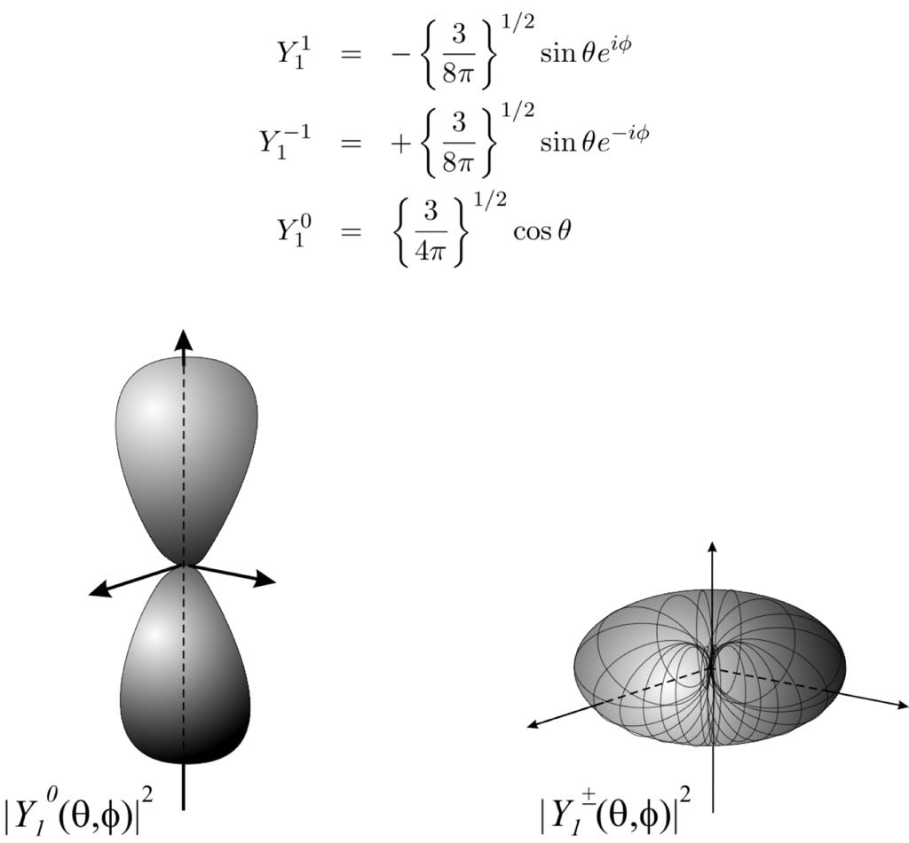
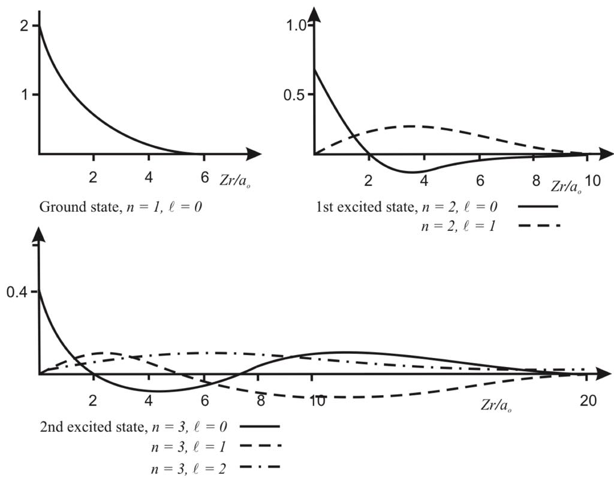
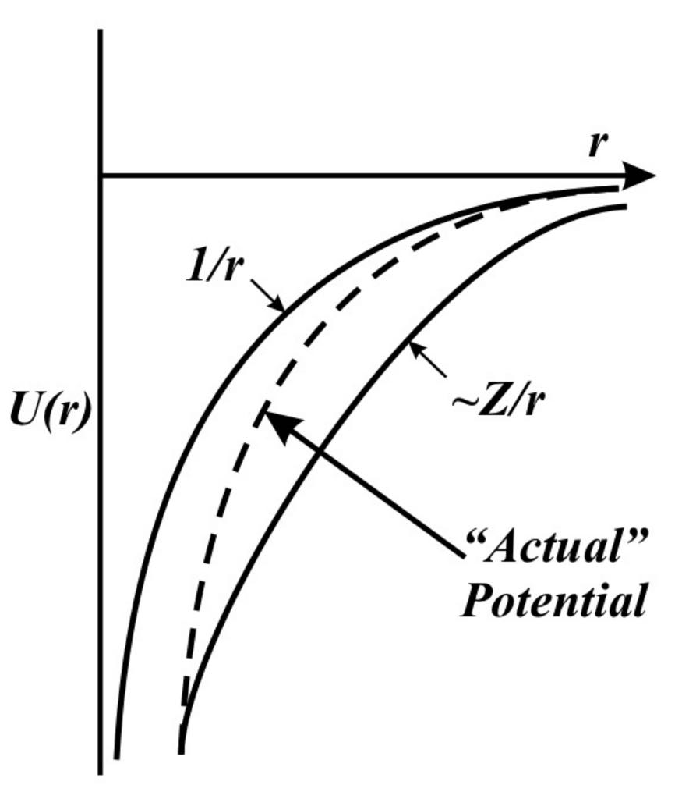
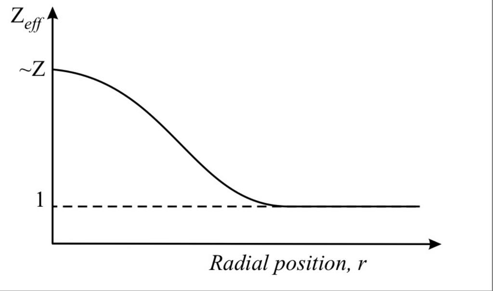
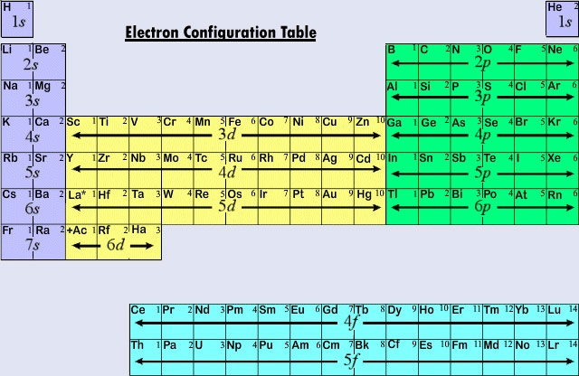
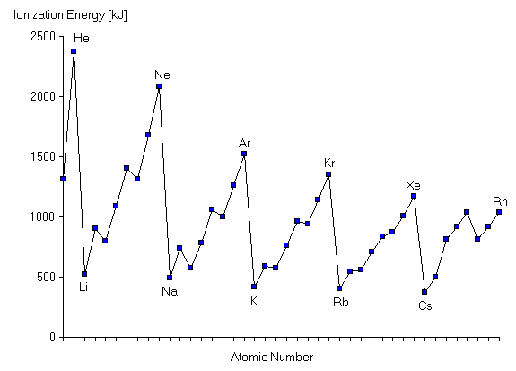
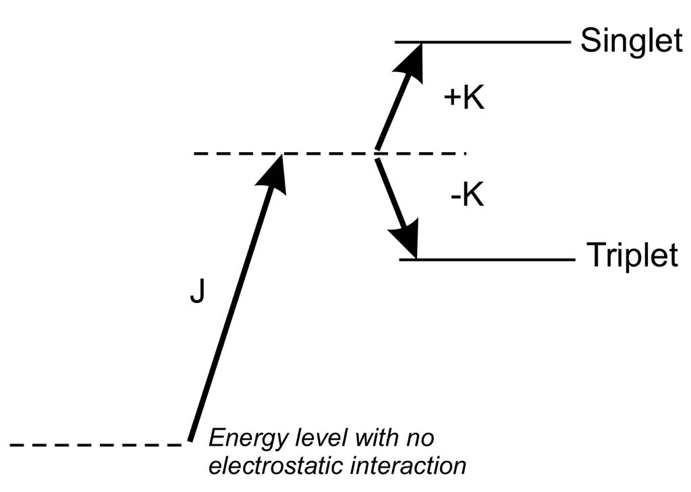
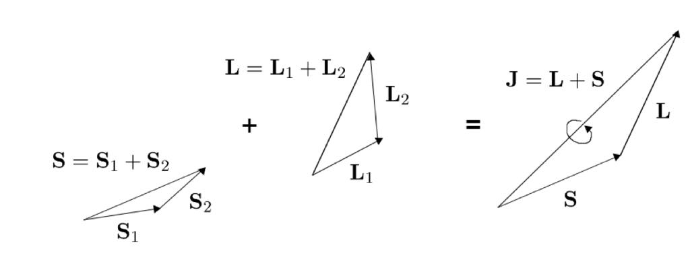

# B3 Atomic Physics <!-- omit in toc -->
- [Moving on from Hydrogen](#moving-on-from-hydrogen)
  - [Hydrogen, the simple Hamiltonian](#hydrogen-the-simple-hamiltonian)
    - [Energy](#energy)
    - [Angular Momentum](#angular-momentum)
    - [Radial Wavefunctions](#radial-wavefunctions)
  - [A Complicated Hamiltonian](#a-complicated-hamiltonian)
- [The Central Field Approximation](#the-central-field-approximation)
  - [Gross Structure](#gross-structure)
    - [The Central Field](#the-central-field)
    - [Form of the Central Field](#form-of-the-central-field)
    - [Electronic Configurations](#electronic-configurations)
      - [Spectroscopic Notation](#spectroscopic-notation)
      - [Constructing a Periodic table](#constructing-a-periodic-table)
        - [Rare Gases](#rare-gases)
        - [Alkalis](#alkalis)
        - [First Ionisation](#first-ionisation)
    - [Energy of Alkalis, the Quantum Defect](#energy-of-alkalis-the-quantum-defect)
  - [Residual Electrostatic Interaction](#residual-electrostatic-interaction)
    - [A Degenerate Perturbation](#a-degenerate-perturbation)
    - [Symmetry, Antisymmetry and Spin](#symmetry-antisymmetry-and-spin)
  - [Spin Orbit Interaction (Fine Structure)](#spin-orbit-interaction-fine-structure)
    - [The Physics](#the-physics)
    - [Finding the Spin Orbit Correction](#finding-the-spin-orbit-correction)
    - [The B Field due to Orbital Motion](#the-b-field-due-to-orbital-motion)
    - [Finding Our Operator](#finding-our-operator)
    - [Doing the Work](#doing-the-work)
    - [Final Result for Spin Orbit](#final-result-for-spin-orbit)
  - [LS-Coupling](#ls-coupling)

# Moving on from Hydrogen
## Hydrogen, the simple Hamiltonian

### Energy
The energy of a Hydrogenic atom doesn't depend on l.
$$
E_n= \frac{Z^2me^4}{(4\pi\epsilon_0)^22\hbar^2n^2} = R\frac{Z^2}{n^2}
$$
### Angular Momentum

Angular wavefunctions are eigenfunctions of $l$ and $m_l$.

### Radial Wavefunctions
- $l=0$ do not vanish at $r=0$
- $l\ \rlap{=}\ /\ 0$ vanishes at $r=0$ 
- Max probability is further out as $l$ increases 
- Size and position of peak probability scales with $n$
- There are $n-l$ nodes
- So $l=n-1$ has only one node at $r=0$

## A Complicated Hamiltonian
The hydrogenic hamiltonian is now pretty well known to us...

$$
\hat{H} = \frac{\hbar}{2m}\nabla^2 + \frac{Ze^2}{4\pi\epsilon_0r}
$$

For a many electron atom however the Hamiltonian gets much more complicated, the best way is to figure out some big hydrogenic term (a central field) and apply small perturbations to it which is what we'll do in the next section.

# The Central Field Approximation

The Hamiltonian built of ever smaller approximations for an atom looks like this...

$$
\begin{aligned}   
\hat{H} &= \hat{H_0} + \hat{H_1} + \hat{H_2} + \hat{H_3} + ...\\
\text{where } \hat{H_0} &= \text{Electrons in central field}\\
 \hat{H_1} &= \text{Residual electrostatic field}\\
 \hat{H_2} &= \text{Spin orbit interaction}\\
 \hat{H_3} &= \text{Hyperfine Structure}\\
 ...\ &= \text{Further approximations}\\
\end{aligned}
$$

We like to deal with cases where $\hat{H_1} > \hat{H_2}$ but this isn't always the case. We say that:

- $\hat{H_0}$ defines **energy levels** in the quantum numbers $n$ and $l$ and is called **gross structure**
- $\hat{H_1}$ splits degeneracy in levels into **terms**
- $\hat{H_2}$ will split terms into **fine structure**
- Nuclear effects lead to **hyperfine structure**

We can now get started looking into these one by one.

## Gross Structure
The hamiltonian of a multi electron atom (considering only the electrostatic interaction between electrons and the nucleus) looks a bit like this...
$$
\begin{aligned}
\hat{H} = \overbrace{\sum^N_{i=1}\bigg\{-\frac{\hbar^2}{2m}\nabla^2_i - \frac{Ze^2}{4\pi\epsilon_0r_i}\bigg\}}^\text{Contribution of each electron in the central field} + \underbrace{\sum_{i>j}\frac{e^2}{4\pi\epsilon_0r_{ij}}}_\text{Mutual electrostatic interaction between electrons}
\end{aligned}
$$

This can't be split into hamiltonians for each electron due to the second mutual interaction term. This term is also too large to be treated as a perturbation! Clearly we are in a bit of a situation. Luckily there's a solution.

### The Central Field

To make our lives easier we want solutions of a similar form as the Hydrogenic ones which we can then apply a perturbation to. This means we want a central $\frac{1}{r}$ potential which allows us to separate the angular and radial components like we did for the Hydrogenic case. Since most of the time **a major part of electron interaction acts radially** we can combine that part with the central nuclear potential to get the Central Field. We now have the Hamiltonian.

$$
\begin{aligned}
    \hat{H} &= \hat{H_0} + \hat{H_1}\\
    \text{where } \hat{H_0} &= \sum_i\bigg\{-\frac{\hbar^2}{2m}\nabla^2_i + U(r_i)\bigg\}\\
    \text{and } \hat{H_1} &= \sum_{i>j}\frac{e^2}{4\pi\epsilon_0r_{ij}} - \sum_i\bigg\{\frac{Ze^2}{4\pi\epsilon_0r_i} + U(r_i)\bigg\}
\end{aligned}
$$

Here $\hat{H_1}$ is the residual electrostatic interaction (the part that isn't radial) this means we can assume that $\hat{H_1}<<\hat{H_0}$ which is great because we can now apply some good old fashioned perturbation theory. By comparing to the Hamiltonian of a Hydrogenic atom we can see the solutions will be of the form...

$$
\psi(n,l,m_l,m_s) = R'_{n,l}(r)Y^m_l(\theta, \phi)\chi(m_s)
$$

In this approximation we still have angular and spin functions ($Y^m_l(\theta, \phi)$ and $\chi(m_s)$) as the same but $R'_{n,l}(r)$, the radial function, will be a little different.

### Form of the Central Field

It's clear that close to the atom the central field looks like the field of the nucleus, far away the potentials will sum and the $Z-1$ other electrons will cancel out the $Z$ charge of the nucleus leaving us with a $\frac{1}{r}$ potential. The result is something like this...

This gives a $Z_\text{eff}$ value which decreases with r.
### Electronic Configurations

Electronic configurations can be guessed at using two key principles

1. The Pauli Exclusion Principle, no more than one electron can be in any state.
2. Principle of least energy, electrons fill lowest states first.

So low energy states are filled one at a time, it's worth noting that under the central field levels are no longer degenerate in $l$ so that's why I do that more detail on that in a bit.

#### Spectroscopic Notation

This is a useful bit of notation for representing energy levels, 

$1s^22s^22p^6$ represents the energy levels $1s^2$ means two electrons are in the level with $n=1$ and $l=0$, $2p^6$ represents 6 electrons in the energy level $n=2$, $l=1$.

Full spectroscopic notation includes totals at the end.

$^{2S+1}L_J$ $2S+1$ is the multiplicity due to spin, L is orbital angular momentum and J total angular momentum.

The letters used to represent numbers is an annoying thing from old fashioned spectroscopy that everyone secretly loves. Just remember, $s=0, p=1, d=2, f=3, g=4$ and it continues alphabetically from there.

#### Constructing a Periodic table
I wonder if we can explain some of the periodic table now? Shockingly we can.

As we can see the lower states fill up first (again the lack of degeneracy in $l$ will be explained in a bit) we have a degeneracy of 2 in $s$ and 6 in $p$ the interesting part is that at the 4th energy level the $l$ effect becomes large enough to span energy levels and $3d$ comes after $4s$ it's actually even more messy than the picture would like us to believe as at Chromium we get,

Va: $3s^23p^6\ \ 3d^34s^2$

Cr: $3s^23p^6\ \ 3d^54s^1$

Mn: $3s^23p^6\ \ 3d^54s^2$

Here a $3d$ electron takes precedence over a $4s$ for a bit! It's off syllabus so luckily we don't have to worry about it hut still it makes me sick.

##### Rare Gases

A key feature of the periodic table is the rare gases. These are chemically inert with high ionisation potentials. This isn't because they have "closed" shells (states for each n are all filled) but because they have filled s and p subshells. This leads to a **spherically symmetric charge distribution** electrons are now indistinguishable and take on a common wavefunction which results in higher binding energies for all leading to the classic Rare gases we know and love.

##### Alkalis

Alkalis are the element next to rare gases and have one electron outside the filled (sp) these are generally very well screened from the attracting nuclear force. This means they have very low ionisation energies and are chemically reactive.

##### First Ionisation
What does this look like then?

We get a periodic situation with a rising trend of first ionisation energies from alkalis to rare gases with some weirdness inbetween. It's worth noting that after first ionisation, the second ionisation energies se atoms shift down one. Alkaline +1 ions become the most stable. 

### Energy of Alkalis, the Quantum Defect

As we established in the [Alkalis](#alkalis) section above, alkalis single outer 'valence' electron moving in a central field of the closed shells. The further out from the nucleus the valence electron is the more it is shielded from it's attraction by the bound electrons of the closed shell. This is why the shape of the wavefunction in R (and therefore $l$) affects the energy level. Looking at the [Radial Wavefunctions](#radial-wavefunctions) section we can see that **lower levels of $l$ penetrate the core more** so we would expect these to have higher energy. It's also important that **core penetration depends very little on $n$** this means that deviation from the Hydrogenic case is almost constant as we move through n states in the valence electron. Alkaline energy levels can be expressed almost like hydrogen then...
$$
E_n = \frac{R}{(n^*)^2}
$$

where n* is the *effective quantum number*

$$
n^* = n - \delta(l)
$$

Where $\delta(l)$ is called the quantum defect and is found empirically. $\delta(l)$ can be shown to be independent of $n$ and decreases as $l$ increases.

For heavier Alkalis $\delta(l)$ increases but ionisation energies stay about the same as valence electrons start at higher values of $n$

One convenient part of the quantum defect is that it helps us identify the source of emission lines in a spectrum. To do this we use the fact that lines of the same quantum defect will correspond to levels of the same angular momentum thus be in the same series.

## Residual Electrostatic Interaction
### A Degenerate Perturbation
For atoms with two electrons we need to start considering the Residual electrostatic interaction. This is represented by the Hamiltonian $\hat{H_1}$

This means that (considering the (closed shell) $3s4s$ state of magnesium,

$$
\Delta E_1 = \big<\psi_1(3s)\psi_2(4s)|\hat{H_1}|\psi_1(3s)\psi_2(4s)\big>
$$

Physically we would expect swapping $\psi_1$ and $\psi_2$ to have no effect. This means that states $|\psi_1(3s)\psi_2(4s)\big>$ and $|\psi_2(3s)\psi_1(4s)\big>$ are degenerate and now we have to use degenerate perturbation theory. This means we need to make linear combinations of our zero order states to diagonalise $\hat{H_1}$ which is actually not too bad. From our derivation of [The Central Field](#the-central-field) we remember that,

$$
\hat{H_1} = \sum_{i>j}\frac{e^2}{4\pi\epsilon_0r_{ij}} - \sum_i\bigg\{\frac{Ze^2}{4\pi\epsilon_0r_i} + U(r_i)\bigg\}
$$

The second sum (over i) completely disappears as the $\frac{1}{r_i}$ term is a single electron operator so doesn't matter and the zero order states are eigenfunctions of the second $U(r_i)$ term. This leaves us to diagonalise the first sum only. We can start by considering the two orthogonal functions 
$$
\begin{aligned}
    \phi_1 &= a\psi_1(3s)\psi_2(4s) + b\psi_1(4s)\psi_2(3s)\\
    \phi_2 &= b^*\psi_1(3s)\psi_2(4s) - a^*\psi_1(4s)\psi_2(3s)
\end{aligned}
$$

Now we just need to find values of $a$ and $b$ where $\big<\phi_1|V|\phi_2\big>=0$ with V being that first term in H the two electron electrostatic repulsion. V doesn't distinguish $\phi_1$ and $\phi_2$ so $|a|=|b|$ which means $|a|=|b|=\frac{1}{\sqrt{2}}$ if we want normalisation.

If we write a couple of definitions,
$$
\begin{aligned}
    J &= \big<\phi_1(3s)\phi_2(4s)|V|\phi_1(3s)\phi_2(4s)\big>&\text{The direct integral}\\
    K &=   \big<\phi_1(3s)\phi_2(4s)|V|\phi_1(4s)\phi_2(3s)\big>&\text{ The exchange integral}\\
\end{aligned}
$$

Then we can calculate matrix elements

$$
\begin{aligned}
    \big<\phi_1|V|\phi_1\big> &= \Delta E_1 = J + K &\text{ singlet}\\
    \big<\phi_2|V|\phi_2\big> &= \Delta E_2 = J - K &\text{ triplet}
\end{aligned}
$$

The off diagonals are zero as that was kind of the point of all this. A big question is "**How do I know which one is the triplet?**" and it's a good question.

### Symmetry, Antisymmetry and Spin
The degeneracy comes from the resolution of symmetry with spin!
$\phi_1$ is a symmetric state and $\phi_2$ is antisymmetric but electrons are all antisymmetric so something must be done! They have to paired with the right spin states...

$$
\begin{aligned}
    
\uparrow_1\uparrow_2,\ \downarrow_1\downarrow_2, &\frac{1}{\sqrt{2}}(\uparrow_1\downarrow_2 + \downarrow_1\uparrow_2):\ \text{symmetric}\\
&\frac{1}{\sqrt{2}}(\uparrow_1\downarrow_2 - \downarrow_1\uparrow_2):\ \text{antisymmetric}

\end{aligned}
$$

The antisymmetric spin states pair with the symmetric wavefunctions and vice versa, this means the antisymmetric state $\phi_2$ has spin degeneracy of 3 making it a triplet and the symmetric state $\phi_1$ is a singlet as it combines with just the ones antisymmetric spin state.

## Spin Orbit Interaction (Fine Structure)

The spin orbit interaction is the hamiltonian term arising from considering magnetic fields, specifically those produced by electron spin and orbit.
### The Physics
> If you want to skip to the end of this bit it's just $\Delta E  = -\underline{\mu} \cdot \underline{B}$

The angular momentum of a spinning electron is $I\underline{\omega}=\underline{\lambda}\hbar$ the energy then is $E=\frac{1}{2}I\omega^2$. The magnetic moment of the rotating electron is $\underline{\mu}=-\gamma\underline{\lambda}\hbar$ where the minus sign is for negative charge and $\gamma$ is the *gyromagnetic ratio*. If a constant B field is applied on the z axis then the moment $\mu$ will precess about that axis with some frequency $\omega^\prime$ so angular motion changes like so:
$$
\omega \rightarrow \omega + \omega^\prime cos\theta\\
\text{Or (if $\underline{\lambda}\hbar$ is in the opposite direction)}\\
\omega \rightarrow \omega - \omega^\prime cos\theta
$$
So the new energy is:
$$
\begin{aligned}
    E^\prime &= \frac{1}{2}I(\omega \pm \omega^\prime cos\theta)^2\\
    &=\frac{1}{2}I\omega^2 + \frac{1}{2}I(\omega^\prime cos\theta)^2 \pm I\omega\omega^\prime cos\theta
\end{aligned}
$$
Assuming precessional motion to be slow compared to origional angular velocity we can say that $\omega^\prime \llless \omega$ which means $(\omega^\prime cos\theta)^2 \llless \omega^2$ this means the energy change $\Delta E = E^\prime - E$ is:
$$
\begin{aligned}
\Delta E &= I\omega\omega^\prime cos\theta\\
&= \lambda\hbar\omega^\prime cos\theta
\end{aligned}
$$

We know from **Lamor's Theorem** that $\omega^\prime = -\gamma B$ so...

$$
\begin{aligned}
    \Delta E &= -\gamma\lambda\hbar Bcos\theta\\
    &=-\underline{\mu} \cdot\underline{B}
\end{aligned}
$$
### Finding the Spin Orbit Correction

Now we can say that 
$$
\begin{aligned}
\hat{H}_2 &=  -\underline{\hat{\mu}} \cdot\underline{B}\\
\Delta E &= -\big<-\underline{\hat{\mu}} \cdot\underline{B}\big>  
\end{aligned}
$$

So we need...

- To find the B Field
- Have an operator for $-\underline{\hat{\mu}} \cdot\underline{B}$ depending on $r$, $\underline{s}$, and $\underline{l}$
- Perform some perturbation theory

### The B Field due to Orbital Motion

The field the electrons experience is the one produced by the electronic orbital motion. This is given by...
$$
\underline{B} = -\frac{\underline{v}\times \underline{E}}{c^2}
$$

as $\underline{p} = m\underline{v}$ 
$$
\underline{B} = -\frac{1}{mc^2}\underline{p}\times\underline{E}
$$

Remembering E is purely radial in the central field we can rewrite it $\underline{B}$:

$$
\underline{B} = -\frac{1}{mc^2}\underline{p}\times\underline{r}\frac{|\underline{E}|}{|\underline{r}|}
$$
Luckily $\underline{r}\times\underline{p} = \underline{l}$ so:
$$
\underline{B} = \frac{1}{mc^2}\frac{|\underline{E}|}{|\underline{r}|}\underline{\hat{l}}
$$

$|\underline{E}| = \frac{\partial\phi}{\partial r}$ and $e\phi(r) = U(r)$ so $|\underline{E}| = -\frac{1}{r}\frac{\partial U(r)}{\partial r}$. Putting it all together we have:
$$
\underline{B} = \frac{1}{emc^2}\frac{1}{r}\frac{\partial U(r)}{\partial r}\underline{\hat{l}}
$$

U(r) is the central potential. 

### Finding Our Operator

The operator we need to find is $-\underline{\mu_s} \cdot \underline{B}$. The intrinsic magnetic moment of an electron due to spin is:

$$
\underline{\mu_s} = -g_s\frac{\mu_B}{\hbar}\underline{\hat{s}}
$$

So

$$
-\underline{\mu_s} \cdot \underline{B} = -g_s\frac{\mu_B}{\hbar}\frac{1}{emc^2}\frac{1}{r}\frac{\partial U(r)}{\partial r}\underline{\hat{s}}\cdot\underline{\hat{l}}
$$

Sadly most of the time we don't know the form of U(r). It is a great tragedy but we must soldier on. We can at least see that the energy operator is proportional to $\frac{1}{r}\frac{\partial U(r)}{\partial r}\underline{\hat{s}}\cdot\underline{\hat{l}}$ which is positive and determined by the relative orientation of $\underline{\hat{s}}$ and $\underline{\hat{l}}$ which is nice. A hydrogen atom has the potential $U(r) = -\frac{Ze^2}{4\pi\epsilon_0r}$ this gives:

$$
    -\underline{\mu_s} \cdot \underline{B} = \frac{\mu_B}{4\pi}2Zg_s\mu_B^2\frac{1}{r^3}\frac{\underline{\hat{s}}\cdot\underline{\hat{l}}}{\hbar^2}
$$

Although if you take into account the relativistic correction of **Thomas Precession** which isn't on syllabus we need to divide by 2 so:

$$
    -\underline{\mu_s} \cdot \underline{B} = \frac{\mu_B}{4\pi}Zg_s\mu_B^2\frac{1}{r^3}\frac{\underline{\hat{s}}\cdot\underline{\hat{l}}}{\hbar^2}
$$

### Doing the Work

$$
\Delta E = \frac{\mu_B}{4\pi\hbar^2}Zg_s\mu_B^2\big<\frac{1}{r^3}\big>\big<\underline{\hat{s}}\cdot\underline{\hat{l}}\big>
$$

The radial part is a standard radial integral using hydrogenic wavefunctions.

$$
\begin{aligned}
    \big<\frac{1}{r^3}\big> &= \int_0^{\infin}R^2_{n,l}(r)\frac{1}{r^3}r^2dr\\
    &=\frac{Z^3}{n^3a_0^3l(l+1/2)(l+1)} 
\end{aligned}
$$

the dot product is a bit harder but we can use the power of the vector model.

$$
\begin{aligned}
\underline{\hat{j}}\ \ &= \underline{\hat{s}} + \underline{\hat{l}}\\
\implies\underline{\hat{j}}^2&=\underline{\hat{s}}^2 + \underline{\hat{l}}^2+\underline{\hat{s}}\cdot\underline{\hat{l}}\\
\therefore\underline{\hat{s}}\cdot\underline{\hat{l}}&=\underline{\hat{j}}^2 - \underline{\hat{s}}^2 + \underline{\hat{l}}^2
\end{aligned}
$$

This means that we can write our matrix elements in a different basis as $|n,l,m_l,s,m_s\big>$ is not diagonalised.

$$
\big<n,l,s,j,m_j|\underline{\hat{s}}\cdot\underline{\hat{l}}|n',l',s',j',m_j'\big> = 0 \text{ unless } j=j'\text{ and } m_j=m_j' 
$$

The diagonal elements are then:

$$
\big<n,l,s,j,m_j|\underline{\hat{s}}\cdot\underline{\hat{l}}|n',l',s',j',m_j'\big> = \frac{1}{2}\{j(j+1) - l(l+1) - s(s+1)\}\hbar^2
$$
 
This is a nice result but what does this mean? We found that we need a new basis when we consider spin orbit. This is because without spin orbit $\underline{\hat{s}}$ and $\underline{\hat{l}}$ are fixed, making their projections in z good quantum numbers. When we consider spin orbit though $\underline{\hat{s}}$ and $\underline{\hat{l}}$ precess around their mutual sum $\underline{\hat{j}}$ which means $m_l$ ans $m_s$ are no longer constants of motion. Clearly it is important to choose a basis which suits the perturbation we're doing.

### Final Result for Spin Orbit

Using
$$
\hat{H_2} \propto\frac{1}{r}\frac{\partial U(r)}{\partial r}\underline{\hat{s}}\cdot\underline{\hat{l}}
$$

We can find perturbed energy:

$$
\Delta E_{SO} = \big<\hat{H_2}\big> = \beta_{n,l} \frac{1}{2}\{j(j+1) - l(l+1) - s(s+1)\}\hbar^2
$$

Where for hydrogen molecules:
$$
\beta_{nl} = \frac{\mu_0Z^4g_s\mu_b^2}{4\pi}\frac{1}{n^3a_0^3l(l+1/2)(l+1)}
$$
For single electron atoms (alkalis) j has twofold degenerac $j =l\pm 1/2$ so energy levels are split in two.  
## LS-Coupling

In these notes we assume LS-Coupling because it's super convenient and I like it. In LS coupling $\bold{J}= \bold{L} +\bold{S}$ which in vector model terms means that $\bold{L}$ and $\bold{S}$ couple to precess around $\bold{J}$ which makes $L,S,J,$ and $M_J$ good quantum numbers but $M_L$ and $M_S$ obviously not.

