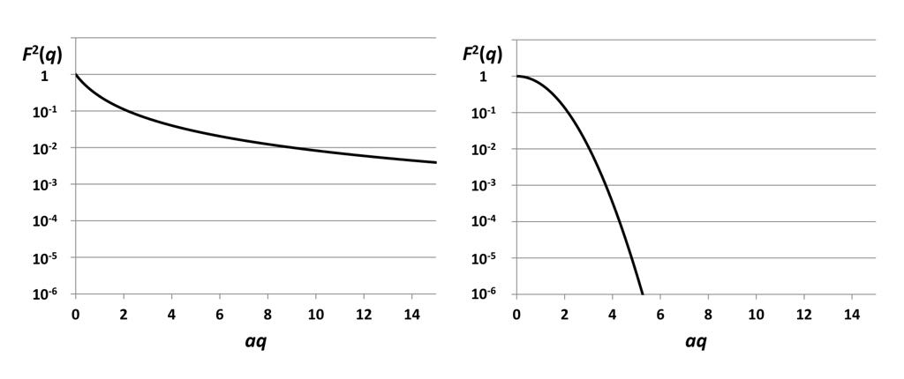
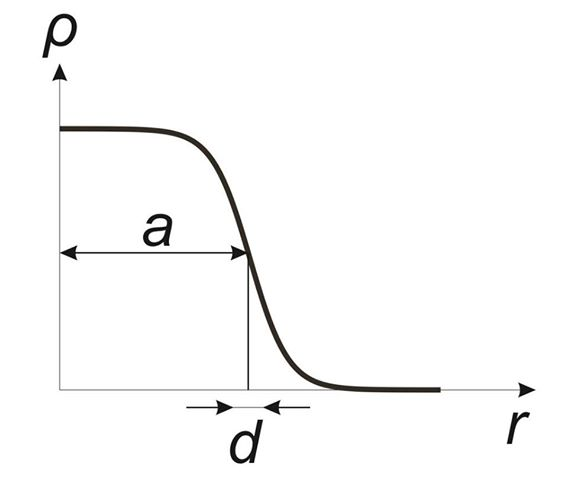
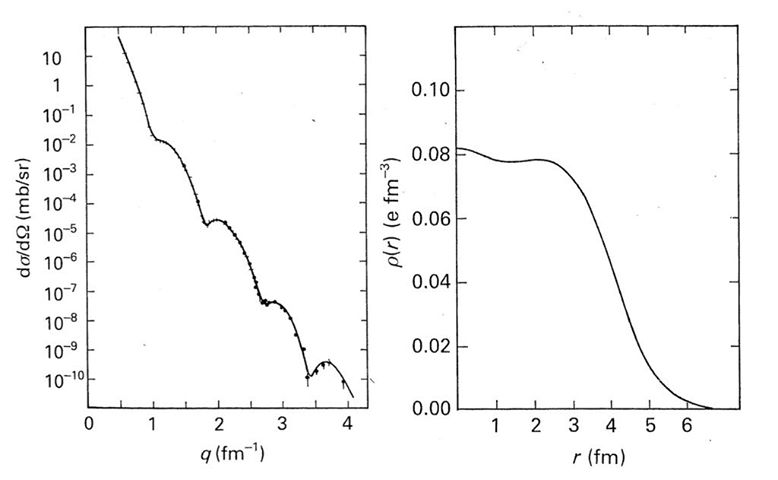
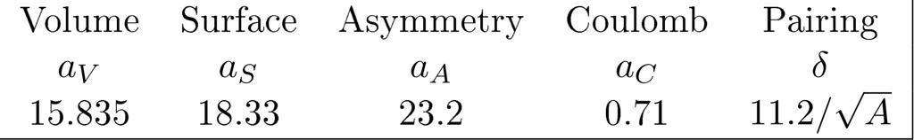
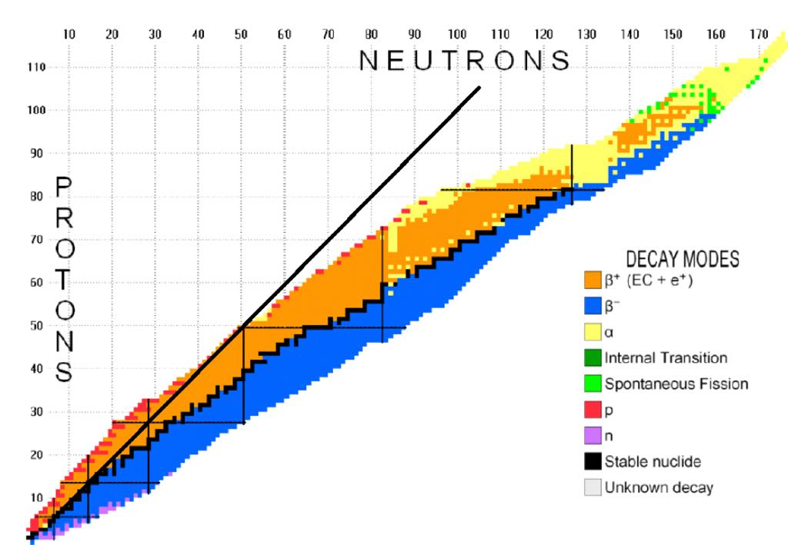
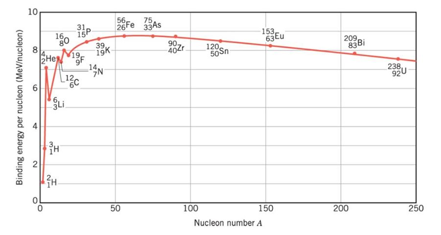
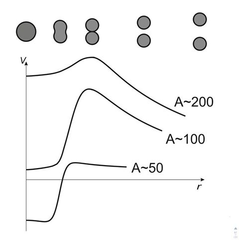
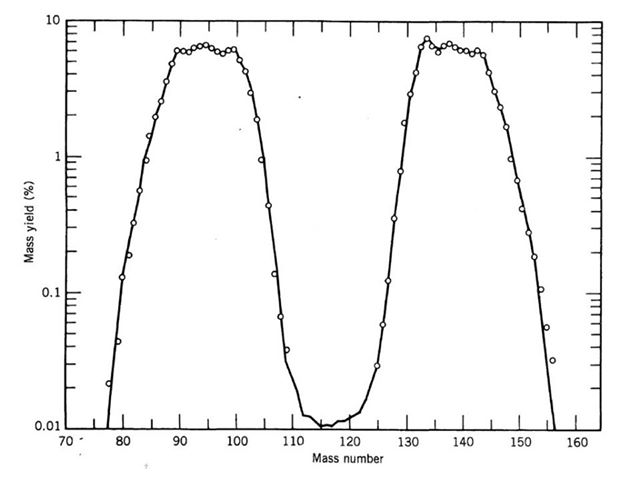

# B4 Subatomic Physics <!-- omit in toc -->

- [Scattering](#scattering)
  - [Classical Scattering](#classical-scattering)
    - [Hard ball scattering.](#hard-ball-scattering)
    - [Classical Rutherford Scattering](#classical-rutherford-scattering)
  - [Quantum Mechanical Scattering](#quantum-mechanical-scattering)
    - [Time Dependant Perturbation Theory Recap...](#time-dependant-perturbation-theory-recap)
    - [A Perturbation for Scattering Theory](#a-perturbation-for-scattering-theory)
    - [A quantum rate equation](#a-quantum-rate-equation)
    - [The Born Approximation](#the-born-approximation)
    - [Second order perturbation](#second-order-perturbation)
    - [Validity of perturbation theory here](#validity-of-perturbation-theory-here)
  - [Application of first order scattering theory](#application-of-first-order-scattering-theory)
    - [The Yukawa Potential](#the-yukawa-potential)
    - [Virtual exchange particles](#virtual-exchange-particles)
    - [The Form Factor](#the-form-factor)
  - [Feynman Diagrams and Feynman's Rules](#feynman-diagrams-and-feynmans-rules)
    - [Yukawa Potential Example](#yukawa-potential-example)
    - [More complicated example](#more-complicated-example)
  - [Resonances](#resonances)
    - [Decays](#decays)
    - [Resonance Scattering](#resonance-scattering)
- [Nuclear Physics](#nuclear-physics)
  - [Nuclear Structure](#nuclear-structure)
    - [Saxon Woods](#saxon-woods)
    - [Radius](#radius)
  - [Nuclear Mass](#nuclear-mass)
    - [Deriving the Asymmetry Term](#deriving-the-asymmetry-term)
  - [Decays and Radiation](#decays-and-radiation)
    - [The $N\!\!-\!\!Z$ plane](#the-n-z-plane)
    - [Q Values](#q-values)
    - [Radioactive Decay Law](#radioactive-decay-law)
    - [Alpha Decay](#alpha-decay)
    - [Weak Decays](#weak-decays)
    - [Fermi Theory of Beta Decay](#fermi-theory-of-beta-decay)
    - [Fission and Fusion](#fission-and-fusion)
      - [Fusion](#fusion)
      - [Fission](#fission)

# Scattering

We can learn a lot about the structure of a material by firing a bunch of particles at it and seeing how they scatter. If the rate of particles reaching a detector at a given solid angle is $n(\theta, \phi)$ and the incoming flux is $j_A$ we define the differential cross section as the ratio between the two...

$$
\frac{d\sigma}{d\Omega} = \frac{n}{j_A} = \frac{\text{Particles per solid angle}}{\text{Incoming flux}} 
$$

The scattering cross section $\sigma$

$$
\sigma = \int\frac{d\sigma}{d\Omega}d\Omega
$$

Represents the 'effective area' of the target in the scattering process.

## Classical Scattering

This is not on the syllabus so I'm going to leave the derivation to be read in the notes. One important result is...
$$
nd\Omega = n\sin\theta d\theta d\phi = j_Abdbd\phi
$$
Here are the results.

### Hard ball scattering.

For a hard sphere of potential...

$$
V(r) = 
\begin{cases}
\begin{aligned}
    0 \text{ for } r>R\\
    \infty \text{ for }r\leq R
\end{aligned}
\end{cases}
$$

We end up with
$$
\frac{d\sigma}{d\Omega}=\frac{R^2}{4}
$$

### Classical Rutherford Scattering

For a coulomb potential given by...
$$
V(r) = \frac{Z_1Z_2e^2}{4\pi\epsilon_0r}
$$

we end up with...

$$
\frac{d\sigma}{d\Omega} = \bigg(\frac{Z_1Z_2e^2}{4\pi\epsilon_0T}\bigg)^2\frac{1}{16\sin^4(\theta/2)}
$$

Where $T$ is the KE of the particle.

## Quantum Mechanical Scattering
### Time Dependant Perturbation Theory Recap...
For first order perturbation theory the probability that we go from initial state $|i\big>$ to final state $|f\big>$ when there is a hamiltonian $H = H_0 + \Delta H(t)$ is...

$$
P^{(1)}_{i\rightarrow f} = \frac{1}{\hbar^2}\bigg|\int^t_{t_0}\big<f|\Delta H|i\big>e^{i(E_f-E_i)t^\prime/\hbar}dt^\prime\bigg|^2
$$

### A Perturbation for Scattering Theory

For scattering theory we need some perturbation depending on the position of the particle $\bold{r}$ to use time dependant perturbation theory though it needs to be time dependant but this makes sense if we think about the fact that the potential only begins to affect the particle as it comes closer so we can make a perturbation $\Delta H(t) = e^{\epsilon t}\Delta H_0$. Which has a term to take into account the fact there is a perturbation which slowly appears from time $t=-\infty$. In out integral now we simply need to integrate from $-\infty$ to some time t. We get...

$$
P^{(1)}_{i\rightarrow f} = |\big<f|\Delta H_0|i\big>|^2\frac{e^{2\epsilon t}}{(E_f-E_i)^2+(\epsilon\hbar)^2}
$$

This is still a probability density function as we only have it for one specific state f. If we define the density of final states $\rho(E_f)$. This gives a probability of transition...

$$
P^{(1)} = \int|\big<f|\Delta H_0|i\big>|^2\frac{e^{2\epsilon t}}{(E_f-E_i)^2+(\epsilon\hbar)^2}\rho(E_f)dE_f
$$

and a rate of transitioning known as **Fermis golden rule**
$$
R^{(1)} = \int|\big<f|\Delta H_0|i\big>|^2\frac{2\epsilon e^{2\epsilon t}}{(E_f-E_i)^2+(\epsilon\hbar)^2}\rho(E_f)dE_f
$$

Our calling this a time dependant perturbation was a bit sneaky though as the potential of the target is probably steady. We can still use the maths though so long as we now let $\epsilon\rightarrow0$. If we take the part with $\epsilon$ in it and find the limit...

$$
\lim_{\epsilon\rightarrow0}\frac{2\epsilon}{(E_f-E_i)^2+(\epsilon\hbar)^2} = \frac{2\pi}{\hbar}\delta(E_f-E_i)
$$

So we have...

$$
R^{(1)} = \frac{2\pi}{\hbar}|\big<f|\Delta H_0|i\big>|^2\rho(E)
$$

Where $E_i=E_f=E$ (This rate equation is Fermi's golden rule).

Finally we might want to get some specific answer for $\rho(E)$ this is simply the density of energy states states. The derivation is the same as always so here it is just to knock it into my head one more time...

$$
\rho(k) = \frac{dN}{dk} = \frac{Vk^2d\Omega}{(2\pi)^3}\\\ \\
E = \frac{\hbar^2k^2}{2m}\\\ \\
\rho(E) = \frac{dN}{dE} = \frac{dN}{dk}\frac{dk}{dE} = \frac{Vk^2d\Omega}{(2\pi)^3}\frac{m}{\hbar^2k}
$$

### A quantum rate equation

We have this rate equation but we still don't have a differential cross section! Remember differential cross section is defined as
$$
\frac{d\sigma}{d\Omega}=\frac{\text{Particles per solid angle}}{\text{Incoming flux}}
$$

We can say that
$$
\text{Partilces per solid angle} = \frac{R}{d\Omega}
$$
and
$$
\text{Incoming flux} = \frac{j}{V} = \frac{\hbar k}{Vm}
$$

Where $j$ is probability current for a plane wave.

This gives the final expression...

$$
\frac{d\sigma}{d\Omega}^{(1)} = \frac{m^2}{(2\pi\hbar^2)^2}V^2|\big<f|\Delta H_0|i\big>|^2
$$

### The Born Approximation

Finally we need to evaluate the matrix element. Let's define our initial and final states in terms of momentum. $|i\big> = V^{-1/2}|\bold{k}\big>$ and $|f\big> = V^{-1/2}|\bold{k}^\prime\big>$ where $V^{-1/2}$ is a normalization. So our differential cross section to first order perturbation theory is given by...
$$
\frac{d\sigma}{d\Omega}^{(1)}=\bigg(\frac{m}{2\pi\hbar^2}\bigg)^2\bigg|\int e^{i\bold{q}\cdot\bold{r}}\Delta H_0(\bold{r})d^3\bold{r}\bigg|^2
$$

So the differential cross section is approximately a fourier transform of the target perturbation. This result is often called the Born approximation.

### Second order perturbation

Since this is only first order perturbation theory we need to turn to higher orders if we get a small result. This is off syllabus but basically we end up with a *propogator factor* which behaves as if there is some intermediate between state which feels no need to conserve energy but which quickly decays into a state which does. This is where the idea of virtual particles comes from.

### Validity of perturbation theory here

The perturbation theory approach is only valid if $\Delta H_0$ is much smaller than the energy of the incoming particle. To get a value on this let's use a step function for $\Delta H$. Where it is given by...

$$
\Delta H  = 
\begin{cases}
\begin{aligned}
  &\Delta H_0\ &0\le t^\prime \le t\\
  &0 &\text{otherwise}
\end{aligned}
\end{cases}
$$
We end up getting...

$$
P_{i\rightarrow f} = \frac{|\big<f|\Delta H_0|i\big>|^2}{\hbar^2}t^2
$$

Which gives us the condition for a small perturbation that...

$$
\big<f|\Delta H_0|i\big>\llless\frac{\hbar}{t}
$$

$t$ is the approximate time to traverse an atom so lets say...

$$
t\approx\frac{a}{v} = \frac{am}{\hbar k}\\
\implies \big<f|\Delta H_0|i\big> = \frac{\hbar^2k}{am}
$$

## Application of first order scattering theory

Our matrix element can be simplified if we remember that basically every potential we see would be central and can be evaluated in polar coordinates...

$$
\Delta H(\bold{r}) = \Delta H(r)\\\ \\
\begin{aligned}
\implies \big<k^\prime|\Delta H|k\big> &= \iiint\Delta H(r)e^{iqr\cos\theta}r^2drdcos\theta d\phi\\\ \\
&=\frac{4\pi}{q}\int^\infty_0r\Delta H(r)\sin qr\ dr
\end{aligned}
$$

### The Yukawa Potential

The Yukawa potential is a more realistic 'screened' Coulomb potential.

$$
V(r) = V_0\frac{e^{-\mu r}}{r}
$$

Evaluating the matrix element in polar coordinates we get...

$$
\big<k^\prime|\Delta H|k\big> = \int^\infty_0 e^{-\mu r}\sin{qr}\ dr =  \frac{4\pi V_0}{q^2+\mu^2}
$$

Which gives a differential cross-section.

$$
\frac{d\sigma}{d\Omega}^{(1)} = \bigg(\frac{2mV_0}{\hbar^2}\bigg)^2\frac{1}{[2k^2(1-\cos\theta)+\mu^2]}
$$
and the cross-section

$$
\sigma^{(1)} = \bigg(\frac{2mV_0}{\hbar^2}\bigg)^2\frac{4\pi}{4k^2\mu^2+\mu^4}
$$

Note if we let $\mu\rightarrow0$ we get coulomb scattering again!

### Virtual exchange particles

Previously in Yukawa potential we had the matrix element

$$
\big<k^\prime|\Delta H|k\big> =  \frac{4\pi V_0}{q^2+\mu^2}
$$

Apparently our lecturer is tempted to call this a product of an interaction strength $\sqrt{4\pi V_0}^2$ and a propagator $1/(q^2+\mu^2)$. For propagators to work they need to have an associated Green's function. Luckily this one does!! It's the greens function the the Klein-Gordon equation...
$$
\Box\psi(\bold{r},t) + \frac{m^2c^2}{\hbar^2}\psi(\bold{r},t) = 0
$$

This was an early attempt at making a relativistic quantum physics equation. It was thrown out for allowing negative probability density (which is now accepted as being due to the possibility of an anti particle solution) but also more seriously breaking down for spin-1/2 particles which is a big deal because that makes up most matter. Luckily this course only needs spin-0 particles so it's cool. The complete Green's function is...

$$
G(P) = \frac{-1}{\frac{P\cdot P}{\hbar^2}-\mu^2}
$$

For a yukawa potential we have $m=\frac{\hbar\mu}{c}$ and clearly $P\cdot P = \frac{E^2}{c^2}-p^2=\frac{\Delta E^2}{c^2}-p^2$ which gives the propagator for the yukawa potential given $\Delta E = 0$.

### The Form Factor

Now that we've seen what scattering looks like off a point coulomb potential let's look at what we see off a distribution. Here we have

$$
\Delta H(\bold{r}) = \int \frac{Z_1Z_2e^2}{4\pi\epsilon_0}\frac{1}{|\bold{r}-\bold{r}^\prime|}\rho(\bold{r}^\prime)d^3\bold{r}^\prime
$$

Which is a convolution of the coulomb potential with the density function $\rho(\bold{r})$ since the matrix element is like a fourier transform we'd expect the integral to evaluate into a point like term and a term dependant on $\rho(\bold{r})$ if we do the integral and define $\bold{x} = \bold{r} - \bold{r}^\prime$ we get...

$$
\big<\bold{k}^\prime|\Delta H|\bold{k}\big> = \underbrace{\frac{Z_1Z_2e^2}{4\pi\epsilon_0}\int\frac{e^{-i\bold{x}(\bold{k}^\prime-\bold{k})}}{|\bold{x}|}d^3\bold{x}}_\text{Point-like matrix element} \times \underbrace{\int e^{-i\bold{r}^\prime(\bold{k}^\prime-\bold{k})}\rho(\bold{r}^\prime)d^3\bold{r}^\prime}_{\text{form factor }F(q)}
$$

Typically the form factor becomes irrelevant $F(q)\rightarrow1$ if $\rho(\bold{r})\rightarrow\delta(\bold{r})$ or $q\rightarrow0$.

|              |                          $\rho(r)$                          |          $F(q)$           |
| :----------: | :---------------------------------------------------------: | :-----------------------: |
| Point Source |                         $\delta(r)$                         |             1             |
| Exponential  |            $\frac{1}{8\pi a^3}e^{-\frac{r}{a}}$             | $\frac{1}{(1+q^2+a^2)^2}$ |
|   Gaussian   | $\bigg(\frac{1}{2\pi a^2}\bigg)^{3/2}e^{-\frac{r^2}{2a^2}}$ |  $e^{-\frac{q^2a^2}{2}}$  |

 
Form factors for exponential (left) and gaussian (right) distributions

## Feynman Diagrams and Feynman's Rules

To get better at dealing with scattering we need to
+ Deal better with relativistic effects
+ Lift the restriction on elastic processes (like particle creation and annihilation)

To do this we need to use propagators which are the Green's fuction of the Dirac equation and the second needs describing particles in terms of fields basically it's Quantum Field Theory. This is a bit beyond syllabus so we'll use feynman diagrams as a simplification.

+ Each scattering process is represented as a series of diagrams with each diagram representing a term in the perturbation series. (I.e higher order perturbations)
+ The diagrams contain propagators and vertices.
+ The more vertices the higher the order.
+ The higher the order the lower the contribution so we can stop at some point in the series.
+ Particles are lines with an arrow forward in time, antiparticles are lines with an arrow pointing backward in time.
+ External legs (incoming and outgoing have well defined 4-Momenta)
+ 4-momentum is conserved at vertices (as well as charge e.c.t)
+ We can use perturbation theory to calculate a rate for a given process in the diagram. By calculating a matrix element and a density of states. This can be done with Feynman's rules:
  - The vertex factor g describes the strength of the interaction. It is proportional to the strength of the force and the charge of the particle. In QED these are $g_{EM}=\sqrt{4\pi\alpha_{EM}}=e/\sqrt{\epsilon_0\hbar c}$
  - We'll say the propagator is the same as for the Yukawa potential from earlier for this course $\frac{1}{P\cdot P-m^2c^2}$
  - For SI units we need to include a factor $\hbar^3c$
  - The first order perturbation matrix element is then the product of the vertex factors and the initial propagator. The rate/cross section is proportional to it's square. 

### Yukawa Potential Example

Let's try it for the Yukawa potential...

$$
\underbrace{\hbar^3c}_\text{Unit factor} \times \underbrace{g^2}_\text{Vertex Factors} \times \overbrace{\frac{1}{p^2+m^2c^2}}^\text{Propagator} \\\ \\
\begin{aligned}
&= \hbar^3c\frac{e^2}{\epsilon_0\hbar c}\frac{1}{\hbar^2q^2+\mu^2\hbar^2}\\\ \\
&= \frac{4\pi}{q^2 + \mu^2}\frac{e^2}{4\pi\epsilon_0}\\\ \\
&= \frac{4\pi V_0}{q^2+\mu^2} &\text{as before}
\end{aligned}
$$

Note there are two vertices as a more accurate diagram is...

### More complicated example

Let's take the example of $e^- + e^+ \rightarrow \mu^- + \mu^+$:

The four momentum of the photon is given by

$$
Q = P_1+P_2
$$

Which we can evaluate in the center of momentum frame where

$$
\begin{aligned}
P_1 &= (E_e/c, \bold{p})\\
P_2 &= (E_e/c, -\bold{p})\\
\implies Q &= (2E_e/c, 0)
\end{aligned}
$$

Since the mass of the photon $m=0$ we have the propogator...

$$
\frac{1}{Q^2-m^2c^2} = \frac{c^2}{4E_e^2}
$$

Putting this together with the vertex factors we get...

$$
|M_{if}|^2 = \bigg|\frac{\hbar^3c^3g^2_{EM}}{4E_e^2}\bigg|^2
$$

The matrix element has dimensions $Jm^3$ though which is sad because it should clearly be $J$ as the matrix is a perturbation to the Hamiltonian. We can fix this with a $V^{-1}$ term. This can be thought of as a normalisation and will disappear later anyway.

$$
|M_{if}|^2 = \bigg|\frac{\hbar^3c^3g^2_{EM}}{4E_e^2}\bigg|^2\frac{1}{V^2}
$$

Using Fermi's Golden Rule...

$$
R_{i\rightarrow f}=\frac{2\pi}{\hbar}|M_{if}|^2\rho(E)
$$

To get a cross section we need to divide by the flux of incoming particles which is given by.. $j = 2v_e/V = 2c^2p_e/E_eV$ (the factor of two is for the two beams)

$$
\sigma = \frac{VE_e}{2c^2p_e}\frac{2\pi}{\hbar}|M_{if}|^2\rho(E)
$$
But the density of states can be found as..
$$
\rho(E) = \frac{dN}{dp_\mu}\frac{dp_\mu}{dE}\\\ \\
\frac{dN}{dp_\mu} = \frac{4\pi V p^2_\mu}{(2\pi\hbar)^3}\\\ \\
E_\mu^2 = p_\mu^2c^2+m_\mu^2c^4\\\ \\
E_\mu dE_\mu = c^2p_\mu dp_\mu\\\ \\
\frac{dp_\mu}{dE}=\frac{1}{2}\frac{dp_\mu}{dE_mu} = \frac{1}{2}\frac{E_\mu}{c^2p_\mu}
$$

Putting it all together we get the monster that is...

$$
\begin{aligned}
\sigma &= \underbrace{\frac{VE_e}{2c^2p_e}\frac{2\pi}{\hbar}}_\text{Coefficent in fermis rule}\times\ \ \ \underbrace{\bigg(\frac{\hbar^3c^3g^2_{EM}}{4E_e^2}\bigg)^2\frac{1}{V^2}}_\text{Matrix element} \times \underbrace{\frac{4\pi V p^2_\mu}{(2\pi\hbar)^3}\frac{1}{2}\frac{E_\mu}{c^2p_\mu}}_\text{Density of states in energy}\\\ \\
&= \pi\hbar^2\frac{\alpha_{EM}}{s}\\\ \\
\alpha_{EM} &= \frac{g^2_{EM}}{4\pi}\\\ \\
s &= \frac{4E_e^2}{c^2}
\end{aligned}
$$

Where we have used conservation of energy to say that $E_e=E_\mu$. This doesn't take into account spin but when we do we get the result that...
$$
\sigma = \frac{4\pi}{3}\hbar^2\frac{\alpha^2_{EM}}{s}
$$

Which matches experiment pretty well for both $e^- + e^+ \rightarrow \mu^- + \mu^+$ and $e^- + e^+ \rightarrow \tau^- + \tau^+$

## Resonances

Currently we've been looking at how originally unpopulated states become populated but how about how an already populated state develops?

### Decays

Imagine we have an unstable state with mean lifetime $\tau$ we can say that the probability to exist at a time $t+dt$ is
$$
P(t+dt) = P(t)\bigg(1-\frac{dt}{\tau}\bigg)
$$

which has the solution

$$
P(t) = P(0)e^{-\frac{t}{\tau}}
$$

This is easy to slot into perturbation theory we just need to say

$$
c_i(t) = e^{-\frac{t}{2\tau}}
$$

We can now look at the final state again!

$$
c^{(1)}_f=-\frac{i}{\hbar}\int^t_0\big<f|\Delta H|i\big>e^{i\big(\frac{E_f-E_i}{\hbar} + \frac{i}{2\tau}\big)t^\prime}dt^\prime
$$

This gives us a complicated transition probability

$$
P_{i\rightarrow f} = |\big<f|\Delta H|i\big>|^2\frac{\bigg|e^{i\big(\frac{E_f-E_i}{\hbar} + \frac{i}{2\tau}\big)t}-1\bigg|^2}{(E_f-E_i)^2+(\frac{\hbar}{2\tau})^2}
$$

Since we have that $t\gg\tau$ we can ignore the exponential and say
$$
P_{i\rightarrow f} = |\big<f|\Delta H|i\big>|^2\frac{1}{(E_f-E_i)^2+(\frac{\hbar}{2\tau})^2}
$$

Which is a lorentzian with width $\Gamma=\frac{\hbar}{\tau}$. If we look at decay into a range of states we get

$$
P = \int |\big<f|\Delta H|i\big>|^2\frac{1}{(E_f-E_i)^2+(\frac{\Gamma}{2})^2}\rho(E_f)dE_f
$$

The rate of decay can be found as

$$
R = \frac{dP}{d\tau} = \frac{2\pi}{\hbar}|\big<f|\Delta H|i\big>|^2\rho(E_f)\\\ \\
\implies \Gamma = \frac{\hbar}{\tau} = \hbar R = 2\pi|\big<f|\Delta H|i\big>|^2\rho(E)
$$

(Where $E_f=E_i=E$) If we have several final states then this decay width will be specific to that state and we have...

$$
\begin{aligned}
\Gamma_f &= 2\pi|\big<f|\Delta H|i\big>|^2\rho(E)\\
\Gamma &= \sum_f\Gamma_f
\end{aligned}
$$

$\Gamma$ is the total width and obeys the $\Gamma=\frac{\hbar}{\tau}$ relationship we had before.

### Resonance Scattering

Now lets consider the generating of an unstable state from a stable initial state. This sort of problem is very common in particle physics where a stable state scatters into an unstable state and the decays into a new stable state. The unstable middle state is called a resonance. To the first order we have that
$$
i\hbar\frac{dc_R^{(1)}(t)}{dt} = \underbrace{\big<R|\Delta H| i\big>e^{i(E_R-E_i)\frac{t}{\hbar}}}_\text{Transition from i to R} - \underbrace{i\bigg(\frac{\Gamma}{2}\bigg)c^{(1)}_R(t)}_\text{Decay of R}
$$

This can be rearranged and integrated to give

$$
\big|c^{(1)}_R(t)\big|^2 = \frac{|\big<R|\Delta H|i\big>|^2}{(E_R-E_i)^2 + \Gamma^2/4}
$$

Since $\Gamma_i = 2\pi|\big<i|\Delta H|R\big>|^2\rho_i(E)$ and  $|\big<R|\Delta H|i\big>|^2=|\big<i|\Delta H|R\big>|^2$ we can write that

$$
\big|c^{(1)}_R(t)\big|^2 = \frac{1}{2\pi\rho_i(E)}\frac{\Gamma_i}{(E_R-E_i)^2+\Gamma^2/4}
$$

To get a rate equation we need to divide this by lifetime so a factor of $\tau^{-1} = \Gamma/\hbar$ is included. If we're looking at a specific final state $|f\big>$ we must reduce by a factor $\Gamma_f/\Gamma$. To get a cross section we divide by the incoming flux $j=\hbar k_i/(\mu V)$ finally if we use the density of state and the dispersion relation $E_i=\hbar^2 k_i^2/(2\mu)$ we get...
$$
\sigma_{i\rightarrow R\rightarrow f} = \frac{\pi}{k_i^2}\frac{\Gamma_i\Gamma_f}{(E_R-E_i)^2 + \Gamma^2/4}
$$

This is the **Briet-Wigner** resonance formula, and it describes how a cross section forms around a resonance. If we want to be a bit more thorough we would use a relativistic version of this but that's only needed for wide resonances. Another correction though is the correction for spin degeneracies which is given below...

$$
\sigma_{i\rightarrow R\rightarrow f} = \frac{\pi}{k_i^2}\frac{2j+1}{(2s_1+1)(2s_2+1)}\frac{\Gamma_i\Gamma_f}{(E_R-E_i)^2 + \Gamma^2/4}
$$

$j$ is the angular momentum of the resonance and $s_1$ and $s_2$ are the spins of the incoming particles. In practice this allows us to find resonances by plotting cross section by energy (no easy experimental feat) and looking for bumps.

 
An example of identifying a resonant particle

# Nuclear Physics

## Nuclear Structure

### Saxon Woods

Scattering off nuclei quickly revealed the [Form Factor](#the-form-factor) was not $1$ which means the distribution is finite. It turns out it matches the **Saxon-Woods potential**.

$$
\rho(r) = \frac{\rho_0}{1+e^\frac{r-a}{d}}
$$

Where $a$ is the radius of the nucleus and $d$ is thickness of the edge region.

 
The Saxon-Woods Potential

An example of this is given below...

 
If you derive charge distribution from differential cross section for Nickel-58 it appears to be a Saxon-Woods potential.

### Radius

For a nucleus consisting of $A$ nucleons we can experimentally see that

$$
a = r_0A^{1/3},\quad\quad r_0\approx1.2\,\text{fm}
$$

This tells us some things about nuclear force...

+ The fact that $a$ is proportional to $A^{1/3}$ means $V\propto A$ so each nucleon makes an equal contribution to volume. This means we only have to consider nearest neighbour interactions between nucleons.
+ There must be some repulsive force separating the nucleons (Pauli Exclusion).
+ The inter-nuclear force must be very strong at small distances to overcome coulomb repulsion between protons but vanishingly small at $\sim2r_0$ as there is no effect on the electrons. This implies there are massive exchange particles.

## Nuclear Mass

Nuclear mass is made up of three parts, the mass of the neutrons, the mass of the protons, and the binding energy.

$$
M(Z, A) = Zm_p + (A-Z)m_n - \frac{B}{c^2}
$$

It turns out $B$ is given by five distinct terms...

$$
B = \underbrace{a_VA}_\text{Volume} - \underbrace{a_SA^{2/3}}_\text{Surface}-\underbrace{a_C\frac{Z^2}{A^{1/3}}}_\text{Coulomb} - \underbrace{a_A\frac{(N-Z)^2}{A}}_\text{Asymmetry} \pm \underbrace{\delta(N,Z)}_\text{Pairing}
$$

Where $a_V, a_S, a_C, a_A,$ and $\delta$ are all constants. Each of these terms have vague explanations below...

+ **Volume and Surface** - These are a result of treating the strong attraction as bonds in a liquid and the nucleus as a liquid drop.
+ **Coulomb** - This is a consideration of energy from coulomb repulsion. This favours a neutral atom.
+ **Asymmetry** - This is a result of pauli exclusion not allowing two protons or two neutrons from being in the same state but a proton and neutron can be because they are distinct. This favours an atom where $A=2Z$.
+ **Pairing** - This is due to the spin states of the nucleon, they tend to couple pairwise ($p\!-\!p$ or $n\!-\!n$) into more stable configurations. This means that nucleons with an even number of nucleons will be bound more tightly so even-even ($N\!-\!Z$) atoms will have $+\delta$, odd-even nuclei have $0$, and odd-odd have $-\delta$

The constants here are determined by experiment which is why this is called the Semi Experimental Mass Formula (SEMF). They're given below.

 
SEMF Constants

### Deriving the Asymmetry Term

If we consider the nucleons to be a fermionic gas then we have

$$
\big<E\big> = \int_0^{E_F}dE\;g(E)E = \frac{3}{5}NE_F\\
\text{where}\quad\quad E_F = \frac{\hbar^2}{2mr_0^2}\bigg(\frac{9\pi}{8}\bigg)^{2/3}
$$

Where $N\approx Z$ we get

$$
\big<E\big> = \big<E_N\big> + \big<E_Z\big> = \frac{3}{5}E_F\frac{N^{5/3} + Z^{5/3}}{(A/2)^{2/3}}
$$

If we let $\delta = (Z-N)/A$ so $N = A(1-\delta)/2$ and $Z = A(1+\delta)/2$ we can taylor expand for small $\delta$ and collect like terms to get...
$$
E_\text{Asymmetry} = \frac{1}{3}E_F\frac{(N-Z)^2}{A}
$$

This evaluates pretty wrong for the coefficient but gives us the form.

## Decays and Radiation

### The $N\!\!-\!\!Z$ plane

If we look at the $N\!\!-\!\!Z$ plane we observe natural isotopes initially follow the line $Z=N$ then tend toward the neutron rich side. 

 
The N-Z Plane

If we maximise the binding energy with respect to $Z$ for a given $A$ we can solve to explain this relation...

$$
\frac{N}{X} = 1 + \frac{a_C}{2a_A}A^{2/3}
$$

This is the *Valley of Stability* in the $N\!\!-\!\!Z$ plane.

### Q Values

Because nuclei are only stable on the Valley of Stability we expect nuclei to decay toward this maximum in binding energy. The available energy to decay is given by the Q-Value...

$$
Q = M(Z,A)c^2  - \underbrace{\sum M(Z^\prime, A^\prime)c^2}_\text{Sum of masses of products}
$$

If $Q>0$ the decay is energetically possible.

### Radioactive Decay Law

For a species with number $N$  decaying at  rate $\Gamma$ we have

$$
\begin{aligned}
\frac{dN}{dt} &= -\Gamma N\\\ \\
\implies N(t) &= N_0 e^{-\Gamma t}
\end{aligned}
$$

We also have that 
$$
\text{Probability of decay in }[t, t+dt] = P(t)dt = -\frac{1}{N_0}\frac{dN}{dt}dt = \Gamma e^{-\Gamma t}dt
$$

Which implies the mean lifetime is...

$$
\tau = \frac{\int_0^\infty tP(t)dt}{\int_0^\infty P(t)dt} = \frac{1}{\Gamma}
$$

For a set of coupled species $\bold{N} = (A, B, C)^T$ we can define  rate matrix $R$

$$
\frac{d\bold{N}}{dt} = R\bold{N}
\implies \bold{N} = \bold{N}(0)e^{Rt}
$$

### Alpha Decay

Alpha decay involves the ejection of a $\ ^4_2\text{He}$ nucleus ($\alpha$ particle) which can be written as

$$
\ ^A_Z\text{X} \rightarrow \ ^{A-4}_{Z-2}\text{Y} +\ ^4_2\text{He}
$$

For this to occur it has to tunnel through the potential barrier present due to the nuclear and electrostatic potentials. We know from 1D tunnelling that the probability of tunnelling is given by 

$$
\Gamma_\text{Tunnelling} = \Gamma_0e^{-2\int k(r)dr} = \Gamma_0e^{-2G}
$$

Where G is the *Gamow Factor*

$$
G = \int k(r)dr = \sqrt{\frac{2m}{\hbar^2}}\int\sqrt{V(r)-Q}dr
$$

If we model the potential as...

$$
V(r) = \begin{cases}
  \text{constant} & \text{for } r\lt R_a\\
  Z_1Z_2\frac{\hbar c\alpha_{EM}}{r} & \text{for } r > R_a
\end{cases}
$$

We have the *Gamow factor*

$$
G \approx\sqrt{\frac{2m}{\hbar^2}}\sqrt{Z_1Z_2\hbar c\alpha_{EM}}\int^{R_b}_{R_a}r^{-1/2}\,dr\approx\frac{Z_1Z_2e^2\sqrt{2m}}{2\pi\epsilon_0\sqrt{Q}}
$$

Here we've integrated between two values...

$$
\begin{aligned}
  &R_a \approx r_0A^{1/3}&\text{Approximate radius of the nucleus}\\
  &R_b = \frac{Z_1Z_2\hbar c\alpha_{EM}}{Q}&\text{Point at which the particle is free}
\end{aligned}
$$

Then we neglect the lower bound contribution because $R_a/R_b \sim Q \ll 1$ This gives us the log rate...

$$
\log\Gamma = A - \frac{BZ}{\sqrt{Q}}
$$

Where $Z$ is the atomic number of the decay product, $Q$ is the final energy and $A$ and $B$ are constants.

### Weak Decays

There are three decays which result from the weak interaction

1. $\beta^-$ decay - Neutron rich isotopes reduce $N$ by emitting an electron and anti-electron neutrino
$$
\boxed{\ ^A_Z\text{X} \rightarrow\ ^A_{Z+1}\text{Y}+e^- + \bar{\nu}_e}
$$
2. $\beta^+$ decay -An isotope with too many protons can emit a positron and a electron neutrino in order to replace a proton with a neutron.
$$
\boxed{\ ^A_Z\text{X} \rightarrow\ ^A_{Z-1}\text{Y}+e^+ + \nu_e}
$$
3. Electron capture - An isotope with too many protons can absorb an electron to do a reversed $\beta^-$ decay
$$
\boxed{\ ^A_Z\text{X} + e^-\rightarrow\ ^A_{Z-1}\text{Y} + \nu_e}
$$

Both $\beta^+$ decay and electron capture result in the same changes and so are competing processes. When considering what process is dominant we have that $Q$ for electron capture is highest but it requires a substantial overlap of the wavefunctions.

### Fermi Theory of Beta Decay

If we apply Fermi's golden rule to beta decay we have

+ The four-body interactions occur at a single point (vertex) which we can associate a fermi coupling constant to $G_F\approx 1.17\times10^-5\,\text{GeV}^{-2}$
+ By doing this we assume incoming and outgoing spin states are irrelevant
+ The wave functions of the electron and anti-neutrino are plane waves...
  $$
  \psi_e(\bold{x}) = e^{i\bold{p}_e\cdot\bold{x}/\hbar},\quad\quad\psi_\nu(\bold{x}) = e^{i\bold{p}_\nu\cdot\bold{x}/\hbar} 
  $$
  Which ignores the coulomb interaction between the electron and nucleus but is a good approximation.
+ the nucleus is very massive in comparison the the electron and the neutrino (Pretty much always true) which gives
  $$
  E_e + E_\nu = Q
  $$

We have initial and final states of

$$
|\Psi_i\big> = |\psi_i\big>,\quad\quad|\Psi_f\big> = |\psi_f\big> \times |\psi_e\big> \times |\psi_\nu\big>
$$

Where the initial state is the parent nucleus and the final state is the product state of the daughter nucleus, electron, and anti-neutrino. The transition matrix element is

$$
\big<\Psi_f|H|\Psi_i\big> = G_F\int\psi_e^*\psi_\nu^*\psi_f^*\psi_i\,d^3\bold{x}
$$

As $\bold{p}\cdot\bold{x}\ll1$ on scales of the nucleus we have

$$
\big<\Psi_f|H|\Psi_i\big> = G_F\int\psi_f^*\psi_i d^3\,\bold{x} \equiv G_FM_\text{nuclear}
$$

The transition probability is 

$$
R(p_e)dp_e = \frac{2\pi}{\hbar}|\big<\Psi_f|H|\Psi_i\big>|^2\rho(p_e)dp_e
$$

We have the density of states

$$
dN(p) = \rho(p)dp = \frac{V4\pi p^2dp}{(2\pi\hbar)^3}
$$

> I'm not sure how useful it is

Putting this in and using Fermi's golden rule $dE_f=dQ=dE_\nu$

$$
\Gamma(p_e)dp_e = \frac{G_F^2|M_\text{nucl}|^2}{2\pi^3\hbar^7c^3}F(Z_D,p_e)p_e^2(Q-E_e)^2dp_e
$$

Where $F(Z_D,p_e)$ is the *Fermi Factor* and describes the electromagnetic interaction between the electron and daughter nucleus.

### Fission and Fusion

Since we want to maximise binding energy it's clear from below that there is a region where fusion is favourable on the left and where fission is favourable on the right...

 
Binding Energy per Nucleon plotted against A

#### Fusion

Fusion is the process by which two small nuclei come close enough to coalesce into a larger one. However to do that they need to overcome their coulomb repulsion. For example the simplest $p\!-\!p$ process:
$$
p + p \rightarrow D + e^+ + \nu_e
$$
Has energy barrier
$$
E_\text{Barrier} \approx \frac{\hbar c \alpha_{EM}}{2\text{ fm}}\approx0.7\text{ MeV}
$$

For each proton to have half of this energy we require $T\approx4\times10^9\,\text{K}$ which is unusual even in stars, there the fusion occurs due to tunnelling and the higher-energy tail of the Boltzman velocity distribution.

In *tokamaks* (attempted fusion reactors) we have a reaction between deuterium (extracted from seawater) and tritium ($t_{1/2}\approx$ 12 years, artificially produced).
$$
\ ^2_1\text{D} + \ ^3_1\text{T}\rightarrow\ ^4\text{He} + n
$$

The temperature of these is typically $\sim 10^8\text{K}$ enough to produce some fusion but it's usually hard to contain.

#### Fission

Fission is the splitting of a nucleus into two daughter nuclei. This happens when nuclei are so massive that the barrier provided by the coulomb interaction is small. As the nuclei are pulled apart the coulomb contribution becomes smaller and smaller but the surface area becomes larger and so the maximum energy barrier is the point where the nuclei have just separated.

 
Maximum barrier potential is where the nuclei have just seperated.

This is called spontaneous fission and decay rates for this are very small for $\ ^{238}\text{U}$ the probability is about $5\times 10^{-7}$ these rates increase massively for induced fission. Induced fission requires a particle (usually a neutron as this is not affected by the coulomb barrier) to collide with the nucleus and push a part of it over the barrier. For $\ ^{238}\text{U}$ they neutrons must have energy approaching $1 \text{MeV}$ otherwise we get a gamma decay

$$
\ ^{238}\text{U} + n \rightarrow \ ^{239}\text{U}^* \rightarrow \ ^{239}\text{U} + \gamma
$$

However for $\ ^{235}\text{U}$ its a different story. Even for thermal neutrons ($E\sim0.1\text{eV}$) we have

$$
\ ^{235}\text{U} + \underbrace{n}_\text{thermal} \rightarrow \ ^{236}\text{U}^*\begin{cases}
  84\%\rightarrow\text{Fission}\\
  16\%\rightarrow\ ^{236}\text{U} + \gamma
\end{cases}
$$

For the case of fission we have

$$
\ ^{235}\text{U} + \underbrace{n}_\text{thermal} \rightarrow \ ^{236}\text{U} \rightarrow \ ^{140}\text{X} + \,^{93}\text{Y} + 3n + \gamma
$$

The daughter nuclei are neutron rich so we expect them to undergo beta decay to reach the valley of stability. The initial daughter nuclei would lie close to the line through the origin of the $N-Z$ plot and $\ ^{235}\text{U}$. This gives...

$$
\frac{N}{Z} \approx \frac{235-92}{92}\approx 1.55
$$

This gives us approximate guesses for the daughter nuclei of... $\ ^{140}\text{Kr}$ and $\ ^{93}\text{Ba}$. This means we expect the final products by beta decay to be $\ ^{140}_{58}\text{Ce}$ and $\ ^{93}_{41}\text{Nb}$. So the total energy released can be found by the difference in binding energy between the original nucleus and the decay products.

$$
\frac{\Delta E}{c^2} = M(235, 92) - M(140, 58) - M(93, 41) - 2m_n\approx200\text{MeV}
$$

The neutrons go on to catalyse more reactions.

 
Mass distribution of products from fission reaction described above.

The neutrons produced by this reaction are typically a bit too fast and get captured by by $^{238}\text{U}$ in the sample before they can catalyse a $^{235}\text{U}$ reaction. Moderators are used to slow the neutrons down to thermal speeds so they are less likely to capture and more likely to catalyse. If we look at the energy loss of the neutron moderator collisions we see

$$
v^\prime_\text{lab} = \begin{pmatrix}
  v_{CM}+v_\text{rel}\cos\theta\\
  v_\text{rel}\sin\theta
\end{pmatrix}\\
\text{where}\quad v_{CM} = \frac{v_\text{lab}m}{m+M}\\
\text{and}\quad v_\text{rel} = \frac{v_\text{lab}M}{m+M}
$$

Where $v_\text{lab}$ is initial velocity. This is derived by evaluating the equation in center of mass frame and transforming back.
We can see that

$$
\bigg<\frac{E^\prime}{E}\bigg> = \bigg<\frac{v^{\prime2}_\text{lab}}{v^2_\text{lab}}\bigg> = \frac{v^2_{CM} + v^2_\text{rel} + 2v_{CM}v_\text{rel}\big<\cos\theta\big>}{(v_{CM} + v_\text{rel})^2}
$$

If the center-of-mass system is isotropic we have $\big<\cos\theta\big>=0$ so...

$$
\bigg<\frac{E^\prime}{E}\bigg> = \frac{v^2_{CM} + v^2_\text{rel}}{(v_{CM} + v_\text{rel})^2}
$$

Which means that the ideal moderator (reduces energy quickly) will have $M=m$ so lot's of nuclei with masses similar to a neutron such as Hydrogen. Here are some common materials which do this...

|                                                  | $\text{H}_2\text{O}$ | $\text{D}_2\text{O}$ | $\text{Be}$ | $\text{C}$ | $\text{U}$ |
| :----------------------------------------------: | :------------------: | :------------------: | :---------: | :--------: | :--------: |
| number of collisions to get from $2$MeV to $1$eV |          16          |          29          |     86      |    114     |    2172    |

However we also have to minimise cross-section for neutron capture, for light water this is quite high and slows reactions enough that only enriched uranium works with this moderator. Heavy water has about $1/80$ the cross section and so can be used with natural uranium samples.