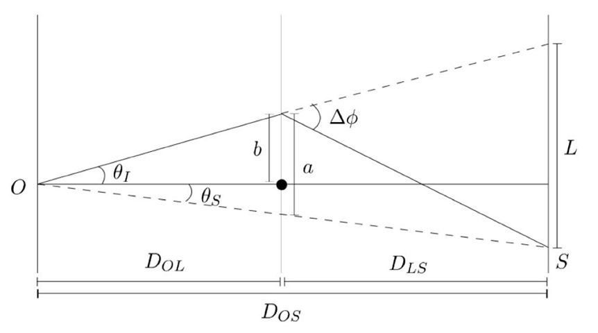

# B5 General Relativity and Cosmology <!-- omit in toc -->
- [The Maths of Curved spacetime](#the-maths-of-curved-spacetime)
  - [Transformation laws](#transformation-laws)
  - [The Covariant Derivative](#the-covariant-derivative)
  - [The Curvature Tensor](#the-curvature-tensor)
  - [Parallel Transport](#parallel-transport)
  - [The Ricci Tensor](#the-ricci-tensor)
  - [Bianchi Identities](#bianchi-identities)
- [Gravity](#gravity)
  - [Gravitational and Inertial Mass](#gravitational-and-inertial-mass)
  - [Equivalence Principles](#equivalence-principles)
  - [The Geodesic Equation](#the-geodesic-equation)
  - [The Metric](#the-metric)
  - [The Newtonian Limit](#the-newtonian-limit)
- [The Einstein Field Equations](#the-einstein-field-equations)
  - [The Stress-Energy Tensor](#the-stress-energy-tensor)
  - [The Field Equations](#the-field-equations)
- [The Schwartzchild Solution](#the-schwartzchild-solution)
  - [The Schwartzchild Metric](#the-schwartzchild-metric)
  - [Schwartzchild Spacetime](#schwartzchild-spacetime)
    - [Radial Photons](#radial-photons)
      - [Orbits](#orbits)
- [Tests of GR](#tests-of-gr)
  - [Gravitational Deflection of Light](#gravitational-deflection-of-light)
    - [Modelling Gravitational Lensing](#modelling-gravitational-lensing)
  - [The Perihelion Advance of Mercury](#the-perihelion-advance-of-mercury)
  - [Shapiro Time Delay](#shapiro-time-delay)
- [Linearised Gravity and Radiation](#linearised-gravity-and-radiation)
  - [Gravitational Waves](#gravitational-waves)
    - [Gauge Invariance](#gauge-invariance)
    - [Plane Waves and TT gauge](#plane-waves-and-tt-gauge)
    - [The Quadrupole Formula](#the-quadrupole-formula)
    - [Radiation](#radiation)

# The Maths of Curved spacetime
## Transformation laws

The simplest vector we can write is the differential coordinate $dx^\mu$ if we transform to some primed frame

$$
dx^{\prime\mu} = \frac{\partial x^{\prime\mu}}{\partial x^\nu}dx^\nu
$$

> Here $dx^\nu$ is a true vector and $x^\nu$ is a component. So the whole vector is $x^\nu dx^\nu$.

We can now define an arbitrary contravariant vector transformation as...

$$
V^{\prime\mu} = \frac{\partial x^{\prime\mu}}{\partial x^\nu}V^\nu
$$

and a covariant vector transformation is...

$$
V^\prime_\mu =  \frac{\partial x^\nu}{\partial x^{\prime\mu}}V_\nu
$$

> Remember this with CO LOW PRIME BELOW.

Any contravariant tensor, covariant tensor, or mixed tensor is transformed by stacking these transformations (in fact this is what defines them as Tensors).

## The Covariant Derivative

Looking at the covariant transformation you can expect it would have a different kind of derivative. You'd be right! Let's try it...

$$
\frac{dA^{\prime\alpha}}{d\tau} = \frac{d}{d\tau}\bigg(\frac{\partial\xi^\alpha}{\partial x^\mu}A^\mu\bigg) = \frac{\partial\xi^\alpha}{\partial x^\mu}\frac{dA^\mu}{d\tau} + \frac{\partial^2\xi^\alpha}{\partial x^\mu\partial x^\nu}\frac{dx^\nu}{d\tau}A^\mu
$$

If we transform this result back to the unprimed frame we get...

$$
\frac{\partial x^\lambda}{\partial\xi^\alpha}\frac{dA^{\prime\alpha}}{d\tau} = \frac{dA^\lambda}{d\tau} + \Gamma^\lambda_{\mu\nu}A^\mu\frac{dx^\nu}{d\tau}
$$

Where we've used the affine connection...
$$
\Gamma^\rho_{\mu\nu} = \frac{\partial x^\rho}{\partial\xi^\alpha}\frac{\partial^2\xi^\alpha}{\partial x^\mu \partial x^\nu}
$$

We can now define the covariant derivative as...
$$
\nabla_\mu A^\lambda = A^\lambda_{;\mu} = \frac{dA^\lambda}{dx^\mu} + \Gamma^\lambda_{\mu\nu}A^\mu
$$

Finally the covariant derivative of tensors is given by...

$$
T^{\lambda\kappa}_{;\mu} = \frac{\partial T^{\lambda\kappa}}{\partial x^\mu} + \Gamma^\lambda_{\mu\nu}T^{\nu\kappa} + \Gamma^\kappa_{\nu\mu}T^{\lambda\nu}\\
\ \\
T_{\lambda\kappa;\mu} = \frac{\partial T_{\lambda\kappa}}{\partial x^\mu} - \Gamma_{\lambda\mu}^\nu T_{\nu\kappa} - \Gamma^\nu_{\kappa\mu}T_{\lambda\nu}\\
\ \\
T^\lambda_{\kappa;\mu} = \frac{\partial T^\lambda_\kappa}{\partial x^\mu} + \Gamma^\lambda_{\nu\mu}T^\nu_\kappa - \Gamma^\nu_{\kappa\mu}T^\lambda_\nu\\
$$
## The Curvature Tensor

The covariant derivative obeys most of the rules of a normal partial derivative but it doesn't necessarily commute after some algebra we find...

$$
\begin{aligned}
V^\mu_{;\sigma;\tau} - V^\mu_{;\tau;\sigma} &= \Big[\partial_\tau\Gamma^\mu_{\lambda\sigma} - \partial_\sigma\Gamma^\mu_{\lambda\tau} + \Gamma^\mu_{\nu\tau}\Gamma^\nu_{\lambda\sigma} - \Gamma^\mu_{\nu\sigma}\Gamma^\nu_{\lambda\tau}\Big]V^\lambda\\
&= R^\mu_{\lambda\sigma\tau}V^\lambda
\end{aligned}
$$

Since the left hand side is a tensor and $V^\lambda$ is a vector we have that $R^\mu_{\lambda\sigma\tau}$ is a valid tensor. We call this the *Riemann curvature tensor*.

Finally we can write a fully covariant Curvature Tensor...
$$
R_{\lambda\mu\nu\kappa} = g_{\lambda\sigma}R^\sigma_{\mu\nu\kappa}
$$

## Parallel Transport

Parallel transport is defined as when the covariant derivative along $x(\tau)$ vanishes so...

$$
V_{;\lambda} = 0\\\ \\
\implies \frac{dV_\lambda}{d\tau} = \Gamma^\mu_{\lambda\nu}\frac{dx^\nu}{d\tau}V_\mu\\\ \\ 
\implies dV_\lambda = \Gamma^\mu_{\lambda\nu}V_\mu dx^\nu 
$$

If we taylor expand $\Gamma^\mu_{\lambda\nu}$ around some initial value $X^\nu$ we can show that the integral of $dV_\lambda$ around some small loop is given by...

$$
\Delta V_\lambda = \frac{1}{2}R^\sigma_{\lambda\nu\rho}V_\sigma dx^\rho dx^\nu
$$

So we get a surface integral sort of like stokes theorem. What's more closed integrals are not zero if there is curvature. You can try this by moving a pencil in  a closed loop around a table and doing the same with a globe (without rotating the pencil). One has the pencil come back in the same rotation and the other doesn't!!

## The Ricci Tensor

The Ricci tensor is a contraction of the curvature tensor...
$$
R_{\mu\kappa} = g^{\lambda\nu}R_{\lambda\mu\nu\kappa}
$$

The Ricci tensor will soon help us write an Einstein's Laplace equation!

There is one more contraction, the Ricci scalar...

$$
R = R^\mu_\mu = g^{\mu\kappa}R_{\mu\kappa}
$$

## Bianchi Identities

The Bianchi identities are analagous to $\nabla\cdot(\nabla\times\bold{V})=0$ for other vectors. The derivation is done in freely falling coordinates (and then generalises to all frames) and uses that the curvature tensor is cyclic. We end up with...

$$
\bigg(R^{\mu\nu} - g^{\mu\nu}\frac{R}{2}\bigg)_{;\mu} = 0
$$

This result will be very useful

# Gravity

If General relativity is meant to be an improvement on the Newtonian view of gravity it helps to know what we're improving on. The force due to newtonian gravity is given by...

$$
\bold{F} = Gm_1m_1\frac{\bold{x}_2-\bold{x}_1}{|\bold{x}_2-\bold{x}_1|^3}
$$

If we say the resulting gravitational acceleration experienced by $m_1$ is $\bold{g}$ then we can write $\bold{g}$ in terms of a potential $\bold{g} = -\nabla\phi$ such that

$$
\phi(\bold{x}) = \sum_i\frac{Gm_i}{|\bold{x}-\bold{x}_i|}
$$

for a distribution of point masses $m_i$. If we want to generalise this to a continuous distribution then we have

$$
\nabla^2\phi = 4\pi G\rho
$$

Where $\rho$ is the density of mass. It is going to be important to get some relationship like that in the newtonian limit if we want general relativity to work as an explanation of gravity.

## Gravitational and Inertial Mass

In the above we used the mass in Newton's Law of Gravitation and Newton's second law were the same. This is not necessarily the case. We call the mass in the former *Gravitational Mass* and in the latter *Inertial Mass*. Imagine we have two masses suspended on a rod. They will be subject to a gravitational force $g$ in the direction that rotates the rod. If their gravitational and inertial masses are different we would expect them to accelerate in that direction...

$$
m_{I1}a_1 = m_{G1}g\\
m_{I2}a_2 = m_{G2}g
$$

We can rearrange these accelerations to a dimensionless quantity and measure it in experiment...

$$
R = \frac{a_1-a_2}{a_1+a_2} = \frac{(m_{G1}/m_{I1} - m_{G2}/m_{I2})}{(m_{G1}/m_{I1} + m_{G2}/m_{I2})}\approx(0.3\pm1.8)\times 10^{-13}
$$

This value is so small we can construct some Equivalence Principles..

## Equivalence Principles

+ Weak Equivalence Principle: All uncharged freely falling particles follow the same trajectory if given the same initial conditions.
+ Einstein Equivalence Principle: WEP but also in all freely falling frames we recover (locally) special relativistic physics.
+ Strong Equivalence Principle: WEP is valid for massive gravitating objects and also test particles and in all freely falling frames we recover special relativistic physics.

This is basically a statement that if you fall freely you can no longer notice the effects of gravity. Freely falling frames are in flat spacetime and regain special relativistic physics. What's more is that since accelerating to meet gravity cancels it out accelerating from a freely falling frame produces an indistinguishable effect from gravity!

$$
\begin{aligned}
\frac{d^2x}{dt^2}&=0\\
x &= x^\prime + \frac{gt^2}{2}\\
\implies \frac{d^2x^\prime}{dt^2} &= -g
\end{aligned}
$$

## The Geodesic Equation

Remember the weird way the equivalence principle was phrased?

It meant a particles path through a gravitational field is the same as if it's path was a straight line through an accelerated frame. Finding a trajectory then is as simple as drawing the equivalent of a straight line in curved spacetime. The straight line through curved space is called a geodesic and is (like a line in Minkowski spacetime) the shortest path between two points.

So for our local inertial coordinates we have...

$$
\frac{d^2\xi^\alpha}{d\tau^2} = 0
$$

Where $\xi^\mu$ represents local inertial coordinates

Our straight line through local Mincowski like spacetime is simply a stationary point w.r.t proper time...

Now we transform to general coordinates using the chain rule.

$$
0 = \frac{d}{d\tau}\bigg(\frac{\partial\xi^\alpha}{\partial x^\mu}\frac{dx^\mu}{d\tau}\bigg) = 
\frac{\partial\xi^\alpha}{\partial x^\mu}\ddot{x}^\mu + \dot{x}^\mu\dot{x}^\nu\frac{\partial^2\xi^\alpha}{\partial x^\mu \partial x^\nu} = 
\frac{\partial\xi^\alpha}{\partial x^\mu}\frac{\partial x^\rho}{\partial\xi^\alpha}\ddot{x}^\mu + \dot{x}^\mu\dot{x}^\nu\frac{\partial^2\xi^\alpha}{\partial x^\mu \partial x^\nu}\frac{\partial x^\rho}{\partial\xi^\alpha}
$$

Where the last expression is just multiplied through by $\frac{\partial x^\rho}{\partial\xi^\alpha}$ This helps us rewrite the first term as $\frac{\partial\xi^\alpha}{\partial x^\mu}\frac{\partial x^\rho}{\partial\xi^\alpha} = \delta^\rho_\mu$. This gives the full geodesic...

$$
\frac{d^2x^\rho}{d\tau^2} + \Gamma^\rho_{\mu\nu}\frac{dx^\mu}{d\tau}\frac{dx^\nu}{d\tau}=0\\\ \\
\Gamma^\rho_{\mu\nu} = \frac{\partial x^\rho}{\partial \xi^\alpha}\frac{\partial^2\xi^\alpha}{\partial x^\mu\partial x^\nu}
$$

This fully describes the trajectory of a particle through curved spactime. As we saw before $\Gamma^\rho_{\mu\nu}$ is the affine connection. It is not actually a tensor but it does clearly contain a lot of information about the curvature of the system.

## The Metric

General relativity is all about curved spacetime. We need some way to describe this spacetime and luckily we basically already have it! Remember in special relativity we had the metric...

$$
g_{\mu\nu} = \eta_{\mu\nu} = \begin{pmatrix}
  -1 & 0 & 0 & 0\\
    0 & 1 & 0 & 0\\
    0 & 0 & 1 & 0\\
    0 & 0 & 0 & 1\\
\end{pmatrix}
$$

If we go back to our local inertial coordinates

$$
-c^2d\tau^2 = \eta_{\alpha\beta}d\xi^\alpha d\xi^\beta = d\xi_\beta d\xi^\beta
$$

And we can generalise this for any coordinate system...

$$
-c^2d\tau^2 = g_{\mu\nu}dx^\mu dx^\nu\\
\text{where}\\
g_{\mu\nu} = \eta_{\alpha\beta}\frac{\partial\xi^\alpha}{\partial x^\mu}\frac{\partial\xi^\beta}{\partial x^\nu}
$$

Notice we recover $g_{\mu\nu} = \eta_{\mu\nu}$ in flat space time (where $dx^\nu = d\xi$) plus we still have the identities...

$$
g_{\mu\nu} = g_{\nu\mu}\\
g_{\mu\nu}g^{\nu\rho} = \delta_\mu^\rho\\
\ \\
\partial_\mu = \frac{\partial}{\partial x^\mu}\implies
\partial_\mu x_\nu = g_{\mu\nu}
$$

We can now write the affine connection in terms of the metric...

$$
\Gamma^\rho_{\mu\nu} = \frac{1}{2}g^{\rho\sigma}(\partial_\mu g_{\nu\sigma} + \partial_\nu g_{\nu\sigma} - \partial_\sigma g_{\nu\mu})
$$

So for a diagonal metric...

$$
\begin{aligned}
\Gamma^a_{ba} = \Gamma^a_{ab} &= \frac{1}{2g_{aa}}\frac{\partial g_{aa}}{\partial x^b}\text{ No sum here despite repeated indices}\\
\Gamma^a_{bb} &= -\frac{1}{2g_{aa}}\frac{\partial g_{bb}}{\partial x^a}\text{ No sum}\\
\Gamma^a_{bc} &= 0 
\end{aligned}
$$

## The Newtonian Limit

So now we have the geodesic and a metric to describe it with but what do we do with it?? Well let's first check it still fits in the Newtonian limit. We can describe the newtonian limit as having...

+ **Weak Gravity**: The metric is close to the minckowski metric. So $g_{\mu\nu} = \eta_{\mu\nu} + h_{\mu\nu}$ and $g^{\mu\nu} = \eta^{\mu\nu} - h^{\mu\nu}$ with $|h_{\mu\nu}| \llless 1$
+ **Slow Motion**: $\bold{v}\llless c$ or $cdt\llless dx^i$ of $\tau\approx t$.
+ **Slowly Varying Gravitational Fields**: This means that derivatives of metrics can be ignored.

This gives for $g_{00}$

$$
\frac{d^2x^\rho}{d\tau^2} + \Gamma^\rho_{00}\bigg(\frac{dx^0}{d\tau}\bigg)^2\approx0\\\ \\
\Gamma^\rho_{00} = -\frac{1}{2}g^{\rho\mu}\frac{\partial g_{00}}{\partial x^\mu} = -\frac{1}{2}\eta^\rho\mu\frac{\partial h_{00}}{\partial x^\mu} = \frac{1}{2}\frac{\partial h_{00}}{\partial x^\rho}\\\ \\
\implies \frac{d^2\bold{x}}{d\tau^2} = \frac{1}{2}\bigg(\frac{dx^0}{d\tau}\bigg)^2\nabla h_{00}
$$

Which is comparable to the Newtonian result! All we need is...

$$
g_{00} = -\bigg(1+\frac{2\phi}{c^2}\bigg) \implies h_{00} = -\frac{2\phi}{c^2}
$$

# The Einstein Field Equations

We now have all the mathematical framework needed to make a Einstein Poisson equation. Similar to 

$$
\nabla^2\phi = 4\pi G\rho
$$

## The Stress-Energy Tensor

For this to work though we need a source term, like $\rho$ which (to be properly equivalent to curvature) would probably be a tensor. Our source term terns out to be the **stress energy tensor** for a system of particles with 4-velocities $U^\nu$ this is defined as...

$$
T^{\mu\nu} = \rho\big<U^\mu U^\nu\big>
$$

Where the brackets mean an average.

For an ideal isotropic fluid in the rest frame we have...

$$
T^{\mu\nu} = \begin{pmatrix}
\rho c^2  & 0 & 0 & 0 \\
0         & P & 0 & 0 \\
0         & 0 & P & 0 \\
0         & 0 & 0 & P \\
\end{pmatrix}
$$

We can then write a tensor to describe it in this frames and this tensor must describe it in all frames therefore

$$
T^{\mu\nu} = P\eta^{\mu\nu} + (\rho + P/c^2)U^\mu U^\nu
$$

Fully describes the stress energy tensor.

It turns out this stress tensor is conserved...
$$
\partial_\mu T^{\mu\nu} = 0
$$

The zeroth component of this is a statement of energy conservation and the space components imply conservation of momentum!

## The Field Equations

So we expect our field equations to be of the form...

$$
G_{\mu\nu} = CT_{\mu\nu}
$$

Where $C$ is a constant. We can also guess that $G_{\mu\nu}$ is a tensor comprised of $g_{\mu\nu}$ it's second derivatives or quadratic products of the first derivatives of $g_{\mu\nu}$. We want the same result as above for our newtonian limit. No specific length scale and for the left hand side to scale as $1/r^2$ (This last one is actually wrong but it's close enough)

We know that $T^{\mu\nu}_{;\nu}=0$ and we can satisfy this if...

$$
G_{\mu\nu} \propto R_{\mu\nu}-\frac{g_{\mu\nu}R}{2}
$$

As this has the same property according to the [Bianchi Identities](#bianchi-identities) if we absorb the proportionality into $C$ we get...

$$
R_{\mu\nu} - \frac{g_{\mu\nu}R}{2} = CT_{\mu\nu}
$$

Multiplying through by $g^{\mu\nu}$ we get...

$$
R - \frac{4R}{2} = -R = CT
$$

So the first equation becomes...

$$
R_{\mu\nu} - \frac{g_{\mu\nu}(-CT)}{2} = CT_{\mu\nu}\\\ \\
\implies R_{\mu\nu} = C\bigg(T_{\mu\nu}-\frac{g_{\mu\nu}T}{2}\bigg) \equiv CS_{\mu\nu}\\\ \\
\boxed{S_{\mu\nu} \equiv T_{\mu\nu}-\frac{g_{\mu\nu}T}{2}}
$$

$S_{\mu\nu}$ is something called the source term which is useful in calculations.

Let's check this against newtonian gravity. Here the $g_{00}$ terms dominate and $g_{00}\approx\eta_{00}$ this means that...

$$
R_{00} = C\frac{\rho c^2}{2}
$$

From explicitly breaking down the Curvature tensor into the Ricci tensor we can find that...
$$
R_{00} = \eta^{\lambda\nu}R_{\lambda0\nu0} = \frac{1}{2}\eta^{\lambda\nu}\frac{\partial^2g_{00}}{\partial x^\lambda\partial x^\nu} = -\frac{1}{c^2}\nabla^2\phi = C\frac{\rho c^2}{2}
$$

So to match Newtonian gravity we need $C = -8\pi G/c^4$ This gives the full Einstein Field Equations...

$$
\boxed{G_{\mu\nu}\equiv R_{\mu\nu} - \frac{1}{2}g_{\mu\nu}R=-\frac{8\pi G}{c^4}T_{\mu\nu} + (\Lambda g_{\mu\nu})} 
$$

The extra $\Lambda$ term is the cosmological constant and not necessary unless on cosmological scales.

We can also write this in source tensor form...

$$
R_{\mu\nu} = -\frac{8\pi G}{c^4}S_{\mu\nu}
$$

# The Schwartzchild Solution

The simplest possible solution to this is a solution for a point mass $M$. Here the source tensor $S_{\mu\nu}=0$ so we have $R_{\mu\nu}=0$ to solve. Since this spacetime would be spherically symmetric we have the initial metric...

$$
-c^2d\tau^2 = -Bc^2dt^2 + Adr^2 + r^2d\Omega^2\\
d\Omega^2 = d\theta^2 + \sin^2\theta d\phi^2
$$

We can expect $A$ and $B$ to be functions of $r$.

We get that...
$$
\begin{matrix}
g_{tt} = -B(r) & g_{rr}=A(r) & g_{\theta\theta} = r^2 & g_{\phi\phi} = r^2\sin^2\theta\\
g^{tt} = -B^{-1}(r) & g^{rr}=A^{-1}(r) & g^{\theta\theta} = r^{-2} & g^{\phi\phi} = r^{-2}(\sin\theta)^{-2}\\
\end{matrix}
$$

The affine connection for a diagonal matrix is...

$$
\Gamma^a_{ab} = \Gamma^a_{ba} = \frac{1}{2g_{aa}}\frac{\partial g_{aa}}{\partial x^b}\\\ \\
\Gamma^a_{bb} = -\frac{1}{2g_{aa}}\frac{\partial g_{bb}}{\partial x^a}\\\ \\
\text{Neither has a sum}
$$

This means we can write the various terms of the connection in terms of $A$, $B$, $r$, and $\theta$. Finally we put these into the Ricci Tensor...

$$
R_{\mu\nu} = \partial_\kappa\Gamma^\lambda_{\mu\lambda} - \partial_\lambda\Gamma^\lambda_{\mu\kappa} + \Gamma^\eta_{\mu\lambda}\Gamma^\lambda_{\kappa\eta} - \Gamma^\eta_{\mu\kappa}\Gamma^\lambda_{\lambda\eta}= 0
$$

This causes a lot of algebra and is horrible but the result is the Schwartzchild Metric!

## The Schwartzchild Metric

The Schwartzchild Metric is...

$$
-c^2d\tau^2 = -\bigg(1-\frac{2GM}{rc^2}\bigg)c^2dt^2 + \bigg(1-\frac{2GM}{rc^2}\bigg)^{-1}dr^2 + r^2d\Omega
$$

explicitly this can be written as

$$
g_{\mu\nu} = \begin{pmatrix}
-\bigg(1-\frac{2GM}{rc^2}\bigg) & 0 & 0& 0\\
0 &-\bigg(1-\frac{2GM}{rc^2}\bigg)^{-1} & 0 & 0\\
0&0&r^2&0\\
0&0&0&r^2\sin^2\theta
\end{pmatrix}
$$

We can see that we get a singularity at $r = R_s = \frac{2GM}{c^2}$ this is the schwartzchild radius and although there is a singular appearance here this is actually just a result of our choice of coordinates and not such a big deal.

## Schwartzchild Spacetime

We can interpret this geodesic in terms of proper time and length.

$$
\int d\tau = \int\bigg(1-\frac{2GM}{rc^2}\bigg)^{1/2}dt\\
\int dl = \int\bigg(1-\frac{2GM}{rc^2}\bigg)^{-1/2}dr\\
$$

Where $dl$ is differential proper length.

### Radial Photons

The gravitational redshift recorded by an observer at infinity relative to someone at r in the spacetime is...

$$
dt = \frac{d\tau}{(1-2GM/rc^2)^{1/2}}
$$

At $r\rightarrow R_s$ we have infinite redshift! No light escapes the event horizon. More explicitly for a radial photon on a geodesic path we have...

$$
-(1-2GM/rc^2)c^2dt^2 + dr^2/(1-2GM/rc^2) = 0
$$

So moving from point $r_A$ to point $r_B$ we get...
$$
\begin{aligned}
t_{AB} &= \int^B_Adt = \frac{1}{c}\int^{r_B}_{r_A}\frac{dr}{(1-2GM/rc^2)} \\\ \\
&= \underbrace{\frac{r_B-r_A}{c}}_\text{Newtonian Result} + \underbrace{\frac{R_s}{c}\ln\bigg(\frac{r_B-R_s}{r_A-R_s}\bigg)}_\text{Relativistic correction} 
\end{aligned}
$$

The relatavistic correction blows up to infinity when we start within $R_s$ (or end).

#### Orbits

Here we want to actually solve the geodesic for orbits around a point mass. Annoyingly the differential time $d\tau$ is $0$ for a photon geodesic so we need to use a new quantity $dp$ where $\tau\propto p$ by some constant which is $0$ for a photon. The easiest way is to use the Euler lagrange equations...

$$
\frac{d^2x^\lambda}{dp^2} + \Gamma^\lambda_{\mu\nu}\frac{dx^\mu}{dp}\frac{dx^\nu}{dp} = 0\\\ \\
\implies \mathcal{L}=g_{\mu\nu} \frac{dx^\mu}{dp}\frac{dx^\nu}{dp} = B(r)c^2\dot{t}^2 + A(r)\dot{r}^2 + r^2\dot{\phi}^2
$$

Here a dot means $d/dp$. We can fix $\theta$ to $\pi/2$ without loss of generality so we can ignore that component. If we evaluate the Euler lagrange equations we get...

$$
\begin{aligned}
\frac{d}{dp}\bigg(\frac{\partial\mathcal{L}}{\partial\dot{t}}\bigg) = -2c^2\frac{d}{dp}\bigg(B\frac{dt}{dp}\bigg) &= 0\\\ \\
\frac{d}{dp}\bigg(\frac{\partial\mathcal{L}}{\partial\dot{\phi}}\bigg) = 2\frac{d}{dp}\bigg(r^2\frac{d\phi}{dp}\bigg) &= 0
\end{aligned}
$$

These can be solved as...

$$
\begin{aligned}
\frac{dt}{dp} &= B^{-1}\\\ \\
r^2\frac{d\phi}{dp} &= J
\end{aligned}
$$

For r we can write the line element for $(d\tau/dp)^2$ and solve.

$$
\begin{aligned}
-c^2B\bigg(\frac{dt}{dp}\bigg)^2 + A\bigg(\frac{dr}{dp}\bigg)^2 + r^2\bigg(\frac{d\phi}{dp}\bigg)^2 &= -c^2\frac{d\tau}{dp}^2\\\ \\
A\bigg(\frac{dr}{dp}\bigg)^2 + \frac{J^2}{r^2} - \frac{c^2}{B} &= -E \text{\ (constant)}
\end{aligned}
$$

In the Newtonian limit we see that the $c^2/B$ term dominates and as $B\sim1$ in that limit we see that $E=c^2$ so E is the rest mass energy per unit mass.

For a bound orbit where $dr/dp = 0$ we can substitute B in to find...

$$
\bigg(1-\frac{2GM}{rc^2}\bigg)\bigg(\frac{J^2}{r^2}+E\bigg) - c^2 = 0\\\ \\
\bigg(1-\frac{2GM}{rc^2}\bigg)\frac{J^2}{r^2} - c^2 = 0 \text{  (for photons)}
$$

Finally we can get the radial equations...

$$
\bigg(\frac{dr}{d\tau}\bigg)^2 + Bc^2\bigg(1+\frac{J^2}{Er^2}\bigg)=\frac{c^4}{E}\\\ \\
\bigg(\frac{dr}{dt}\bigg)^2 + B^3\bigg(E+\frac{J^2}{r^2}\bigg)=B^2c^2\\\ \\
\bigg(\frac{dr}{d\phi}\bigg)^2 + r^2B\bigg(1+\frac{Er^2}{J^2}\bigg)=\frac{c^2r^4}{J^2}\\\ \\
$$

# Tests of GR

## Gravitational Deflection of Light

While we have some idea how of light in closed orbits around masses behave it's easier to observe how light is deflected by a mass. If we consider light coming from $r=-\infty$ to $r=+\infty$ we classically expepect to see $\Delta\phi=\pi$ (no deflection) but with GR it's quite different! If we take the last of the orbit equations and write it in terms of $u=1/r$ we get...

$$
\bigg(\frac{du}{d\phi}\bigg) + u^2\bigg(1-\frac{2GMu}{c^2}\bigg) = \frac{c^2}{J^2}
$$

Where $E=0$ for a photon Differentiating w.r.t $\phi$ we get...
$$
u^{\prime\prime} + u = \frac{3GM}{c^2}u^2 = \alpha u\\
\alpha = \frac{3GM}{c^2}
$$

We can split up $u$ into a larger term and a small correction $u=u_0+\delta u$. Where $\delta u = \mathcal{O}(\alpha u_0) \ll u_0$. This leaves us with two equations.

$$
u_0^{\prime\prime} + u_0 = 0\\\ \\
\implies u_0 = \frac{\sin\phi}{b} \text{(The Newtonian solution)}\\\ \\
\delta u^{\prime\prime} + \delta u = \alpha u_0^2 = \frac{\alpha}{2b^2}(1-\cos 2\phi)\\\ \\
\implies \delta u = \frac{\alpha}{2b^2}\bigg(1 + \frac{1}{3}\cos2\phi\bigg)\\\ \\
\implies u = \frac{\sin\phi}{b} + \frac{\alpha}{2b^2}\bigg(1 + \frac{1}{3}\cos2\phi\bigg)
$$

For the case that $r\rightarrow\infty$ we have $u\rightarrow0$ and (for a first order approximation) $\phi=0,\pi$ in the $\cos$ function. This gives us...
$$
\Delta\phi = \frac{4\alpha}{3b} = \frac{4GM}{bc^2}
$$

### Modelling Gravitational Lensing

 
The geometry of gravitational lensing, Observer at O and the Source at S

In small angle approximation we have

$$
\begin{aligned}
  \theta_ID_{OL} &= b\\
  \theta_SD_{OL} &= a - b\\
  (\theta_I + \theta_S)(D_{OL} + D_{LS}) &= L\\
  \Delta\phi D_{LS} &= L\\
  \implies (\theta_I + \theta_S)D_{OL} = b + (a-b) &= a\\
  \implies (\theta_I + \theta_S)(D_{OL} + D_{LS}) = \frac{a}{D_{OL}}(D_{OL} + D_{LS}) &= \Delta\phi D_{LS}\\
  a = \frac{D_{OL}D_{LS}}{D_{OS}\Delta\phi}
\end{aligned}
$$

For a set of many points in the lens plane we can write this as an integral where $\bold{x}$ is the point where the light rays intersect the plane.

$$
\bold{a}(\bold{x}) = \frac{D_{OL}D_{LS}}{D_{OS}}\frac{4G}{c^2}\int d^3\bold{x}^\prime\rho(\bold{x}^\prime)\frac{\bold{x}-\bold{x}^\prime}{|\bold{x}-\bold{x}^\prime|^2}
$$

For a Einstein ring we have the source directly behind the mass so $\theta_S = 0$ and we end up with...

$$
\boxed{\theta_I = \bigg(\frac{4GM}{c^2}\frac{D_{LS}}{D_{OL}D_{OS}}\bigg)^{1/2}}
$$

## The Perihelion Advance of Mercury

Because the gravitational potential isn't quite $1/r$ we can expect to see a slightly open elliptical orbits so the perihelion will precess. Starting similarly to the deflection of light above but with $E=1$ for matter.

$$
u^{\prime\prime} + u = \frac{3GM}{c^2}u^2 + \frac{GM}{J^2}
$$

In the Newtonian case the first term on the right hand side is small so we ignore it and get the solution...

$$
u_0 = \frac{GM}{J^2}(1+e\cos\phi)
$$

Doing a similar thing as before and letting $u=u_0+\delta u$ we get a differential equation for $\delta u$

$$
\delta u^{\prime\prime} + \delta u = a(1+2e\cos\phi + e^2\cos^2\phi)\\
a = \frac{3(GM)^3}{c^2J^4}
$$

If we write this in exponential form where $\delta\tilde{u} = \delta u$ we can find a solution and add this perturbation to $u$ to get the final solution of...

$$
u \approx \frac{GM}{J^2}(1 + e\cos\phi + \alpha e\phi\sin\phi)\\
\alpha = 3(GM/Jc)^2\ll1
$$

This corresponds to a taylor expansion

$$
u = \frac{GM}{J^2}(1 + e\cos[\phi(1-\alpha)])
$$

This means that the orbit period becomes...

$$
T = \frac{2\pi}{1-\alpha} \approx 2\pi + 2\pi\alpha
$$

This gives a perihelion advance of...

$$
\Delta\phi = 2\pi\alpha = 6\pi\bigg(\frac{GM}{Jc}\bigg)^2 = 6\pi\bigg(\frac{GM}{c^2l}\bigg)
$$

So for Mercury $\Delta\phi=43$ arc seconds per century.

## Shapiro Time Delay

# Linearised Gravity and Radiation 

## Gravitational Waves

We can linearise the gravitational field equations if we use the weak field limit so 
$$
g_{\mu\nu} = \eta_{\mu\nu} + h_{\mu\nu}\\
g^{\mu\nu} = \eta^{\mu\nu} - h^{\mu\nu}\\
|h_{\mu\nu}\ll1|
$$

In the weak field limit we can write the Ricci tensor as 
$$
R_{\mu\nu} = \frac{1}{2}\eta^{\rho\lambda}(\partial_\mu\partial_\rho h_{\nu\lambda} + \partial_\nu\partial_\lambda h_{\rho\mu} - \partial_\lambda\partial_\rho h_{\mu\nu} - \partial_\mu\partial_\nu h_{\rho\lambda})
$$

Defining $\Box = \partial_\rho\partial^\rho$ and $h=h^\rho_\rho$ we have...
$$
R_{\mu\nu} = \frac{1}{2}(\partial_\rho\partial_\mu h^\rho_\nu + \partial_\rho\partial_\nu h^\rho_\mu - \partial_\mu\partial_\nu h - \Box h_{\mu\nu})
$$

With 

$$
R = \partial_\mu\partial_\nu h^{\mu\nu} - \Box h
$$

So our linearised tensor is...

$$
G_{\mu\nu} = \frac{1}{2}(\partial_\rho\partial_\mu h^\rho_\nu + \partial_\rho\partial_\nu h^\rho_\mu - \partial_\mu\partial_\nu h - \Box h_{\mu\nu} - \eta_{\mu\nu}\partial_\mu\partial_\nu h^{\mu\nu} + \eta_{\mu\nu}\Box h)
$$

### Gauge Invariance

As with electromagnetism the Gravitational field is gauge invariant. The gauge transformation looks like this
$$
h_{\mu\nu} \rightarrow h_{\mu\nu} + \partial_\mu\xi_\nu + \partial_\nu\xi_\mu
$$ 

This leaves the Ricci tensor (and so curvature) unchanged. We chose the *harmonic gauge*

$$
\boxed{\partial^\mu\bar{h}_{\mu\nu} = \partial^\mu\bigg(h_{\mu\nu} - \frac{1}{2}\eta_{\mu\nu}h\bigg)} = 0
$$

This leads to $G_{\mu\nu} = -\frac{1}{2}\Box\bar{h}_{\mu\nu}$ So for $\Lambda = 0$ we have a wave equation...

$$
\Box\bar{h}_{\mu\nu} = -\frac{16\pi G}{c^4\mathbb{T}_{\mu\nu}}
$$

Which gives us gravitational waves. It turns out the solution to this has the form...

$$
\bar{h}_{\mu\nu}(\bold{r},t) = \frac{4G}{c^4}\int\frac{T_{\mu\nu}(\bold{r}^\prime,t-R/c)}{R}d^3\bold{r}^\prime
$$

Which looks very similar to the retarded potential for EM waves!

### Plane Waves and TT gauge

Linear gravitational waves have only two modes of polarization. In the Transverse Traceless (TT) coordinates a plane wave in the $z$ direction has one mode with $h_{yy} = -h_{xx}$ and all other components being zero. The other mode is with $h_{xy}=h_{yx}$ The TT Gauge is only available for plane waves, at this point I'm not confident it would come up in questions so I'm not going to do any maths on it.

### The Quadrupole Formula

The quadrupole formula is

$$
\bar{h}^{ij} = \frac{2G}{c^6r}\frac{d^2I^{ij}}{dt^{\prime2}}
$$

Where $I^{ij}$ is the *quadropole moment tensor* and is defined by...

$$
I^{ij} = \int T^{00}x^{\prime i}x^{\prime j}d^3r^{\prime}
$$

This leads to a good numerical estimation...

$$
\frac{d^2I^{ij}}{dt^{\prime 2}} \sim Ma^2c^2\omega^2
$$

Where $M$ is characteristic mass of the system, $a$ is internal separation and $\omega$ is characteristic frequency. This gives...

$$
\bar{h}^{ij} \sim \frac{2GMa^2\omega^2}{c^4r} = \bigg(\frac{2.9532}{r_{km}}\bigg)\bigg(\frac{M}{M_\odot}\bigg)\bigg(\frac{a\omega}{c}\bigg)^2
$$

For LIGO where $r = 1.2\times10^{22}\text{km}$ and $(aw/c)^2 \sim 0.1$ because the system is very relativistic we get $\bar{h}_{ij} = 1.5\times10^{-21}$ which is just about the observed peak amplitude.

### Radiation

The calculation of the gravitational radiation formula is really long and complicated and I'm not overly sure it's on syllabus. (Toby doesn't include it, the Lecture notes do and the Syllabus just says "Simple Treatment of Radiation") The result is..

$$
L_{GW} = \frac{G}{5c^5}\frac{d^3J^{ij}}{dt^3}\frac{d^3J^{ij}}{dt^3}\\
J_{ij} = I_{ij} - \frac{1}{3} 
\delta_{ij}\delta^{mn}I_{mn}
$$