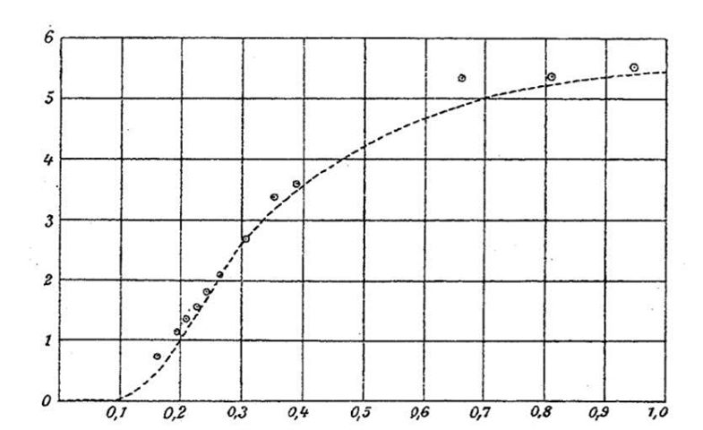

# B6 Condensed Matter Physics <!-- omit in toc -->

- [Introduction to Condensed Matter](#introduction-to-condensed-matter)
  - [Bonding Types](#bonding-types)
    - [List of Types](#list-of-types)
      - [Ionic Bonding](#ionic-bonding)
      - [Covalent Bonding](#covalent-bonding)
      - [Molecular Bonding](#molecular-bonding)
      - [Hydrogen Bonding](#hydrogen-bonding)
    - [One Dimensional Model of Bonding](#one-dimensional-model-of-bonding)
      - [Thermal Expansion](#thermal-expansion)
      - [Elasticity](#elasticity)
  - [Heat Capacity of Solids](#heat-capacity-of-solids)
    - [Einstein's Calculation](#einsteins-calculation)
    - [Born von Karman Boundaries](#born-von-karman-boundaries)
    - [Debye Model](#debye-model)
  - [Electrons in Metals](#electrons-in-metals)
    - [Drude Theory](#drude-theory)
      - [In Electromagnetic Fields](#in-electromagnetic-fields)
    - [Free Electron (Sommerfield) Theory](#free-electron-sommerfield-theory)
      - [Conductivity and Ohms Law](#conductivity-and-ohms-law)
      - [Mean Free Path](#mean-free-path)
      - [Density of States](#density-of-states)
      - [Heat Capacity](#heat-capacity)
- [Crystals](#crystals)
  - [Crystal Structure](#crystal-structure)
    - [Lattices](#lattices)
    - [The Unit Cell](#the-unit-cell)
    - [Lattices in 3D](#lattices-in-3d)
      - [The Body Centred Cubic (BCC) Lattice](#the-body-centred-cubic-bcc-lattice)
      - [The Face Centred Cubic (FCC) Lattice](#the-face-centred-cubic-fcc-lattice)
      - [Bravais Lattice Types](#bravais-lattice-types)
  - [The Reciprocal Lattice](#the-reciprocal-lattice)
    - [The Reciprocal Lattice as a Fourier Transform (The Structure Factor)](#the-reciprocal-lattice-as-a-fourier-transform-the-structure-factor)
    - [The Reciprocal Lattice as Families of Lattice Planes](#the-reciprocal-lattice-as-families-of-lattice-planes)
      - [Miller Indices](#miller-indices)
    - [Brillouin Zones](#brillouin-zones)
  - [Crystal Diffraction](#crystal-diffraction)
    - [Laue and Bragg](#laue-and-bragg)
      - [Using Fermi's golden rule](#using-fermis-golden-rule)
      - [Using Diffraction](#using-diffraction)
      - [Equivalence of Bragg and Laue](#equivalence-of-bragg-and-laue)
    - [Scattering Amplitudes and Structure Factors](#scattering-amplitudes-and-structure-factors)
      - [Neutrons](#neutrons)
      - [X-Rays](#x-rays)
      - [Comparison of Neutrons and X-Rays](#comparison-of-neutrons-and-x-rays)
      - [In practice](#in-practice)
      - [Systemic Absences Example](#systemic-absences-example)
- [Atomic Chains](#atomic-chains)
  - [The Monatomic Chain](#the-monatomic-chain)
    - [A dispersion relation](#a-dispersion-relation)
    - [Counting Normal Modes](#counting-normal-modes)
    - [Velocities](#velocities)
    - [Sound Waves](#sound-waves)
    - [Density of States](#density-of-states-1)
    - [Energy and Heat Capacity](#energy-and-heat-capacity)
  - [Diatomic Chain](#diatomic-chain)
    - [Optical and Acoustic modes](#optical-and-acoustic-modes)
- [Electrons in Solids](#electrons-in-solids)
  - [The Tight Binding Chain](#the-tight-binding-chain)
    - [Filling bands](#filling-bands)
    - [Two Orbitals per Atom (or Diatomic Case)](#two-orbitals-per-atom-or-diatomic-case)
      - [Band Gaps](#band-gaps)
    - [Insulators, Conductors, and Semiconductors](#insulators-conductors-and-semiconductors)
  - [Nearly Free Electrons](#nearly-free-electrons)
    - [Degenerate Perturbation Theory](#degenerate-perturbation-theory)
      - [Simple Case: $k$ is at The Brillouin Boundary](#simple-case-k-is-at-the-brillouin-boundary)
      - [Complicated Case: $k$ Not Quite on the Boundary](#complicated-case-k-not-quite-on-the-boundary)
      - [Higher Dimensions](#higher-dimensions)

# Introduction to Condensed Matter

## Bonding Types

### List of Types

There are 5 kinds of bonding covered in this course. Here is a table of them...

|      Type of Bonding      | Description                                                                                                                      | Typical Atoms                                                                                     | Typical Properties                                                                                                                                                         |
| :-----------------------: | -------------------------------------------------------------------------------------------------------------------------------- | ------------------------------------------------------------------------------------------------- | -------------------------------------------------------------------------------------------------------------------------------------------------------------------------- |
|           Ionic           | An electron is transferred from one atom to another and the resulting ions attract each other                                    | Binary compounds made of constituents with very different electronegativity. I.e Group I and VII. | <ul><li>Hard, very brittle</li> <li>High melting temp</li> <li>Electrical Insulators</li> <li>Water soluble</li> </ul>                                                     |
|         Covalent          | An electron is shared equally between two atoms forming a bond. The electron energy is lowered by delocalising the wavefunction. | Solids of only one element or compounds of similar electronegativities.                           | <ul> <li>Very Hard</li> <li>High melting point</li> <li>Electrical insulators or semiconductors</li> </ul>                                                                 |
|          Metalic          | Electrons are delocalised throughout the solid, acting as a bonding agent between the ions.                                      | Metals found on the left and middle of the Periodic table                                         | <ul> <li>Ductile and malleable due to the non-directional nature of the bond</li> <li>Lower melting temperature</li> <li>Good electrical and thermal conductors</li> </ul> |
| Molecular (Van-der-Waals) | There is no electron transfer. Instead the dipole moments of constituents align causing an attraction between the molecules.     | Noble gas solids, or solids made of slightly polar molecules.                                     | <ul> <li>Soft and weak (like Megan)</li> <li>Low melting temperature</li> <li>Electrical Insulators</li> </ul>                                                             |
|         Hydrogen          | Involves a $H^+$ ion bound to one atom but still attracted to the other.                                                         | Organic and biological materials.                                                                 | <ul> <li>Weak bond (but stronger than molecular)</li> <li>Important for maintaining the shape of DNA and proteins</li> </ul>                                               |

#### Ionic Bonding

In ionic bonds an electron is transferred from one atom to another and the resulting ions are attracted to one another. To describe this we need three terms...

+ *Ionisation energy* the energy cost to ionise the atom which forms positive ion.
+ *Electron Affinity* the energy released by the formation of the negative ion.
+ *Cohesive Energy* the energy released on forming the bond.

The change in energy is then...

$$
\Delta E = \text{Electron Affinity} + \text{Cohesive Energy} - \text{Ionisation Energy}
$$

We require that this is positive for the bond to form (i.e that energy will be released) Electron Affinity and Ionisation Energy have to be experimentally calculated but we can approximate cohesive energy using the coulomb attraction...
$$
\text{Cohesive Energy} \approx \frac{e^2}{4\pi\epsilon_0R}
$$

This actually leads to an **overestimation of $\Delta E$** as it ignores the interaction of the electron clouds when the atoms get very close.

#### Covalent Bonding

Covalent bonding is when an electron is shared between two similar atoms. We can imagine this electron having the Hamiltonian...

$$
H = T + V_1 + V_2\\\ \\
T = \frac{\bold{p}^2}{2m_e}\\\ \\
V_i = \frac{e^2}{4\pi\epsilon_0|\bold{r}-\bold{R}_i|}
$$

For a state of the form
$$
|\psi\big> = \phi_1|1\big> + \phi_2|2\big>
$$

Where $|1\big>$ and $|2\big>$ are the states an electron localised in each nucleus. This gives...

$$
H = \begin{pmatrix}
    E_0 + V_c   & -t\\
    -t^*        & E_0 + V_c
\end{pmatrix}
$$

Where
$$
\begin{aligned}
E_0 &= \big<1|T + V_1|1\big> = \big<2|T + V_2|2\big>\\
V_c &= \big<1|V_2|1\big> = \big<2|V_1|2\big>\\
t &= \big<1| H | 2\big>
\end{aligned} 
$$

$E_0$ is the hydrogenic energy of an electron in a single nucleus, $V_c$ is the *cross-term* energy associated with an electron in orbital $|1\big>$ feel the attraction of the other nucleus and vice versa, t is the *hopping term*, the energy associated with moving between orbitals. The solution of this hamiltonian is...
$$
E_\pm = E_0 + V_c \pm |t|
$$

Since we expect a cancellation of the coulomb attraction from an atom outside of it we can ignore $V_c$ so long as the atoms are sufficiently far apart. So we have...

$$
E_\pm \approx E_0 \pm |t|
$$

So for the lower energy eigenstate it's energetically favourable to form a bond. The eigendtates are...

$$
|\psi_\pm\big> = \frac{1}{\sqrt{2}}(|1\big>\pm|2\big>) 
$$

They correspond to more and less separated atoms respectively.

#### Molecular Bonding

*Van-der-Waals bonding* is a result of electric dipoles of two molecules aligning to attract one another. For two atoms separated by $r = |\bold{r}|$ where the first has a dipole moment $\bold{p}_1$. Then the second feels an electric field...
$$
\bold{E} = \frac{|\bold{p}_1|^2}{4\pi\epsilon_0}\frac{\hat{\bold{r}}}{r^3}
$$

The second atom then has polarisation $\bold{p}_2 = \chi_e\bold{E}$ as a result. The PE due to this interaction then is...
$$
U(r) = -\bold{p}_2\cdot\bold{E} = -\frac{|\bold{p}_1|^2\chi_e}{(4\pi\epsilon_0)^2}\frac{1}{r^6}
$$

This means that the force due to the bond $\bold{F} = -\nabla U \propto r^{-7}$ this quickly drops off with seperation which is why this is such a weak form of bonding.

#### Hydrogen Bonding

Non-Examinable

### One Dimensional Model of Bonding

If we consider the potential of two nearby atoms we can approximate it by taylor expanding it around the equilibrium position...

$$
  V(x) = V(x_{eq}) + \frac{\kappa}{2}(x-x_{eq})^2 + \frac{\kappa_3}{3!}(x-x_{eq})^3 + \dots 
$$

Here we've ignored the linear term because if there was one there'd be no $x_{eq}$ this let's us approximate $V(x)$ as a quadratic around $x_{eq}$.

 
Our one dimensional model

#### Thermal Expansion

As the potential is likely to be asymmetric in reality, we can see that as T increases we get $x_{max}$ increasing more and more whilst $x_{min}$ is asymptotic this will mean the average distance will increase and the system will expand.

#### Elasticity

If we apply a force to this quadratic potential we expect to find

$$
-\kappa\delta x = F
$$

As this is a hooke potential. The usual description of compressibilty is...

$$
\beta = -\frac{1}{V}\frac{\partial V}{\partial P}
$$

If we choose $T=S=0$ for simplicity we get 

$$
\beta = \frac{1}{\kappa x_{eq}} = 
\frac{1}{\kappa a}
$$

Since $x_eq$ is the characteristic distance between atoms we call it $a$ the lattice constant. We'll learn more about lattices now!

## Heat Capacity of Solids

Recall that Heat Capacity is given by 

$$
\boxed{
C_{(...)} = \bigg(\frac{\partial U}{\partial T}\bigg)_{(...)} 
}
$$

A useful rule of thumb is the Law of Dulong-Petit which claims 
$$
C = 3Nk_B = 3R
$$

While not always true this law holds extremely well in room temperatures.

### Einstein's Calculation

Einstein's attempt to find the heat capacity of solids went like this...

In one dimension the eigenstates of a simple harmonic oscillator are

$$
E_n = \hbar\omega(n+1/2)
$$

The partition function is then...

$$
\begin{aligned}
Z_{1D} &= \sum_{n\geq0}e^{-\beta\hbar\omega(n+1/2)}\\
&= \frac{e^{-\beta\hbar\omega/2}}{1-e^{-\beta\hbar\omega}}\\
&= \frac{1}{2\sinh(\beta\hbar\omega/2)} 
\end{aligned}
$$

If we remember statistical mechanics (which I don't) then the expected energy is

$$
\big<E\big> = -\frac{1}{Z}\frac{\partial Z}{\partial \beta} = \frac{\hbar\omega}{2}\coth\bigg(\frac{\beta\hbar\omega}{2}\bigg) = \hbar\omega\bigg(n_B(\beta\hbar\omega)+\frac{1}{2}\bigg)
$$

Where $n_B$ is the Bose occupation factor...

$$
n_B(x) = \frac{1}{e^x-1}
$$

This gives us the heat capacity

$$
C = \frac{\partial\big<E\big>}{\partial T} = k_B(\beta\hbar\omega)^2\frac{e^{\beta\hbar\omega}}{(e^{\beta\hbar\omega} - 1)^2}
$$

If we generalise to the three dimensional case we have 

$$
\begin{aligned}
E_{n_x,n_y,n_z} &= \hbar\omega[(n_x + 1/2) + (n_y + 1/2) + (n_z + 1/2)]\\
\implies\quad Z_{3D} &= (Z_{1D})^3\\
\implies \big<E_{3D}\big> &= 3\big<E_{1D}\big>\\
\implies \quad\quad C &= 3k_B(\beta\hbar\omega)^2\frac{e^{\beta\hbar\omega}}{(e^{\beta\hbar\omega} - 1)^2}
\end{aligned}
$$

This is plotted below and clearly tends to the law of Dulong-Petit at high temperatures.

 
Plot of Einstein Heat Capacity agreement with Dulong Petit

This model doesn't perfectly fit massively well at high and low temperatures.

 
Plot of results next to predictions of the model

This is likely due to the lack of quantum treatment as this was years before the Shrodinger equation was discovered! Enter Debye to solve this problem with a distinctly quantised solution.

### Born von Karman Boundaries

In this course we'll keep running into these periodic "Born-Von-Karman" boundary conditions. In 1D this is the idea that $f(x) = f(x+L)$ for some $L$ and $f$. As we'll derive we look at the [density of states in the monatomic chain](#counting-normal-modes) this gives us the restriction on values of k to 

$$
k = \frac{2\pi n}{L}\quad\quad\text{where }n\text{ is an integer}
$$

For large enough L we can replace the sum over these values with an integral.

$$
\sum_k \rightarrow \frac{L}{2\pi}\int^\infty_{-\infty}dk
$$

For higher dimensions we need to consider the discrete values across all dimensions. 

$$
\bold{k} = \frac{2\pi}{L}\begin{pmatrix}
  n_1, & n_2, & n_3
\end{pmatrix}\\
\implies\sum_k \rightarrow \frac{L^3}{(2\pi)^3}\int^\infty_{-\infty}d\bold{k}
$$

### Debye Model

Debye uses the result from Born-Von-Karman boundaries to find a different solution for $C$. He decided that oscillation  modes were waves with frequencies $\omega(\bold{k}) = v|\bold{k}|$ with $v$ the velocity of sound. For each $\bold{k}$ he expected three possible modes one for each direction of motion. He wrote a calculation for $\big<E\big>$
$$
\begin{aligned}
\big<E\big> &= 3\sum_\bold{k}\hbar\omega(\bold{k})\bigg(n_B(\beta\hbar\omega(\bold{k})) + \frac{1}{2}\bigg)\\
&= 3\frac{L^3}{(2\pi)^3}\int d\bold{k}\,\hbar\omega(\bold{k})\bigg(n_B(\beta\hbar\omega(\bold{k})) + \frac{1}{2}\bigg)
\end{aligned}
$$

Turning this into a spherical integral and using $k=\omega/v$ we can get...

$$
\begin{aligned}
\big<E\big> &= 3\frac{4\pi L^3}{(2\pi)^3}\int_0^\infty d\omega\,\omega^2\frac{1}{v^3}\hbar\omega \bigg(n_B(\beta\hbar\omega) + \frac{1}{2}\bigg)\\
&= \int_0^\infty d\omega\,g(\omega)\hbar\omega \bigg(n_B(\beta\hbar\omega) + \frac{1}{2}\bigg)\\
\text{where}\quad\quad g(\omega) &=N \bigg(\frac{12\pi\omega^2}{(2\pi)^3nv^3}\bigg) = N\frac{9\omega^2}{\omega_d^3}\\
\text{and}\quad\quad\quad\quad\! \omega_d &= 6\pi^2nv^3
\end{aligned}
$$

Where $\omega_d$ is the *Debye frequency*

After a "nasty" integral we get

$$
\big<E\big> = 9N\frac{(k_BT)^4\pi^4}{(\hbar\omega_d)^315} + T\quad\text{(some independent constant)}
$$

This gives...

$$
C = Nk_B\frac{(k_BT)^3}{(\hbar\omega_d)^3}\frac{12\pi^4}{5}\sim T^3
$$

The $T^3$ relationship matches the deviation we saw at from the Einstein calculation. If we define the *Debye Temperature* as $\hbar\omega_d = k_BT_\text{debye}$ we get...

$$
C = Nk_B\frac{T^3}{T_\text{debye}^3}\frac{12\pi^4}{5}
$$

This doesn't match at all at high temperatures though! We need to use something called Debye's interpolation. Basically this is the decision not to consider sound waves above some maximum frequency $\omega_\text{max}$.

$$
3N = \int^{\omega_\text{max}}_0d\omega\,g(\omega)
$$

This makes energy (dropping the constant contribution)

$$
\big<E\big> = \int^{\omega_\text{max}}_0d\omega\,g(\omega)\hbar\omega n_B(\beta\hbar\omega)
$$

In the high temperature limit we have

$$
n_B = \frac{1}{e^{\beta\hbar\omega}-1}\rightarrow\frac{k_BT}{\hbar\omega}\\\ \\
\implies \big<E\big> = k_BT\int_0^{\omega_\text{max}}d\omega g(\omega) = 3k_BNT
$$

Which agrees with Dulong-Petit!

If we do the first integral for $3N$ we find that $\omega_\text{max} = \omega_d$!

This fits experiment much more closely.

 
Comparison of Debye Theory and Experiment.

Although there are still some issues with it.

+ The random inclusion of a maximum frequency isn't very rigorous.
+ Assuming sound waves follow $\omega=vk$ doesn't hold at higher $k$.
+ Experimentally it is very accurate but not exact.
+ At very low temperatures metals have a linear term on top of the $T^3$ one and this should dominate. 

## Electrons in Metals

### Drude Theory

Drude theory models electrons as objects obeying kinetic theory making the following assumptions...

1. Electrons have a scattering time $\tau$. The probability of scattering within a time interval $dt$ is $dt/\tau$
2. Once scattering occurs we assume the electron goes to the momentum $\bold{p}=0$
3. Inbetween events electrons are charge $e$ particles which respons to the $\bold{E}$ and $\bold{B}$ fields.

If we consider an electron with momentum $\bold{p}(t)$ let's ask what momentum it will have at $t + dt$. We actually have two cases scattering with probability $dt/\tau$ which would lead to $\bold{p}=0$ and motion under the fields with probability $1-dt/\tau$ that the motion would be described by $d\bold{p}/dt=\bold{F}$. Putting these together we have an expected value...

$$
\big<\bold{p}(t+dt)\big> = \bigg(1-\frac{dt}{\tau}\bigg)(\bold{p} + \bold{F}dt) + \frac{dt}{\tau}\bold{0}\\
\implies \frac{d\bold{p}}{dt} = \bold{F} - \frac{\bold{p}}{\tau}
$$

The scattering term is kind of like a drag force on the electron.

#### In Electromagnetic Fields

Here we have

$$
\frac{d\bold{p}}{dt} = -e(\bold{E} + \bold{v}\times\bold{B}) - \frac{\bold{p}}{\tau}
$$

In steady state we have $d\bold{p}/dt = 0$ so 

$$
0 = -e\bold{E} + \frac{\bold{j}\times\bold{B}}{n} - \frac{m}{ne\tau}\bold{j}
$$

Using the definitions $\bold{p} = m\bold{v}$ and $\bold{j} = -ne\bold{v}$. If we write this like the inverse of Ohms Law ($\bold{E} = \tilde{\rho}\bold{j}$) we have...

$$
\bold{E} = \tilde{\rho}\bold{j} = \bigg(\frac{1}{ne}\bold{j}\times\bold{B} + \frac{m}{ne^2\tau}\bold{j}\bigg)
$$

If we align $\bold{B}$ with the $z$ axis we have

$$
\tilde{\rho} = \begin{pmatrix}
  \frac{m}{ne^2\tau} & \frac{B}{ne} & 0\\
  -\frac{B}{ne} & \frac{m}{ne^2\tau} & 0\\
  0 & 0 & \frac{m}{ne^2\tau}
\end{pmatrix}
$$

### Free Electron (Sommerfield) Theory

Given a system of free electrons with chemical potential $\mu$ the probability of an Eigenstate with energy $E$ being occupied is given by the fermi occupation number.

$$
n_F(\beta(E-\mu)) = \frac{1}{e^{\beta(E-\mu)} + 1}
$$

At low temperature this looks like a step function where all states below a certain energy $E_F$ are filled and all others are empty.This stacking up is due to the electrons being under the fermi exclusion principle.

 
Fermi occupation

If our electrons are in a cubic box with length L ($V = L^3$) and we have energy $\varepsilon(\bold{k}) = \frac{\hbar^2|\bold{k}|^2}{2m}$, we can see that...

$$
N = 2\sum_\bold{k}n_F(\beta(\varepsilon(\bold{k})-\mu)) = 2\frac{V}{(2\pi)^3}\int d\bold{k}n_F(\beta(\varepsilon(\bold{k})-\mu))
$$

Here the $2$ accounts for possible spin states and the chemical potential can be determined as a function of temperature for a given $N$. We also turn the sum into an integral by using [Born Von Karman conditions](#born-von-karman-boundaries).

We can define the *Fermi Energy* $E_F$ (sometimes the *Fermi Level*) as the chemical potential at $T=0$. The states that are filled then are called the *Fermi Sea* and the *Fermi Temperature* and *Fermi Wavevector* are defined below from $E_F$.

$$
T_F = \frac{E_F}{K_b}\quad\quad\text{Definition of the Fermi Temperature}\\
E_F = \frac{\hbar^2 k_F^2}{2m}\quad\quad\text{Definition of the Fermi Wavevector}
$$

The *Fermi Momentum* ($p_F = \hbar k_F$) and *Fermi Velocity* ($v_F = \hbar k_F/m$) are also sometimes used. 

> Remember $E_F$ is not energy of the highest occupied state but energy halfway between the highest occupied and lowest unoccupied state.

At $T=0$ $n_F$ becomes a step function so we have...

$$
N = 2\frac{V}{(2\pi)^3}\int^{|\bold{k}|<k_F}d\bold{k} = 2\frac{V}{(2\pi)^3}\int^{k_F}_0 4\pi k^2 dk = 2\frac{V}{(2\pi)^3}(\frac{4}{3}\pi k_F^3)\\
\implies k_F = (3\pi^2 n)^{1/3}
$$

Where $n = N/V$ this is an integral over the *Fermi Sphere* the shape of filled states at $T=0$ the surface of this (which divides filled and unfilled states) is the *Fermi Surface*. From above we can derive

$$
E_F = \frac{\hbar^2(3\pi^2n)^{2/3}}{2m}
$$

If we calculate this for copper we get $E_F = 7\text{eV}$ and $T_F = 80,000\text{K}$! It's worth noting that $T_F\gg T$ for any temperature near room temperature for all metals.

Because the temperature is so large the *Fermi Sea* is deep so perturbations barely move electrons above the surface and lower states close to $\bold{k} = 0$ are hard to move as there are no empty states nearby to move to.

#### Conductivity and Ohms Law

If we use [Drude Theory](#drude-theory) to create a relaxation equation to account for scattering of electrons but divide through by $\hbar$ we can have a $\bold{k}$ relaxation equation for the fermi surface

$$
\frac{d\bold{k}}{dt} = -\frac{\bold{k}}{\tau} - \frac{e}{\hbar}\bold{E}
$$

Here we're thinking in terms of the Electric field only. In steady state we get.

$$
\bold{k} = -\frac{e\tau}{\hbar}\bold{E}
$$

Which means we can define drift velocity...

$$
\bold{v}_d = \frac{\hbar\bold{k}}{m} = -\frac{e\tau}{m}\bold{E}
$$

This means we can determine conductivity in terms of the scattering time by using ohms law

$$
\bold{j} = \sigma\bold{E} = -ne\bold{v}_d \implies \sigma = \frac{ne^2\tau}{m}
$$

#### Mean Free Path

Since the scattering only happens in states close to $E_F$ so can say scattering time scale $\tau=\lambda/v_F$ this gives...

$$
\lambda = \frac{m\sigma v_F}{ne^2}
$$

Which allows us to measure mean free path from conductivity. It becomes clear $\lambda \gg a \sim n^{-1/3}$ where $a$ is the spacing between atoms so Sommerfield theory can be applied here.

#### Density of States

You know occupation number statistics well enough to know that

$$
U = V\int_0^\infty g(\varepsilon)n_F(\beta(\varepsilon - \mu))d\varepsilon
$$

Is not much of a surprise. We've changed variables from above to integrate over $\varepsilon$ rather than $\bold{k}$ and everything within the integral is **per unit volume**. The density of states per unit volume can be derived from the one for $k$ quite easily
$$
g(\varepsilon)d\varepsilon = \frac{2}{(2\pi)^3}4\pi k^2dk = \frac{(2m)^{3/2}}{2\pi^2\hbar^3}\varepsilon^{1/2}d\varepsilon
$$

If we use the definition of $E_F$ we have

$$
g(\varepsilon) = \frac{3n}{2E_F}\bigg(\frac{\varepsilon}{E_F}\bigg)^{1/2}
$$

#### Heat Capacity

If we look at the figure from before

 
Fermi Occupation Again

We can see that a small increase in temperature above $T=0$ causes the step function to smear so that electrons within about $k_BT$ from the fermi surface can be excited. These electrons are excited above the surface by around $k_BT$ again so we have to first order...
$$
E(T) = E(T=0) + (\gamma/2)\times\underbrace{Vg(E_F)(k_BT)}_\text{\# electrons excited}\times\underbrace{k_BT}_\text{Energy excited by} + \dots
$$

Here $\gamma$ is a experimental constant which isn't included in the approximate argument but can be calculated (it's about $\pi^2/3$). This gives an approximate value for heat capacity...

$$
C = \gamma \bigg(\frac{3Nk_B}{2}\bigg)\bigg(\frac{T}{T_F}\bigg)
$$

# Crystals

> Be warned this section is heavy on it's definitions.

## Crystal Structure

### Lattices

A **lattice** is an infinite set of points defined by integer sums of linearly independent primitive lattice vectors. In three dimensions we have the lattice...

$$
\bold{R}_{[n_1, n_2, n_3]} = n_1\bold{a_1} + n_2\bold{a_2} + n_3\bold{a_3}
$$

Another useful definition is that a lattice is a set of points for which the environment of any one point is identical to the environment of all the others.

This means that something like a honeycomb is definitely not a lattice...

 
Here R and P do not have identical environments.

To describe the honeycomb and other similar structures we need to define the unit cell.

### The Unit Cell

A **Unit Cell** is a region of space such that when many identical unit cells are stacked together in tiles it completely fills and reconstructs the full structure. Ideally we want the smallest possible cell.

A **Primitive Unit Cell** is a unit cell containing only one point.

Sometimes we have a **conventional cell** which is not primitive but easier to work with for whatever reason (usually orthogonal axes).

Finally we have the Wigner-Seitz cell which is a cell constructed by the rule "Given a lattice point all space closer to that cell than any other lattice points constitutes the Wigner-Seitz cell". A good way to do this is to draw bisectors of lines to all neighbouring cells and those lines will border the Weigner-Seitz cell.

 
A diagram of unit cells

The description of objects within a unit cell is known as a basis.

 
An example of a basis

### Lattices in 3D

When we describe a 3D lattice we can represent a given vector out of the lattice vectors as

$$
[uvw] = u\bold{a}_1 + v\bold{a_2} + w\bold{a_3}
$$

For orthogonal bases we assume $\bold{a}_{1,2,3}$ corresponds to $\bold{\hat{x}}, \bold{\hat{y}}, \bold{\hat{z}}$ in this course we'll only deal with orthogonal bases according to the lecture notes.

The simplest 3D lattice is the cubic lattice which has the primitive unit cell of a cube. This is not really that common as arranging atoms along that basis is energetically unfavourable because it leaves a lot of space in the middle.

The next most complicated are the tetragonal and orthorhombic lattices which have unit cells which are basically just cuboids.

 
Unit Cells for orthorhombic and tetragonal lattices left and right.

#### The Body Centred Cubic (BCC) Lattice

This is a cubic lattice with an additional point at the very center of the cube.

One way to think of the BCC lattice is as a cubic lattice with a unit cell containing two points.

 
BCC lattice and a unit cell for a cubic lattice which would describe it.

This would have the basis...
$$
\begin{aligned}
\bold{R}_\text{corner} &= [u,v,w]\\
\bold{R}_\text{middle} &= [u,v,w] + [a/2,a/2,a/2]
\end{aligned}
$$

but if the atoms are all the same it can be fully described by the primitive lattice vectors...

$$
\begin{aligned}
\bold{a_1} &= [a,0,0]\\
\bold{a_2} &= [0,a,0]\\
\bold{a_3} &= [\frac{a}{2},\frac{a}{2},\frac{a}{2}]
\end{aligned}
$$

The BCC lattice has the Wigner-Seitz cell...

 
The Wigner-Seitz cell for BCC

#### The Face Centred Cubic (FCC) Lattice

The FCC lattice has a point at the center of each face. It can similarly be described as a cubic lattice with a conventional unit cell containing four points...

 
The FCC Latice

The basis for that cell would be...

$$
\begin{aligned}
&\bold{R}_\text{corner} &= &[u,v,w]\\
&\bold{R}_\text{face-xy} &= &[u,v,w] + [a/2,a/2,0]\\
&\bold{R}_\text{face-xz} &= &[u,v,w] + [a/2,0,a/2]\\
&\bold{R}_\text{face-yz} &= &[u,v,w] + [0,a/2,a/2]\\
\end{aligned}
$$

And if we wanted to define this fully with orthogonal primitive lattice vectors we would have

$$
\begin{aligned}
  \bold{a}_1 &= [a/2,a/2,0]\\
  \bold{a}_2 &= [a/2,0,a/2]\\
  \bold{a}_3 &= [0,a/2,a/2]\\
\end{aligned}
$$

#### Bravais Lattice Types

There are more types but we don't need to know much about them...

 
Bravais Lattice Types

## The Reciprocal Lattice

The Reciprocal lattice is sort of like it sounds (an inverse to the lattice) but has the more intense definition of...

Given a direct lattice of points $\bold{R}$ a point $\bold{G}$ is in the reciprocal lattice if
$$
e^{i\bold{G}\cdot\bold{R}}=1
$$
for all points $\bold{R}$ in the lattice.

If we say...
$$
R = u\bold{a}_1 + v\bold{a}_2 + w\bold{a}_3\\
G = h\bold{b}_1 + k\bold{b}_2 + l\bold{b}_3\\
\implies \bold{a}_i\cdot\bold{b}_j = 2\pi\delta_{ij}\\
\&\ h,k,l \subset \Z
$$

For this to work we get...

$$
\bold{b}_1 = \frac{2\pi\bold{a}_2\times\bold{a}_3}{\bold{a_1}\cdot(\bold{a}_2\times\bold{a}_3)}\\
\bold{b}_2 = \frac{2\pi\bold{a}_3\times\bold{a}_1}{\bold{a_1}\cdot(\bold{a}_2\times\bold{a}_3)}\\
\bold{b}_3 = \frac{2\pi\bold{a}_1\times\bold{a}_2}{\bold{a_1}\cdot(\bold{a}_2\times\bold{a}_3)}\\
$$

### The Reciprocal Lattice as a Fourier Transform (The Structure Factor)

Let the density of atoms be $\rho(\bold{r})$. This is clearly periodic in the lattice vector $\rho(\bold{r}) = \rho(\bold{r} + \bold{R})$. We can get the fourier transform...

$$
\tilde{\rho}(\bold{k}) = \int d^3\bold{r}e^{i\bold{k}\cdot\bold{r}\rho(\bold{r})}
$$

Since this is periodic we can write this integral as...

$$
\begin{aligned}
\tilde{\rho}(\bold{k}) &= \sum_{\bold{R}}\int_\text{unit cell} d^3\bold{x}e^{i\bold{k}\cdot(\bold{x+R})}\rho(\bold{x+R})\\
&= \sum_\bold{R} e^{i\bold{k}\cdot\bold{R}}\int_\text{unit cell}d^3\bold{x}e^{i\bold{k}\cdot(\bold{x})}\rho(\bold{x})
\end{aligned}
$$

Where $\bold{x}$ is a vector describing position within the unit cell. We know that $e^{i\bold{k}\cdot\bold{R}}$ will only have a value if $\bold{k}$ is on the reciprocal lattice so we get...

$$
\tilde{\rho}(\bold{k}) = (2\pi)^3\sum_\bold{G} \delta^3(\bold{k}-\bold{G})S(\bold{k})\\
S(\bold{k}) = \int_\text{unit cell}d^3\bold{x}e^{i\bold{k}\cdot(\bold{x})}\rho(\bold{x})
$$

Where $S(\bold{k})$ is the **Structure Factor**

### The Reciprocal Lattice as Families of Lattice Planes

A **Lattice Plane** is a place containing three or more noncolinear points in the lattice (this condition actually means it has to contain an infinite number)

A **Family of Lattice Planes** is a infinite set of equally spaced lattice planes which together contain all points in the lattice.

 
Two examples of families of lattice planes

If we define a lattic plane by the points $\bold{r}$ such that...

$$
\bold{G}\cdot\bold{r} = 2\pi m
$$

Where m is an integer we have an infinite set of planes normal to $\bold{G}$. Since $e^{i\bold{G}\cdot\bold{r}} = 1$ by this definition we know that every point is on this family of planes! The distance between planes can be found using $\bold{r}_1$ and $\bold{r}_2$ defined as being on adjacent planes.
$$
\bold{G}\cdot\bold{r}_1 = 2\pi m\\
\bold{G}\cdot\bold{r}_2 = 2\pi n\\
\bold{G}\cdot(\bold{r}_1-\bold{r}_2)= 2\pi(m-n)= 2\pi\\

d = |\bold{r}_1-\bold{r}_2|= \frac{2\pi}{|\bold{G}|}\\
$$

To find the maximum possible separation for a given direction in the reciprocal lattice we only need to use the smallest possible $\bold{G}$ as all possible reciprocal lattice vectors will give a valid family of lattice planes but the longer the vector the more dense the planes.
$$
d_\text{max} = \frac{2\pi}{|\bold{G}_\text{min}|}\\
$$

#### Miller Indices

If a reciprocal lattice vector for a lattice plane is defined as 
$$
\bold{G}_{hkl} = h\bold{b}_1 + k\bold{b}_2 + l\bold{b}_3
$$
Then the lattice plane can be defined with the *Miller Indices*

$$
[hkl]
$$

> NOTE: For fcc and bcc latices the miller indices are defined by the primitive lattice vectors of the cubic lattice.

You can write the spacing between planes in terms of miller indices... 

$$
d_{(hkl)} = \frac{2\pi}{|\bold{G}|} = \frac{2\pi}{\sqrt{h^2|\bold{b}_1|^2 + k^2|\bold{b}_2|^2 + l^2|\bold{b}_3|^2}}
$$

For orthogonal axes we have $|\bold{b}_i| = \frac{2\pi}{|\bold{a}_i|}$ so...

$$
\frac{1}{|d_(hkl)|^2} = \frac{h^2}{a_1^2} + \frac{k^2}{a_2^2} + \frac{l^2}{a_3^2}
$$

Finally for a cubic lattice $a_1=a_2=a_3=a$ so...
$$
d_{(hkl)}^\text{cubic} = \frac{a}{\sqrt{h^2 + k^2 + l^2}}
$$

### Brillouin Zones

For now we can define the brillouin zone as the unit cell of the reciprocal lattice.

Centred on lattice point $\bold{0}$ we can say the first brillouin zone is defined as being the area of all points closer to $\bold{0}$ than any other lattice point. The second brillouin zone is the area of all points where $\bold{0}$ is the second closest lattice points, and so on.

We construct brillouin zones with the Wigner-Seitz construction. The first is bounded by bisectors of the nearest neighbouring points. The second is bounded by bisectors of the next nearest and so on. 

 
An example of constructing Brillouin Zones

## Crystal Diffraction

### Laue and Bragg

#### Using Fermi's golden rule

If we consider a particle coming in to a crystal and experiencing some diffraction then we can consider the crystal as some potential $V(\bold{r})$ and Fermi's golden rule states that the transition rate per unit time for a particle scattering from $\bold{k}$ to $\bold{k}^\prime$

$$
\Gamma(\bold{k}^\prime, \bold{k}) = \frac{2\pi}{\hbar}|\big<\bold{k}^\prime|V|\bold{k}\big>|^2\delta(E_{\bold{k}^\prime} - E_{\bold{k}})
$$

The matrix element is...

$$
\big<\bold{k}^\prime|V|\bold{k}\big> = \int d\bold{r}\frac{e^{-i\bold{k}^\prime\cdot\bold{r}}}{\sqrt{L^3}}V(\bold{r})\frac{e^{i\bold{k}\cdot\bold{r}}}{\sqrt{L^3}} = \frac{1}{L^3}\int d\bold{r}e^{-i(\bold{k} - \bold{k}^\prime)\cdot\bold{r}}V(\bold{r})
$$

Is actually just a fourier transform of the sample. If we do something similar to what we did with the [Structure factor](#the-reciprocal-lattice-as-a-fourier-transform-the-structure-factor) we can put this integral into the form...

$$
\big<\bold{k}^\prime|V|\bold{k}\big> = \frac{1}{L^3}\sum_\bold{R}\int_{\text{unit cell}}d\bold{x}e^{-i(\bold{k}^\prime-\bold{k})\cdot(\bold{x}+\bold{R})}V(\bold{x}+\bold{R})
$$

Since $V(\bold{x}+\bold{R}) = V(\bold{x})$ we can write

$$
\big<\bold{k}^\prime|V|\bold{k}\big> = \frac{1}{L^3}\bigg[\sum_\bold{R}e^{-i(\bold{k}^\prime-\bold{k})\cdot\bold{R}}\bigg]\bigg[\int_\text{unit cell}d\bold{x}e^{-i(\bold{k}^\prime-\bold{k})\cdot\bold{x}}V(\bold{x})\bigg]
$$

Since the term with the sum is in the form of the definition of the crystal lattice we have...

$$
\bold{k}^\prime - \bold{k} = \bold{G}
$$

The **Laue Condition** which is a statement of conservation of crystal momentum. When the wave leaves the crystal we have...

$$
|\bold{k}| = |\bold{k}^\prime|
$$

Which should make a lot of sense.

The result of this is that for any vector $\bold{k}$ which enters the reciprocal lattice there is only diffraction if you can draw a circle around it which intersects a reciprocal lattice point. Like below...

 
An example of an Ewald Sphere

#### Using Diffraction

It turns out that the Laue condition is a result of a condition resulting from diffraction from a grating, this is the Bragg description of crystal diffraction. 

 
Diffraction Diagram

It's clear from the above diagram that the extra distance can be given by 

$$
\text{extra distance} = 2d\sin\theta
$$

and the wave has been deflected by $2\theta$.

In order to have constructive interference we require

$$
n\lambda = 2d\sin\theta
$$

which is **Bragg's Law**.

#### Equivalence of Bragg and Laue

The picture below shows diffraction of a family of lattice planes defined by the reciprocal lattice vector $\bold{G}$. The planes are separated by $d = 2\pi/|\bold{G}|$

 
Diffraction off a family of lattice planes

It's clear from above that

$$
\bold{\hat{k}}\cdot\bold{\hat{G}} = \sin\theta = -\bold{\hat{k}\cdot\bold{\hat{G}}}
$$

If the Laue condition is satisfied and $|\bold{k}| = |\bold{k}^\prime| = 2\pi/\lambda$ we can write the Laue condition as...
$$
\frac{2\pi}{\lambda}(\bold{\hat{k}}-\bold{\hat{k}}^\prime) = \bold{G}
$$

dotted with $\bold{\hat{G}}$ we have...

$$
\begin{aligned}
\bold{\hat{G}}\cdot\frac{2\pi}{\lambda}(\bold{\hat{k}}-\bold{\hat{k}}^\prime) &= \bold{\hat{G}}\cdot\bold{G}\\
\frac{2\pi}{\lambda}(\sin\theta-\sin\theta^\prime) &= |\bold{G}|\\
\frac{2\pi}{|\bold{G}|}(2\sin\theta) &= \lambda\\
2d\sin\theta &= \lambda
\end{aligned}
$$

This is the Bragg condition (- a factor of n) from the Laue condition. We can get the true condition so long as we remember that $\bold{G} = n\bold{G}$ as any length reciprocal vector could work which adds the factor we need.
### Scattering Amplitudes and Structure Factors

Remember from [Fermi's golden rule](#using-fermis-golden-rule) that our rate of transition is related to the matrix element...

$$
\big<\bold{k}^\prime|V|\bold{k}\big> = \frac{1}{L^3}\bigg[\sum_\bold{R}e^{-i(\bold{k}^\prime-\bold{k})\cdot\bold{R}}\bigg]\bigg[\int_\text{unit cell}d\bold{x}e^{-i(\bold{k}^\prime-\bold{k})\cdot\bold{x}}V(\bold{x})\bigg]
$$

The first bracketed term was relevant for the Laue condition but if that is true we can see the second reduces ti the structure factor for the unit-cell...

$$
S(\bold{G}) = \int_\text{unit cell}d\bold{x}e^{-i\bold{G}\cdot\bold{x}}V(\bold{x})
$$

Which we can write as...
$$
I_{(hkl)} \propto |S_{(hkl)}|^2
$$

Now we know the importance of the structure factor let's see how it differs for Neutron and X-Ray diffraction.

#### Neutrons

Since neutrons are uncharged they scatter from nuclei and the potential can be approximated as a delta function...

$$
V(\bold{x}) = \sum_{\text{Atom }j \text{ in the cell}}f_j\delta(\bold{x}-\bold{x}_j)
$$

$f_j$ is the *Atomic Form Factor* it represents the strength of scattering from that particular nucleus. For neutrons it's proportional to the "nuclear-scattering-length" $b_j$ so you might see...

$$
V(\bold{x}) \sim \sum_{\text{Atom }j \text{ in the cell}}b_j\delta(\bold{x}-\bold{x}_j)
$$

Putting this in the structure factor we get...

$$
S(\bold{G}) \sim \sum_{\text{Atom }j \text{ in the cell}}b_je^{i\bold{G}\cdot\bold{x}_j}
$$

#### X-Rays

X-Rays scatter from electrons so we're likely to see 
$$
V(\bold{x}) \sim\sum_{\text{Atom }j \text{ in the cell}}Z_jg_j(\bold{x}-\bold{x}_j)
$$

Where $Z_j$ is the atomic number and $g_j$ is a function approximating the size and distribution of an atom. Taking the transform we get...

$$
S(\bold{G}) \sim \sum_{\text{Atom }j \text{ in the cell}}f_j(\bold{G})e^{i\bold{G}\cdot\bold{x}_j}
$$

Where $f_j$ the form factor is roughly proportional to $Z_j$ but also has some dependence on $|\bold{G}|$ as well. We can approximate this as independent of $\bold{G}$ but this would only be really true if $g$ was very short ranged.

#### Comparison of Neutrons and X-Rays

+ For X-Rays since $f_j\sim Z_j$ the x-rays scatter very strongly from heavy atoms and weakly from light ones. This makes it very difficult to see elements like Hydrogen in a solid. Also to distinguish atoms close in size.
+ $b_j$ Varies erratically with $Z_j$ So it is easy to distinguish atomic number. Also Hydrogen is very easy to see as it scatters fairly well.
+ For Neutrons scattering doesn't depend on $\bold{G}$ because scattering is very short ranged which isn't the case for X-Rays
+ Neutrons have spin and so scattering off electrons (which is weak but observable) can show us what the electron spin states are. 

#### In practice

In practice we need to write the basis down for the unit cell we're working with and put that into the sum for the Structure Factor.

For primitive lattice vectors we can write...

$$
S_{(hkl)} = \sum_{\text{Atom }j \text{ in the cell}}f_je^{2\pi i(hx_j+ky_j+lz_j)}
$$

#### Systemic Absences Example

Let's look at an example of calculating the structure factor for a Cs crystal. This has the basis...

|Atom         | Position        |
|:-----------:|:---------------:|
|Cs           | $[0,0,0]$       |
|Cs           | $[a/2,a/2,a/2]$ |

This gives a structure factor of...

$$
\begin{aligned}
S_{(hkl)} &= f_{Cs} + f_{Cs}e^{2\pi i(h,k,l)\cdot(1/2,1/2,1/2)}\\
&=f_{Cs}[1+(-1)^{h+k+l}]
\end{aligned}
$$

So the structure factor (and therefore all scattering) vanishes for $h+k+l$ being any odd integer!

# Atomic Chains

In this section we want to look at the models of vibration in a solid by looking at the simple case of one dimensional chains. We'll look at normal modes and phonons.

## The Monatomic Chain

 
The set up for a monatomic chain.

With a monatomic chain like above we can let $x_n$ be the position of the $n^\text{th}$ atom and $x_n^{eq} = na$ is the equilibrium position. We end up with a $\delta x_n$ displacement value.

$$
x_n = x_n^{eq} + \delta x_n
$$

Using NII we can say that

$$
\begin{aligned}
m\delta\ddot{x}_n &= \kappa(\delta x_{n+1} - \delta x_n) - \kappa(\delta x_n - \delta x_{n-1})\\
&= \kappa(\delta x_{n+1}+ \delta x_{n-1} - 2\delta x_n)
\end{aligned}
$$

As we expect oscillatory motion a good guess initially is...

$$
\delta x_n = Ae^{i(\omega t - kna)}
$$

Since our lattice is periodic in $a$ we expect the reciprocal space to be periodic in $2\pi/a$ and it's clear from above that $k\mapsto k+2\pi/a$ doesn't effect the solution at all.

### A dispersion relation

Substituting this solution in we get the dispersion relation...

$$
\omega = 2\omega_0\bigg|\sin\frac{ka}{2}\bigg|,\quad\quad\omega_0 = \sqrt{\frac{\kappa}{m}}
$$

This is $2\pi/a$ periodic again which means the first Brillouin zone has boundaries $[-\pi/a,\; \pi/a]$ 

### Counting Normal Modes

Say we have $N$ masses in this chain forming a circle this would give $x_n = x_{n+N}$ which produces an interesting result...

$$
\begin{aligned}
  Ae^{i(\omega t - kna)} &= Ae^{i(\omega t - k(n+N)a)}\\
  \implies e^{ikNa} &= 1\\
  k &= \frac{2\pi p}{Na}\quad\quad\text{where } p \text{ is an integer}
\end{aligned}
$$

So $k$ is no longer continuous but separated by discrete amounts $\frac{2\pi}{Na}$ this gives...

$$
\text{Total \# modes} = \frac{\text{Range of }k}{\text{Spcaing between discrete } k}= \frac{2\pi/a}{2\pi/Na} = N
$$

### Velocities

It's clear that phase and group velocities are...

$$
v_p = \frac{\omega}{k} = \frac{2\omega_0}{k}\bigg|\sin\frac{ka}{2}\bigg|,\quad v_g = \frac{d\omega}{dk} = a\omega_0\bigg|\cos\frac{ka}{2}\bigg|
$$

To get $v_g$ it's easier to differentiate $\omega^2$ to avoid the modulus. 

### Sound Waves

Sound waves are waves with very long wavelength, which means we can find their velocity by finding the limit as $k\rightarrow0$.
$$
c_s = \lim_{k\rightarrow0}v_g = a\omega_0 = a\sqrt\frac{\kappa}{m}
$$

Since density is $\rho = m/a$ and compressibility is $\beta_s = 1/\kappa a$ we can write

$$
c_s = a \sqrt{\frac{1/(\beta_sa)}{\rho a}} = \frac{1}{\sqrt{\rho\beta_s}}
$$

Which is a good general relationship for speed of sound.

### Density of States

We know the separation of k states from before is $2\pi/Na$, since we have 2 states for each k (a positive and negative direction) we get...
$$
g(k)dk = 2\frac{Na}{2\pi}dk = \frac{Na}{\pi}dk
$$

Alternatively we can integrate across negative and positive k and ignore the factor of 2.

For $\omega$ we get...

$$
g(\omega) = g(k)\frac{dk}{d\omega} = \frac{2N}{\pi}\frac{1}{\sqrt{(2\omega_0)^2-\omega^2}}
$$

### Energy and Heat Capacity

If we assume the vibrations of our monatomic chain can be modelled as phonons which obey Bose-Einstein Statistics then we get...

$$
U = \int\,d\omega\bar{n}_ig(\omega)\hbar\omega = \frac{2N}{\pi}\int^{2\omega_0}_0d\omega\frac{1}{\sqrt{(2\omega_0)^2-\omega^2}}\frac{\hbar\omega}{e^{\beta\hbar\omega} - 1}
$$

This gives

$$
C_V =\frac{\partial U}{\partial T} = -\frac{\beta}{T}\frac{\partial U}{\partial \beta} = \frac{\beta}{T}\frac{2N}{\pi}\int^{2\omega_0}_0d\omega\frac{(\hbar\omega)^2}{\sqrt{(2\omega_0)^2 - \omega^2}}\frac{e^{\beta\hbar\omega}}{(e^{\beta\hbar\omega}-1)^2}
$$

We can non-denationalise this with $x = \beta\hbar\omega$ so

$$
C_V = \frac{2Nk_B}{\pi}\int^{2x_0}_0dx\frac{1}{\sqrt{(2x_0)^2 - x^2}}\frac{x^2e^x}{(e^x-1)^2}
$$
In the high temperature limit $x,x_0\ll1$ so tge second fraction becomes $\sim1$ and the heat capacity becomes $C_V = Nk_B = R$ the law of Dulong-Petit in 1D.

## Diatomic Chain

 
The set up for a diatomic chain.

For a diatomic chain we can write similar force equations and use trial solutions...

$$
\delta x_n = A_xe^{i(\omega t - kna)}\\
\delta y_n = A_ye^{i(\omega t - kna)}
$$

To get a matrix equation...

$$
\begin{pmatrix}
  2\kappa - m_1\omega^2 & -\kappa(1 + e^{ika})\\
  -\kappa(1+e^{-ika}) & 2\kappa - m_2\omega^2
\end{pmatrix}\begin{pmatrix}
  A_x\\A_y
\end{pmatrix} = 0
$$

This implies the determinant of the leftmost matrix is $0$ which gives the dispersion relation...

$$
\omega_\pm^2 = \kappa\bigg(\frac{1}{m_1} + \frac{1}{m_2}\bigg)\pm\kappa\bigg(\frac{1}{m_1^2} + \frac{1}{m_2^2} + \frac{2}{m_1m_2}\cos ka\bigg)^{1/2}
$$

### Optical and Acoustic modes

But wait! There are two modes for each $k$?! That's $2N$ normal modes for $N$ unit cells! These two modes are known as...

+ **Acoustic** - This is amode which has linear dispersion as $k\rightarrow0$, which is the case for sound waves. In acoustic modes masses oscillate together in the long wavelength limit corresponding to a eigenvector of $(A_x,\;A_y) = (1,\; 1)$ at $k=0$ this makes $\omega_-$ the acoustic one.
+ **Optical** - This is any mode with constant dispersion as $k\rightarrow0$, it's called this because these phonons have zero energy at $k=0$ which means they can interact with light. In optical masses oscillate anti-phase so  $(A_x,\;A_y) = (1,\; -1)$ at $k=0$. This makes them higher in energy and they clearly correspond to $\omega_+$

 
The acoustic and optical dispersion relations in reduced zone scheme

We can also show this by unfolding into the second Brillouin zone.

 
The acoustic and optical dispersion relations in extended scheme

As you'd expect this reduces to the monatomic case as $m_1\rightarrow m_2$.

 
When the masses are equal the diatomic picture looks like the monatomic one

# Electrons in Solids

## The Tight Binding Chain

Consider $N$ adjacent atoms with a single orbital spaced by $a$ let $|n\big>$ be the state of an electron in the orbital of the $n^\text{th}$ atom. The energy of being in an orbital is $E_0$ and the hopping energy is $t$ so

$$
\begin{aligned}
\big<n|H|n\big> &= E_0\\
\big<n\pm1|H|n\big> & = -t
\end{aligned}
$$

We also assume the states are orthogonal ($\big<n|m\big>=\delta_{nm}$). We want solutions of the form

$$
|\psi\big> = \sum_n\phi_n|n\big>
$$

Putting this arbitrary state through the shrodinger equation we get...

$$
H|\psi\big> = E|\psi\big>\\
\implies E_0\phi_n - t\phi_{n-1} - t\phi_{n+1} = E\phi_n
$$

Inserting the Ansatz $\phi_n=e^{i(\omega t - kna)}$ we get

$$
E(k) = E_0 - 2t\cos(ka)
$$

 
Tight Binding Energy Dispersion

This relation has one *band*, that is a single connected curve in the dispersion relation.

Close to the bottom this looks like

$$
E(k) = \text{constant} + ta^2k^2
$$

We can define the effective mass $m^*$ so this section looks like free electrons with a larger effective mass.

$$
E(k) = \text{constant} + \frac{\hbar^2k^2}{2m^*},\quad\quad m^*=\frac{\hbar^2}{2ta^2}
$$

### Filling bands

If we imagine this picture is made by $N$ atoms donating one electron each (a valence one maybe). Since there are $N$ states and elctrons are fermions you'd think they would fill the band. This isn't quite true, ince electrons can have positive or negative spin the band is half filled and you get a fermi-surface.

 
Half filled band for 1 valence elctron. Left shows filled states of the fermi sea. Right shows slightly perturbed sea allowing current to run.

On the other hand if the atoms supplied 2 electrons we would have completely filled states and perturbations would do nothing as there is nowhere to go. This means **filled bands carry no current**.

### Two Orbitals per Atom (or Diatomic Case)

In the diatomic or two orbital case we have $E_0^A$ and $E_0^B$ instead of $E_0$ as there are two distinct eigenstates with different enrgies. We also have $t$ hopping from A to B states but not A to A states as tese aren't adjacent. This gives a 2D matrix solution instead.

$$
\begin{pmatrix}
  E_0^A - E & -t(1+e^{ika})\\
  -t(1+e^{ika}) & E_0^B - E
\end{pmatrix}\begin{pmatrix}
  A\\
  B
\end{pmatrix} = 0
$$

Which has eigenvalues...

$$
E_\pm(k) = \frac{1}{2}\bigg[E_0^A + E_0^B \pm \bigg((E_0^A - E_0^B)^2 8t^2(1+\cos ka)\bigg)^{1/2}\bigg]
$$

So now we have two bands seperated by a band gap which depends on $t$ (note that if $t=0$ we recover $E_0^A$ and $E_0^B$). The two bands become obvious in the dispersion graph.

 
Diatomic Tight Binding Dispersion in One Dimension Plotted on Reduced and Extended zone scheme 

#### Band Gaps

It's interesting to note that if these atoms are monovalent we expect the lower band to be filled. This means that a weak electric field can't overcome the bandgap and no current can flow. This means for small enough electric fields (and temperatures) we see insulating behavior.

### Insulators, Conductors, and Semiconductors

We can now see the distinction between insulators, conductors, and semiconductors. Conductors have a hald filled band or overlapping bands such that electrons can easily be peturbed. Semiconductors have a smalll gap between the filled valence band and the open conducting band which can be overcome. Insulators have only a filled band or a very large gap between the filled valence band and the next which means electrons cannot be peturbed even by a large field because there's no where to go.

## Nearly Free Electrons

If we start with completely free electrons with the Hamiltonian

$$
H_0 = \frac{\bold{p}^2}{2m}
$$

Which gives plane waves eigenstates $|\bold{k}\big>$ with energies...
$$
\varepsilon_0(\bold{k}) = \frac{\hbar^2|\bold{k}|^2}{2m}
$$

If we think about a weak peturbation to this potential

$$
H = H_0 + V(\bold{r})
$$

Which is periodic so $V(\bold{r}) = V(\bold{r}+\bold{R})$ where $\bold{R}$ is a lattice vector then we have

$$
\big<\bold{k}^\prime|V|\bold{k}\big> = \frac{1}{L^3}\int d\bold{r}e^{i(\bold{k}-\bold{k}^\prime)\cdot\bold{r}}V(\bold{r}) = V_{\bold{k}^\prime-\bold{k}}
$$

This is zero unless $\bold{k}^\prime - \bold{k}$ is a lattice vector. If we apply perturbation theory to the first order we have

$$
\varepsilon(\bold{k}) = \varepsilon_0(\bold{k}) + \big<\bold{k}|V|\bold{k}\big> = \varepsilon_0(\bold{k}) + V_0
$$

Which is just a constant enrgy shift. To the second order we have

$$
\varepsilon(\bold{k}) = \varepsilon_0(\bold{k}) + V_0 + \sum_{\bold{k}^\prime = \bold{k} + \bold{G}}\frac{|\big<\bold{k}^\prime|V|\bold{k}\big>|^2}{\varepsilon_0(\bold{k}) - \varepsilon_0(\bold{k}^\prime)}
$$

Where in the sum $\bold{G}=\!\!\!\!\!/\;0$. This sum breaks down in the *degenerate* case because $\varepsilon_0(\bold{k})=\varepsilon_0(\bold{k}^\prime)$ and the sum diverges. To account for this we need degenerate perturubation theory.

### Degenerate Perturbation Theory

We need to look at what happens when

$$
\varepsilon_0(\bold{k}) = \varepsilon_0(\bold{k}^\prime)\\
\bold{k}^\prime = \bold{k} + \bold{G}
$$

In the one dimensional case we have

$$
\varepsilon_0(k) \sim k^2 \implies k^\prime = -k = \pi n/a
$$

Which means the $k$ solutions are precisely on the Brillouin Zone boundaries. In fact our requirements are met for a point on a Brillouin Zone boundary by another similar point in 3 dimensional space as well as 1 dimensional. Degenerate perturbation theory requires us to diagonalise the degenerate part of the H matrix first then apply normal perturbation theory.

We have (taking $V_0=0$)

$$
\begin{aligned}
\big<\bold{k} | H | \bold{k}\big> &= \varepsilon_0(\bold{k})\\
\big<\bold{k}^\prime | H | \bold{k}^\prime\big> &= \varepsilon_0(\bold{k}^\prime) = \varepsilon_0(\bold{k} + \bold{G})\\
\big<\bold{k} | H | \bold{k}^\prime\big> &= V_{\bold{k}-\bold{k}^\prime} \;= V_\bold{G}^*\\
\big<\bold{k}^\prime | H | \bold{k}\big> &= V_{\bold{k}^\prime-\bold{k}} \;= V_\bold{G}\\
\end{aligned}
$$

We can write any state in this space as

$$
|\Psi\big> = \alpha|\bold{k}\big> + \beta|\bold{k}^\prime\big> = \alpha|\bold{k}\big> + \beta|\bold{k} + \bold{G}\big>
$$

So we have

$$
\begin{pmatrix}
  \varepsilon_0(\bold{k}) & V_\bold{G}^*\\  
  V_\bold{G}              & \varepsilon_0(\bold{k}+\bold{G})\\
\end{pmatrix}\begin{pmatrix}
  \alpha\\
  \beta
\end{pmatrix} = E\begin{pmatrix}
  \alpha\\
  \beta
\end{pmatrix}
$$

We need to diagonalise this so we find the eigenvalues using the equation

$$
\bigg(\varepsilon_0(\bold{k}) - E\bigg)\bigg(\varepsilon_0(\bold{k}+\bold{G}) - E\bigg) - |V_\bold{G}|^2 = 0
$$

there is a simple and more complex case

#### Simple Case: $k$ is at The Brillouin Boundary

In this case $\varepsilon_0(\bold{k}) = \varepsilon_0(\bold{k} + \bold{G})$ so we get...

$$
\bigg(\varepsilon_0(\bold{k}) - E\bigg)^2 = |V_\bold{G}|^2
\implies E_\pm = \varepsilon_0(\bold{k}) \pm |V_\bold{G}|
$$

This gives a gap at the boundary where the eigenstates form linear combinations with energies split by $\pm|V_\bold{G}|$

In one dimesnsion we find

$$
|\psi_\pm\big> = \frac{1}{\sqrt{2}}(|k\big> \pm |k^\prime\big>)
$$

Since we can write the original plane wave unnormallised eigenstates as 

$$
\begin{aligned}
\psi_k &= e^{ikx} \,= e^{ix\pi/a}\\
\psi_{k^\prime} &= e^{ik^\prime x} = e^{-ix\pi/a}
\end{aligned}
$$

We find

$$
\psi_+ = cos(x\pi/a)\\
\psi_- = sin(x\pi/a)
$$

 
Image of Energy plots and Probability Density Functions

#### Complicated Case: $k$ Not Quite on the Boundary

Let's consider $k = n\pi/a + \delta$ and $k^\prime = -n\pi/a + \delta$ the vector it scatters to. We have for initial energy

$$
\varepsilon_0(n\pi/a+\delta) = \frac{\hbar^2}{2m}[(n\pi/a)^2 + 2n\pi\delta/a + \delta^2]\\
\varepsilon_0(-n\pi/a+\delta) = \frac{\hbar^2}{2m}[(n\pi/a)^2 - 2n\pi\delta/a + \delta^2]
$$

The characteristic eigenvalue equation is then solved to give

$$
E_\pm = \frac{\hbar^2}{2m}\bigg[\bigg(\frac{n\pi}{a}\bigg)^2 + \delta^2\bigg] \pm \sqrt{\bigg(\frac{\hbar^2}{2m}\frac{2n\pi\delta}{a}\bigg)^2 + |V_G|^2}
$$

Expanding for small $\delta$ we have

$$
E_\pm = \frac{\hbar^2}{2m}\bigg(\frac{n\pi}{a}\bigg)^2 \pm |V_G| + \frac{\hbar^2\delta^2}{2m}\bigg[1\pm\frac{\hbar^2}{m}\big(\frac{n\pi}{a}\big)^2\frac{1}{|V_G|}\bigg]
$$

Which we can rewrite as 

$$
E_\pm = E_\pm(\delta=0) + \frac{\hbar^2\delta^2}{2m^*_\pm}
$$

Where we define effective masses

$$
m^*_\pm = \frac{m}{\bigg[1\pm\frac{\hbar^2}{m}\bigg(\frac{n\pi}{a}\bigg)^2\frac{1}{|V_G|}\bigg]}
$$

 
Energy Dispersion relation bands for nearly free electrons visible in reduced scheme. 

#### Higher Dimensions

The reason we saw so many bands in the above image is because in the multidimensional case there is not just one but many different $\bold{k}$ states that are degenerate with each other near the boundary.
